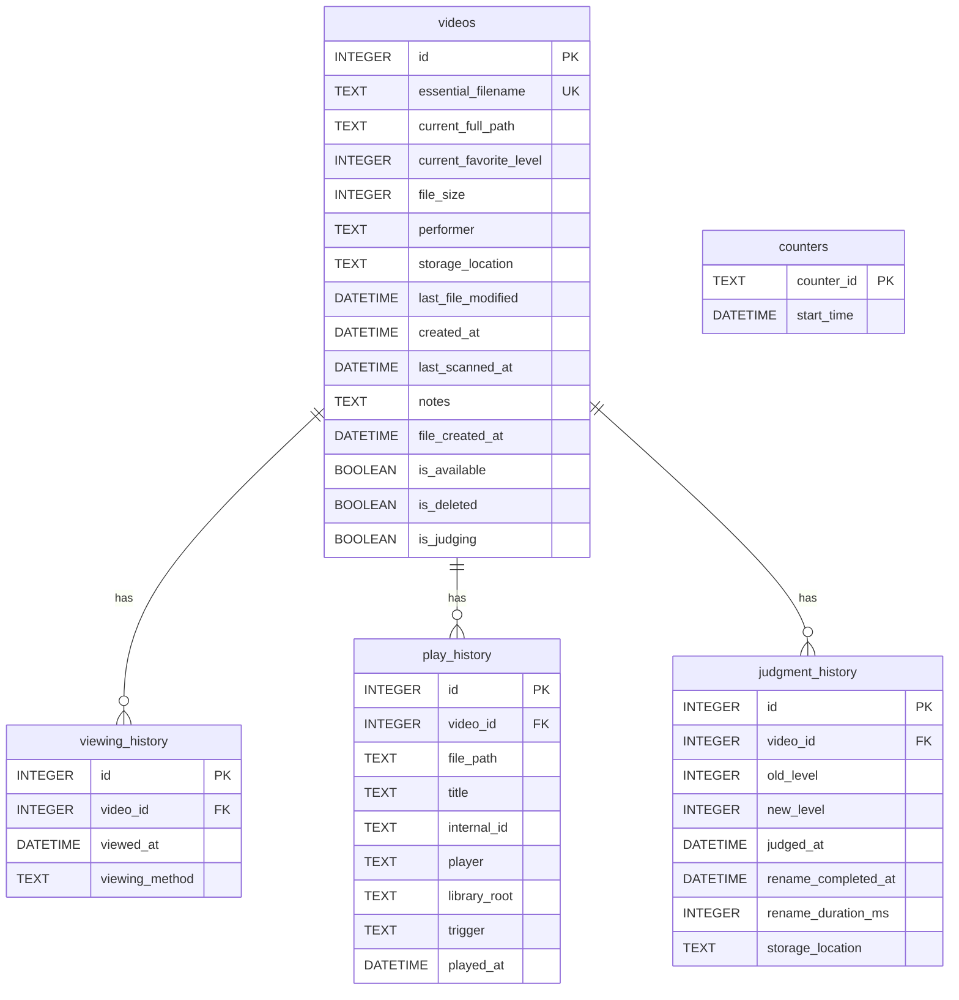

# ClipBox データモデル
**作成日**: 2026-01-25
**バージョン**: 1.0

---

## 1. データベース概要

### 1.1 基本情報

| 項目 | 値 |
|------|-----|
| DBMS | SQLite 3.x |
| ファイル | `data/videos.db` |
| エンコーディング | UTF-8 |
| 外部キー制約 | 有効（PRAGMA foreign_keys = ON） |

### 1.2 接続管理

`core/database.py`の`get_db_connection()`コンテキストマネージャを使用:

```python
from core.database import get_db_connection

with get_db_connection() as conn:
    cursor = conn.execute("SELECT * FROM videos WHERE id = ?", (video_id,))
    # 成功時: conn.commit()が自動実行
    # 例外時: conn.rollback()が自動実行
```

---

## 2. テーブル定義

### 2.1 videos（動画情報）

動画ファイルのメタデータを格納するメインテーブル。

| カラム | 型 | 制約 | 説明 |
|--------|-----|------|------|
| `id` | INTEGER | PRIMARY KEY AUTOINCREMENT | 主キー |
| `essential_filename` | TEXT | NOT NULL UNIQUE | 本質的ファイル名（プレフィックス除去後） |
| `current_full_path` | TEXT | NOT NULL | 現在の絶対パス |
| `current_favorite_level` | INTEGER | DEFAULT 0 | お気に入りレベル (-1:未判定, 0-4) |
| `file_size` | INTEGER | | ファイルサイズ（バイト） |
| `performer` | TEXT | | 出演者（親ディレクトリ名） |
| `storage_location` | TEXT | | 'C_DRIVE' または 'EXTERNAL_HDD' |
| `last_file_modified` | DATETIME | | ファイル更新日時 |
| `created_at` | DATETIME | DEFAULT CURRENT_TIMESTAMP | レコード作成日時 |
| `last_scanned_at` | DATETIME | | 最終スキャン日時 |
| `notes` | TEXT | | メモ |
| `file_created_at` | DATETIME | | ファイル作成日時 |
| `is_available` | BOOLEAN | DEFAULT 1 | ファイル存在フラグ |
| `is_deleted` | BOOLEAN | DEFAULT 0 | 論理削除フラグ |
| `is_judging` | BOOLEAN | DEFAULT 0 | 判定中フラグ |

### 2.2 viewing_history（視聴履歴）

視聴イベントを記録するテーブル。

| カラム | 型 | 制約 | 説明 |
|--------|-----|------|------|
| `id` | INTEGER | PRIMARY KEY AUTOINCREMENT | 主キー |
| `video_id` | INTEGER | NOT NULL, FK → videos(id) | 動画ID |
| `viewed_at` | DATETIME | DEFAULT CURRENT_TIMESTAMP | 視聴日時 |
| `viewing_method` | TEXT | | 記録方式（下記参照） |

**viewing_method の値**:
- `APP_PLAYBACK`: アプリ内再生ボタンによる記録
- `FILE_ACCESS_DETECTED`: ファイルアクセス検知による記録
- `MANUAL_ENTRY`: 手動エントリー

### 2.3 play_history（再生履歴）

詳細な再生ログを記録するテーブル。

| カラム | 型 | 制約 | 説明 |
|--------|-----|------|------|
| `id` | INTEGER | PRIMARY KEY AUTOINCREMENT | 主キー |
| `video_id` | INTEGER | FK → videos(id) | 動画ID |
| `file_path` | TEXT | NOT NULL | ファイルパス |
| `title` | TEXT | NOT NULL | タイトル |
| `internal_id` | TEXT | | 内部ID |
| `player` | TEXT | NOT NULL | 使用プレイヤー |
| `library_root` | TEXT | NOT NULL | ライブラリルート |
| `trigger` | TEXT | NOT NULL | 再生トリガー |
| `played_at` | DATETIME | DEFAULT CURRENT_TIMESTAMP | 再生日時 |

### 2.4 judgment_history（判定履歴）

お気に入りレベル変更の履歴を記録するテーブル。

| カラム | 型 | 制約 | 説明 |
|--------|-----|------|------|
| `id` | INTEGER | PRIMARY KEY AUTOINCREMENT | 主キー |
| `video_id` | INTEGER | NOT NULL, FK → videos(id) | 動画ID |
| `old_level` | INTEGER | | 変更前レベル |
| `new_level` | INTEGER | NOT NULL | 変更後レベル |
| `judged_at` | DATETIME | NOT NULL | 判定日時 |
| `rename_completed_at` | DATETIME | | リネーム完了日時 |
| `rename_duration_ms` | INTEGER | | リネーム所要時間（ミリ秒） |
| `storage_location` | TEXT | | ストレージ場所 |

### 2.5 counters（カウンター）

視聴カウンターを管理するテーブル。

| カラム | 型 | 制約 | 説明 |
|--------|-----|------|------|
| `counter_id` | TEXT | PRIMARY KEY | カウンタID ('A', 'B', 'C') |
| `start_time` | DATETIME | | カウント開始日時（NULL = 未使用） |

---

## 3. テーブル関連図



---

## 4. 外部キー制約

すべての外部キーはCASCADEで設定されています。親レコード削除時に子レコードも自動削除されます。

| 子テーブル | 親テーブル | 動作 |
|-----------|-----------|------|
| viewing_history.video_id | videos.id | ON DELETE CASCADE |
| play_history.video_id | videos.id | ON DELETE CASCADE |
| judgment_history.video_id | videos.id | ON DELETE CASCADE |

---

## 5. インデックス一覧

パフォーマンス向上のため、以下のインデックスが定義されています。

| テーブル | インデックス名 | カラム |
|---------|---------------|--------|
| videos | idx_essential_filename | essential_filename |
| videos | idx_favorite_level | current_favorite_level |
| videos | idx_performer | performer |
| videos | idx_storage_location | storage_location |
| videos | idx_file_created_at | file_created_at |
| videos | idx_is_available | is_available |
| videos | idx_is_deleted | is_deleted |
| viewing_history | idx_video_id | video_id |
| viewing_history | idx_viewed_at | viewed_at |
| play_history | idx_play_history_file_path | file_path |
| play_history | idx_play_history_played_at | played_at |
| play_history | idx_play_history_video_id | video_id |
| judgment_history | idx_judged_at | judged_at |
| judgment_history | idx_judgment_video_id | video_id |

---

## 6. データアクセスパターン

### 6.1 頻出クエリ

**動画一覧取得（フィルタ付き）**:
```sql
SELECT v.*,
       COUNT(vh.id) as view_count,
       MAX(vh.viewed_at) as last_viewed
FROM videos v
LEFT JOIN viewing_history vh ON v.id = vh.video_id
WHERE v.is_deleted = 0
  AND v.is_available = 1
  AND v.current_favorite_level IN (?, ?, ?)
  AND v.storage_location = ?
GROUP BY v.id
ORDER BY v.current_favorite_level DESC, v.essential_filename
```

**未判定動画のランダム取得**:
```sql
SELECT * FROM videos
WHERE is_deleted = 0
  AND is_available = 1
  AND current_favorite_level = -1
ORDER BY RANDOM()
LIMIT ?
```

**カウンター値の取得**:
```sql
SELECT COUNT(*) FROM viewing_history
WHERE viewed_at >= (SELECT start_time FROM counters WHERE counter_id = ?)
```

**視聴回数ランキング**:
```sql
SELECT v.essential_filename, COUNT(vh.id) as view_count
FROM videos v
JOIN viewing_history vh ON v.id = vh.video_id
WHERE v.is_deleted = 0
GROUP BY v.id
ORDER BY view_count DESC
LIMIT ?
```

### 6.2 ヘルパー関数

`core/database.py`には以下のヘルパー関数があります:

| 関数 | 説明 |
|------|------|
| `get_distinct_favorite_levels(conn)` | レベル一覧を取得 |
| `get_distinct_performers(conn)` | 出演者一覧を取得 |
| `get_distinct_storage_locations(conn)` | ストレージ一覧を取得 |
| `get_view_counts_map(conn)` | 動画IDごとの視聴回数マップ |
| `get_last_viewed_map(conn)` | 動画IDごとの最終視聴日時マップ |
| `get_total_videos_count(conn)` | 総動画数 |
| `get_total_views_count(conn)` | 総視聴回数 |

---

## 7. データモデル（Python）

### 7.1 Video

`core/models.py`

```python
@dataclass
class Video:
    id: int
    essential_filename: str
    current_full_path: str
    current_favorite_level: int
    file_size: Optional[int]
    performer: Optional[str]
    storage_location: Optional[str]
    last_file_modified: Optional[datetime]
    created_at: Optional[datetime]
    last_scanned_at: Optional[datetime]
    notes: Optional[str]
    file_created_at: Optional[datetime]
    is_available: bool
    is_deleted: bool
    is_judging: bool

    @property
    def display_name(self) -> str:
        """表示用のファイル名を返す"""
        return self.essential_filename
```

### 7.2 ViewingHistory

```python
@dataclass
class ViewingHistory:
    id: int
    video_id: int
    viewed_at: datetime
    viewing_method: str
```

---

## 8. マイグレーション

### 8.1 自動マイグレーション

`core/database.py`の`init_database()`でアプリ起動時に自動実行:

1. テーブルが存在しない場合は作成（`CREATE TABLE IF NOT EXISTS`）
2. 新しいカラムがない場合は追加（`ALTER TABLE ADD COLUMN`）
3. インデックス作成（`CREATE INDEX IF NOT EXISTS`）
4. 初期データ挿入（countersの初期レコード）

### 8.2 マイグレーション履歴

| 日付 | 変更内容 |
|------|---------|
| 初期 | videos, viewing_history, play_history作成 |
| - | file_created_at, is_available, is_deleted追加 |
| - | is_judging追加（判定中フラグ） |
| - | judgment_history, countersテーブル追加 |

---

## 9. パフォーマンス考慮事項

### 9.1 現在の規模

- videos: 数百〜数千件を想定
- viewing_history: 数千件を想定
- インデックスで十分な性能

### 9.2 将来の最適化候補

- viewing_historyが数万件になった場合: viewed_atでパーティション化
- カウンター計算が遅くなった場合: キャッシュ導入

### 9.3 接続プール

現在は都度接続。将来的に接続プール導入を検討。

---

## 10. バックアップ

### 10.1 手動バックアップ

```bash
cp data/videos.db data/backups/videos_$(date +%Y%m%d).db
```

### 10.2 設定タブからのバックアップ

設定タブにバックアップボタンがあり、`data/backups/`にバックアップファイルを作成。
