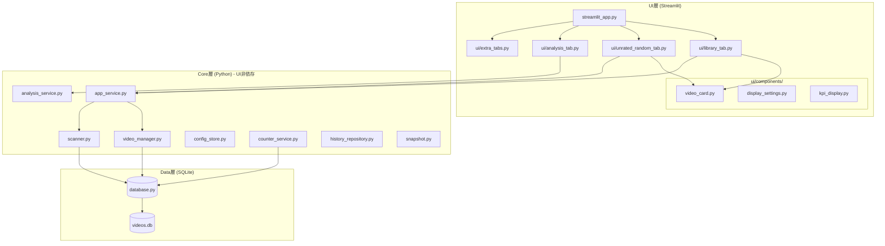
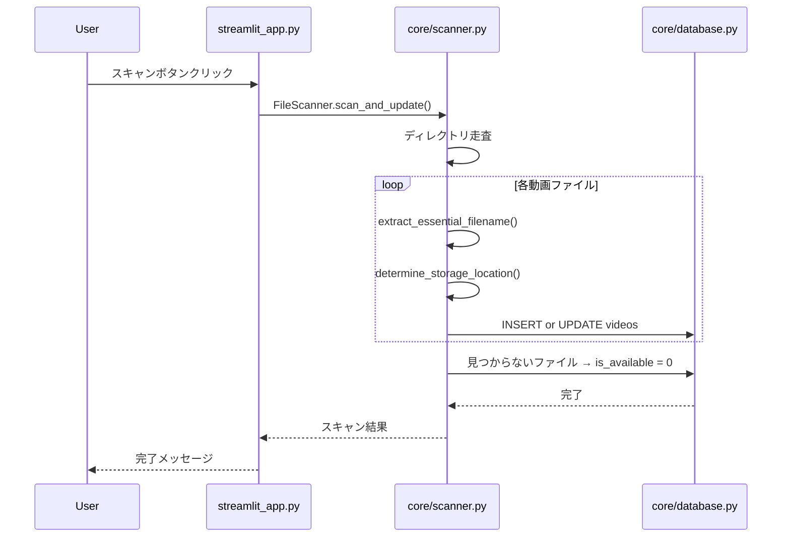
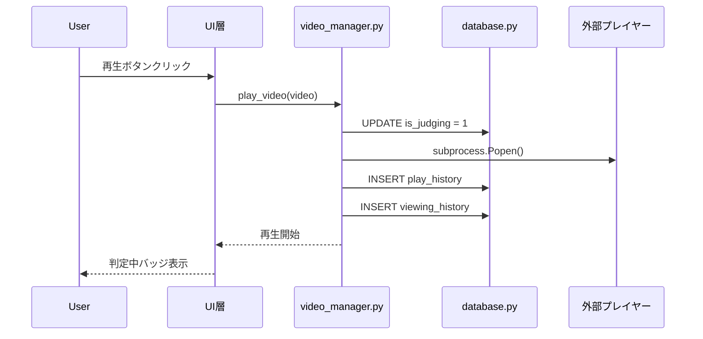
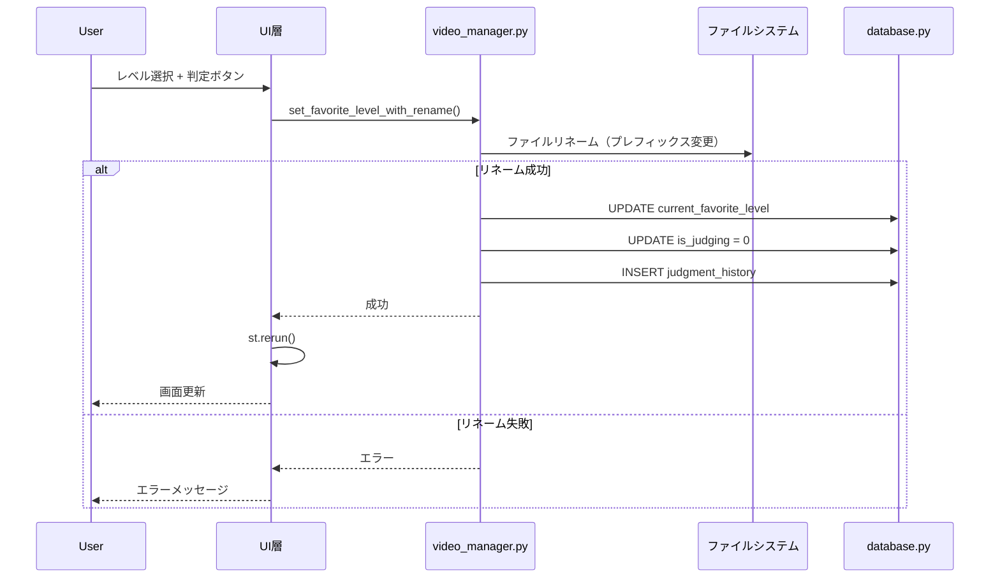

# ClipBox 実装ガイド
**作成日**: 2026-01-25
**バージョン**: 1.0

---

## 1. システムアーキテクチャ

### 1.1 3層構成

ClipBoxは厳格な3層アーキテクチャを採用しています。



**重要**: Core層では`st`（Streamlit）をインポートしない。

### 1.2 設計原則

1. **レイヤー分離**: UI層とCore層の依存は一方向のみ（UI → Core）
2. **本質的ファイル名による識別**: パスではなくファイル内容で動画を識別
3. **グレースフルデグラデーション**: エラー時もクラッシュせず動作継続

---

## 2. ディレクトリ構成

```
ClipBox/
├── streamlit_app.py          # メインエントリーポイント
├── config.py                 # 設定定数
├── CLAUDE.md                 # AIガイダンス
│
├── ui/                       # UI層
│   ├── library_tab.py        # 動画一覧タブ
│   ├── unrated_random_tab.py # 未判定ランダムタブ
│   ├── analysis_tab.py       # 分析タブ
│   ├── extra_tabs.py         # 設定タブ等
│   ├── _theme.css            # グローバルスタイル
│   └── components/
│       ├── video_card.py     # 動画カード表示
│       ├── display_settings.py # 表示設定UI
│       └── kpi_display.py    # KPI表示
│
├── core/                     # Core層（UIに依存しない）
│   ├── app_service.py        # UIファサード
│   ├── video_manager.py      # ビジネスロジック
│   ├── scanner.py            # ファイルスキャナー
│   ├── database.py           # DB接続・操作
│   ├── models.py             # データモデル
│   ├── config_store.py       # ユーザー設定管理
│   ├── migration.py          # DBマイグレーション
│   ├── snapshot.py           # スナップショット管理
│   ├── counter_service.py    # カウンターサービス
│   ├── analysis_service.py   # 分析サービス
│   ├── history_repository.py # 履歴リポジトリ
│   └── file_ops.py           # ファイル操作
│
├── data/                     # データ
│   ├── videos.db             # SQLiteデータベース
│   ├── user_config.json      # ユーザー設定
│   └── backups/              # バックアップ
│
├── tests/                    # テスト
│   ├── test_scanner.py
│   ├── test_video_manager.py
│   ├── test_analysis_service.py
│   └── ...
│
├── docs/                     # ドキュメント
│   ├── PROJECT_OVERVIEW_20260125.md
│   ├── IMPLEMENTATION_GUIDE_20260125.md
│   └── DATA_MODEL_20260125.md
│
└── archive/                  # アーカイブ（非アクティブ）
    ├── setup_db.py
    └── unused_tabs/
```

---

## 3. モジュール責務

### 3.1 UI層

| ファイル | 責務 |
|---------|------|
| `streamlit_app.py` | メインエントリーポイント、セッション状態管理、タブ切り替え |
| `ui/library_tab.py` | 動画一覧タブのUI |
| `ui/unrated_random_tab.py` | 未判定ランダムタブのUI |
| `ui/analysis_tab.py` | 分析・統計タブのUI |
| `ui/extra_tabs.py` | 設定タブ等のUI |
| `ui/components/video_card.py` | 動画カードコンポーネント（再利用可能） |
| `ui/components/display_settings.py` | 表示設定UI |
| `ui/components/kpi_display.py` | KPI表示コンポーネント |

### 3.2 Core層

| ファイル | 責務 |
|---------|------|
| `core/app_service.py` | UI層とCore層の橋渡し（ファサード） |
| `core/video_manager.py` | 動画の取得、再生、判定、視聴履歴記録 |
| `core/scanner.py` | ディレクトリスキャン、プレフィックス解析 |
| `core/database.py` | DB接続、テーブル初期化、ヘルパー関数 |
| `core/models.py` | Video, ViewingHistoryなどのデータクラス |
| `core/config_store.py` | ユーザー設定のJSON永続化 |
| `core/migration.py` | DBスキーマのマイグレーション |
| `core/snapshot.py` | 統計スナップショット管理 |
| `core/counter_service.py` | カウンター機能 |
| `core/analysis_service.py` | 統計分析 |
| `core/history_repository.py` | 再生履歴リポジトリ |
| `core/file_ops.py` | ファイル操作ユーティリティ |

---

## 4. UI構成

### 4.1 タブ構成

```
streamlit_app.py
├── 📁 動画一覧        (library_tab.py)
│   └── フィルタリング可能な動画一覧
│   └── ソート機能
│   └── 動画カード表示
│
├── 🎲 未判定ランダム   (unrated_random_tab.py)
│   └── 未判定動画のランダム選択
│   └── シャッフル機能
│   └── 判定UI
│
├── 📊 分析             (analysis_tab.py)
│   └── カウンター表示
│   └── 視聴回数ランキング
│   └── 統計グラフ
│
└── ⚙️ 設定             (extra_tabs.py)
    └── ライブラリ設定
    └── データベース管理
```

### 4.2 サイドバー

- フィルタ（お気に入りレベル、ストレージ）
- スキャンボタン
- 表示件数

### 4.3 共通コンポーネント

**video_card.py**:
- 動画カードの表示
- 再生ボタン
- 判定UI（レベル選択 + 判定ボタン）
- バッジ表示

---

## 5. 機能実装マップ

### 5.1 スキャン機能

| 機能 | ファイル | 関数 | 状態 |
|------|---------|------|------|
| ディレクトリスキャン | `core/scanner.py` | `FileScanner.scan_and_update()` | ✅ |
| プレフィックス解析 | `core/scanner.py` | `extract_essential_filename()` | ✅ |
| ストレージ判定 | `core/scanner.py` | `determine_storage_location()` | ✅ |
| 利用可能性更新 | `core/scanner.py` | `FileScanner.scan_and_update()` | ✅ |

### 5.2 再生機能

| 機能 | ファイル | 関数 | 状態 |
|------|---------|------|------|
| 動画再生 | `core/video_manager.py` | `VideoManager.play_video()` | ✅ |
| 視聴履歴記録 | `core/database.py` | `insert_play_history()` | ✅ |
| 判定中フラグ設定 | `core/video_manager.py` | `VideoManager.set_is_judging()` | ✅ |

### 5.3 判定機能

| 機能 | ファイル | 関数 | 状態 |
|------|---------|------|------|
| レベル変更 + リネーム | `core/video_manager.py` | `VideoManager.set_favorite_level_with_rename()` | ✅ |
| 判定履歴記録 | `core/video_manager.py` | 同上（judgment_historyへ挿入） | ✅ |
| 判定中フラグ解除 | `core/video_manager.py` | 同上 | ✅ |

### 5.4 統計機能

| 機能 | ファイル | 関数 | 状態 |
|------|---------|------|------|
| カウンター取得 | `core/counter_service.py` | `get_counter_values()` | ✅ |
| カウンターリセット | `core/counter_service.py` | `reset_counter()` | ✅ |
| 視聴回数ランキング | `core/analysis_service.py` | `get_viewing_ranking()` | ✅ |

---

## 6. データフロー

### 6.1 ファイルスキャンフロー



### 6.2 動画再生フロー



### 6.3 判定フロー



### 6.4 視聴履歴記録フロー

3つの記録方式があります:

```
APP_PLAYBACK:
  再生ボタンクリック → play_video() → viewing_history INSERT

FILE_ACCESS_DETECTED:
  定期スキャン → アクセス時刻変更検知 → ユーザー確認 → viewing_history INSERT

MANUAL_ENTRY:
  ユーザーが明示的にマーク → viewing_history INSERT
```

---

## 7. 主要コンポーネントの詳細

### 7.1 VideoManager

`core/video_manager.py`

ビジネスロジックの中核。動画の取得、再生、判定を担当。

```python
class VideoManager:
    def get_videos(filters) -> List[Video]
    def get_random_video(filters) -> Optional[Video]
    def play_video(video) -> None
    def set_favorite_level_with_rename(video, level) -> bool
    def set_is_judging(video_id, is_judging) -> None
```

### 7.2 FileScanner

`core/scanner.py`

ファイルスキャンとプレフィックス解析を担当。

```python
def extract_essential_filename(filename) -> Tuple[int, str]
# 戻り値: (お気に入りレベル, 本質的ファイル名)

class FileScanner:
    def scan_and_update(db_conn) -> None
```

### 7.3 AppService

`core/app_service.py`

UI層とCore層の橋渡し。ファサードパターン。

```python
class AppService:
    def __init__(video_manager, scanner)
    def scan_library() -> None
    def get_filtered_videos(filters) -> List[Video]
```

---

## 8. セッション状態管理

Streamlitのセッション状態で管理されるキー:

| キー | 型 | 用途 | 初期値 |
|------|-----|------|--------|
| `user_config` | dict | ユーザー設定 | config_storeから読み込み |
| `video_manager` | VideoManager | ビジネスロジックインスタンス | 初期化時に作成 |
| `selected_video` | Video | 選択中の動画 | None |
| `display_settings` | dict | 表示設定 | デフォルト値 |
| `filter_levels` | list | レベルフィルタ | [4,3,2,1,0,-1] |
| `filter_storage` | str | ストレージフィルタ | 'ALL' |
| `unrated_shuffle_token` | int | シャッフル制御 | 0 |
| `unrated_sample_ids` | list | サンプルID配列 | None |

---

## 9. エラーハンドリング

### 9.1 ファイル操作エラー

| エラー種別 | 検出方法 | 対応 |
|-----------|---------|------|
| ファイル不存在 | `Path.exists()` | エラー表示、DB更新なし |
| ファイル使用中 | `PermissionError` | エラー表示、DB更新なし |
| OneDrive同期中 | `PermissionError` | エラー表示、再試行促す |
| アクセス権限なし | `PermissionError` | エラー表示、DB更新なし |

### 9.2 データベースエラー

コンテキストマネージャで自動ロールバック:

```python
with get_db_connection() as conn:
    # 成功時: 自動commit
    # 例外時: 自動rollback
```

---

## 10. テスト戦略

### 10.1 ユニットテスト

```bash
# 全テスト実行
pytest

# カバレッジ付き
pytest --cov=core

# 特定ファイル
pytest tests/test_scanner.py
```

### 10.2 テスト対象

- `core/scanner.py`: プレフィックス解析のエッジケース
- `core/video_manager.py`: 再生・判定ロジック
- `core/analysis_service.py`: 統計計算
