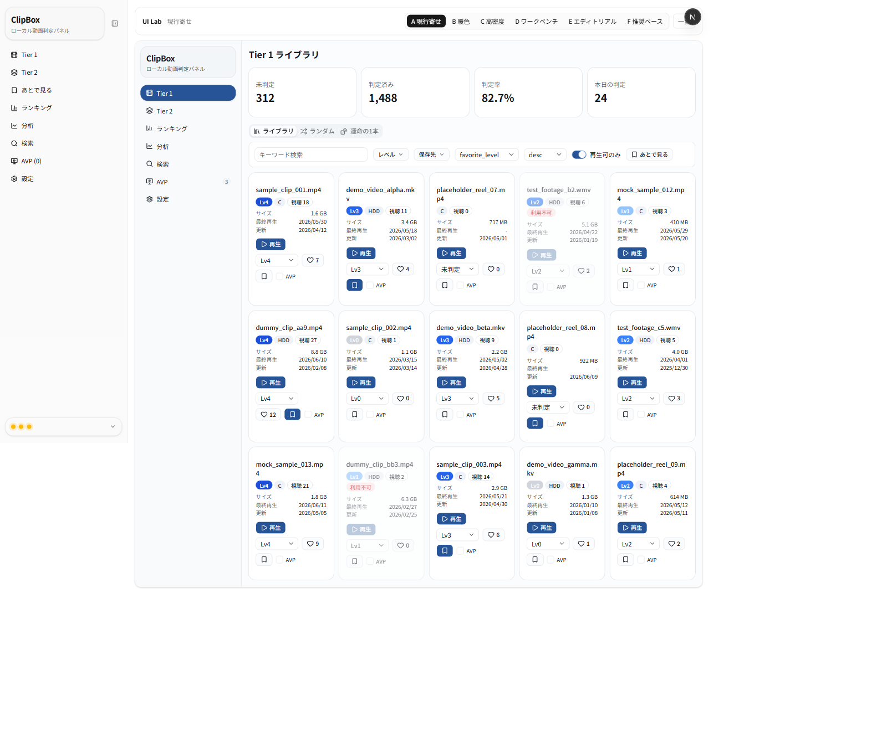
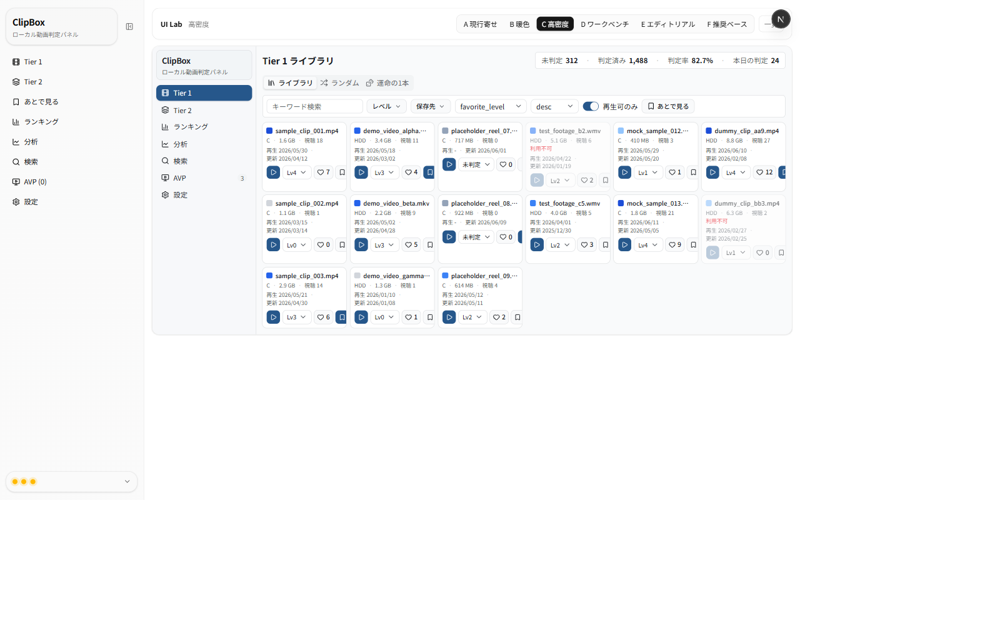
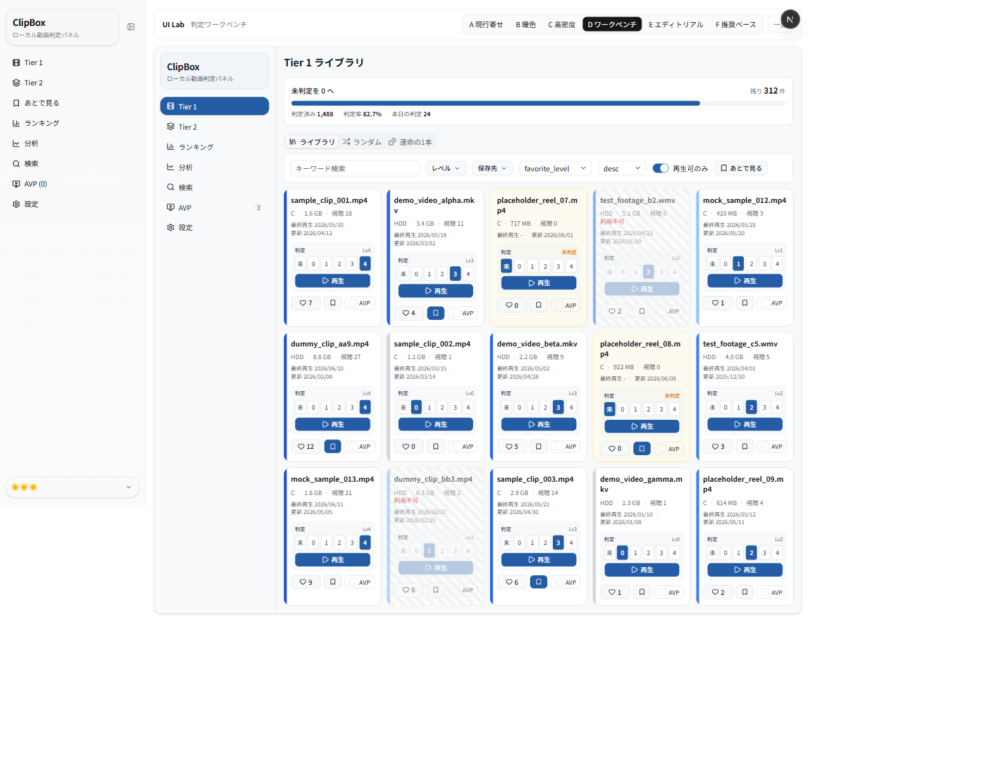
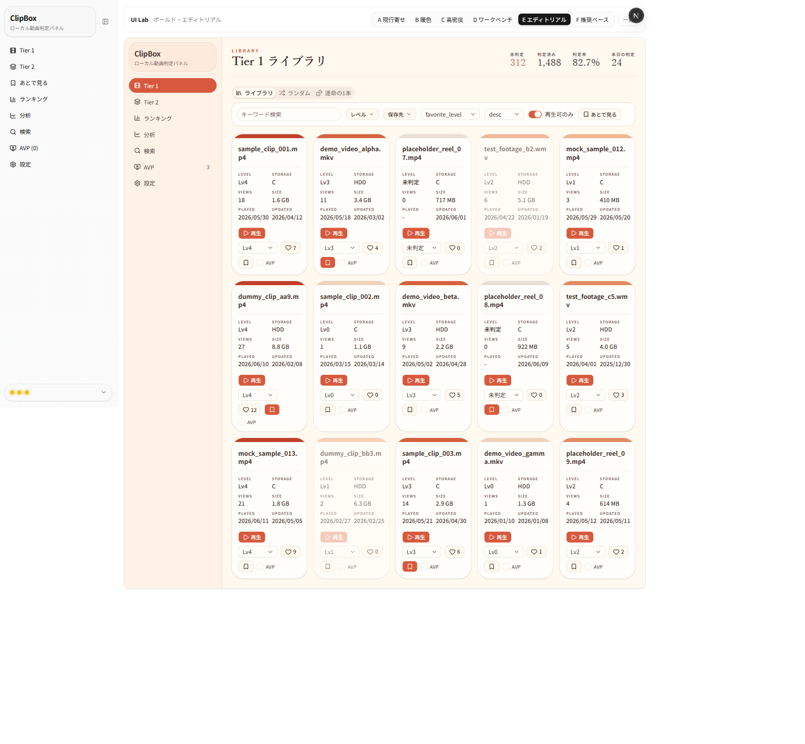
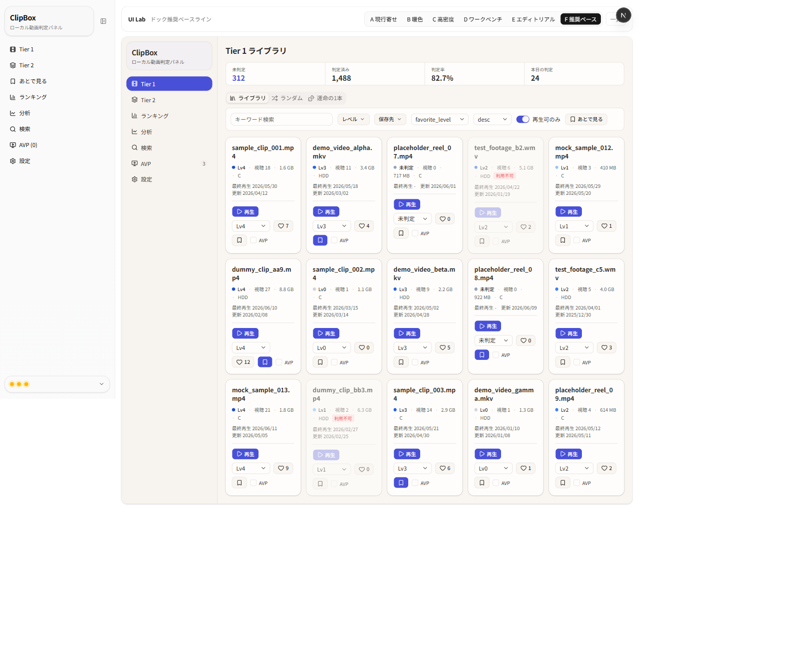

# UIラボ Variant A〜F 比較レビュー（2026-06-14）

UIラボ（`/lab`）の動画情報カード改善案 6 種（A〜F）を、同一モックデータ・デスクトップ幅で
一括表示確認し、`frontend-design` / `ux-strategist` / `design-review` の観点で比較したレポート。

- 対象: `frontend/src/app/lab/variant-{a..f}/page.tsx`
- スクリーンショット: 本フォルダ内 `variant-{a..f}.png`（Playwright・fullPage・約1580–1600px幅）
- 制約: 実 DB / API / localStorage 非接続・サムネなし・本体画面と既存 Variant は無変更（本レビューは**確認のみ**）

> 注: スクリーンショット左端の細いナビは**本体 `SidebarNav`**（ルートレイアウト由来の既存挙動）。
> その右の「ClipBox」枠がラボのモックサイドバー＝レビュー対象。

---

## サマリ（総合ランキング）

| 順位 | Variant | 合計(50点) | 一言 |
|---|---|:--:|---|
| 1 | **F 推奨ベースライン** | **45** | バランス最良・低リスク・即移植できる「出荷可能な決定版」 |
| 2 | B 暖色ニュートラル | 40 | 長時間が最も疲れにくい暖色の堅実案 |
| 3 | A 現行寄せ | 38 | 学習コストゼロ・最速移植だが改善幅は小 |
| 4 | D 判定ワークベンチ | 37 | 判定効率は最強だが移植コスト高め |
| 5 | E ボールド・エディトリアル | 33 | 見た目は最高だが移植/リスク/密度に難 |
| 6 | C 高密度 | 31 | 大量確認向きだが疲れやすい |

---

## Variant A — 現行寄せ

- **狙い**: 現行構成を温存し、色・余白・バッジ階層・日付ラベルだけ洗練。
- **良い点**: 現行とほぼ同じで学習コストゼロ・移植が最速。2段バッジ＋日付ラベルで圧迫感だけ軽減。
- **弱い点**: 「垢抜けた感」は出ない。判定効率・疲れにくさへの寄与は小さい。

## Variant B — 暖色ニュートラル

- **狙い**: 暖色・低コントラスト・純黒抑制。統計をチップ化し 5 列で長時間でも疲れにくく。
- **良い点**: 柔らかい影＋暖色で**最も目が疲れにくい**。レベルのドット＋淡色ピルが上品。
- **弱い点**: 構造は現行のまま。判定効率への寄与は小さい。

## Variant C — 高密度

- **狙い**: 横5〜6列を強く維持し一覧性最優先。メタを1〜2行に詰める。
- **良い点**: 1画面の情報量が最大。**大量確認・ランキング向き**。`tabular-nums` で走査が速い。
- **弱い点**: 密度が高く長時間は疲れやすい。アクションが小アイコンで誤操作しやすい。

## Variant D — 判定ワークベンチ

- **狙い**: 「未判定を大量にさばく」に全振り。オンカードの大セグメントで1クリック判定＋ステータス・レーン。
- **良い点**: **1クリックで判定確定**。未判定を注意色で前面化＋「未判定→0」進捗バーで動機づけ。情報階層が明確。
- **弱い点**: 本体との差が大きく**移植コスト/挙動変更が必要**。セグメントでカード高が増え件数は減る。未判定強調が amber 固定色（ダーク非対応）。

## Variant E — ボールド・エディトリアル

- **狙い**: B の暖色を発展。明朝見出し＋テラコッタ1アクセント＋レベル色帯で本体と別物の見た目に。
- **良い点**: 最も「デザインされた」印象。レベル色帯で一覧の識別性が高い。
- **弱い点**: **テラコッタ上の白文字がAA下限付近**（要微調整）。英字ラベルが多く実用密度は低め。明朝はOS依存フォールバック。レベル色が独自暖色スケールで他案と不一致。

## Variant F — 推奨ベースライン

- **狙い**: 参考ドック「UI方向性 検討」の推奨案（標準改善）を再現。暖色ペーパー＋インディゴ。
- **良い点**: タイトル主役・メタ1行・アクション分離・サマリーバーで**情報階層が最も明快**。標準コンポーネント中心で**移植が容易・低リスク**。
- **弱い点**: 意図的に保守的で「攻め」は弱い。判定の1クリック化など効率機能は持たない。

---

## 表示確認結果（1〜14）

| # | 確認項目 | A | B | C | D | E | F |
|---|---|:--:|:--:|:--:|:--:|:--:|:--:|
|1|表示できる|✅|✅|✅|✅|✅|✅|
|2|JSエラー無 ※1|✅|✅|✅|✅|✅|✅|
|3|サイドバー7項目一致|✅|✅|✅|✅|✅|✅|
|4|不要メニュー無(運命=タブ/カード状態無)|✅|✅|✅|✅|✅|✅|
|5|タブ3つ(ライブラリ/ランダム/運命の1本)|✅|✅|✅|✅|✅|✅|
|6|サムネ無(``=0)|✅|✅|✅|✅|✅|✅|
|7|横5列 ※2|✅|✅|⚠️5–6|✅|✅|✅|
|8|フィルタ7項目|✅|✅|✅|✅|✅|✅|
|9|カード項目11|✅|✅|✅|✅|✅|✅|
|10|AVPチェックボックス(各15)|✅|✅|✅|✅|✅|✅|
|11|AVP選択状態バッジ無|✅|✅|✅|✅|✅|✅|
|12|未判定/未選別の重複バッジ無|✅|✅|✅|✅|✅|✅|
|13|長タイトル耐性 ※3|✅|✅|✅|✅|✅|✅|
|14|横スクロール無|✅|✅|✅|✅|✅|✅|

- ※1 全 Variant でコンソールに出るのは `localhost:8000/api/runtime` の `ERR_CONNECTION_REFUSED` のみ。
  本体 `SidebarNav` の FastAPI ポーリング（既存挙動）で、**ラボ起因ではない**（ラボからの API 呼び出しは 0）。
- ※2 C は `lg:grid-cols-5 / 2xl:grid-cols-6`。1280px で5列、1536px 以上で6列（撮影は約1600pxで6列）。C の設計（5〜6列）どおり。
- ※3 最も厳しい C（`line-clamp-1`・6列）で 160文字無スペース＋長い日本語タイトルを実行時注入 →
  横スクロール無し・全カード同幅(168px)維持。`break-all`+`line-clamp` で破綻なしを確認。

---

## 比較評価表（5点満点）

| 観点 | A | B | C | D | E | F |
|---|:--:|:--:|:--:|:--:|:--:|:--:|
|現行からの違和感の少なさ|5|4|3|2|2|4|
|見た目の改善度|3|4|3|4|5|4|
|横5列での読みやすさ|4|4|3|3|4|5|
|情報階層の明確さ|3|4|3|5|4|5|
|操作のしやすさ|3|3|3|5|3|4|
|長時間の疲れにくさ|3|5|3|3|4|4|
|フィルタの分かりやすさ|4|4|3|4|4|4|
|動画カードの実用性|3|4|4|5|3|5|
|本体への反映しやすさ|5|4|3|3|2|5|
|実装リスクの低さ|5|4|3|3|2|5|
| **合計** | **38** | **40** | **31** | **37** | **33** | **45** |

---

## 採用候補として強い Variant

- **総合本命: F** — バランス最良・低リスク・即移植しやすい「出荷可能な決定版」。
- **作業効率特化: D** — 中核タスク「未判定をさばく」で圧倒的（操作性・情報階層・実用性が最高）。
- **快適性: B / F の暖色** — 長時間運用の疲れにくさ。

## 混ぜるなら「どの要素をどの Variant から」

| 採用要素 | 採用元 | 理由 |
|---|---|---|
| カード骨格（タイトル主役・メタ1行・アクション分離）・統計サマリーバー・標準コンポーネント | **F** | 情報階層が明確で移植が容易・低リスク |
| 暖色ペーパー＋インディゴ配色 / 疲れにくさ | **F（＋Bの柔らかさ）** | 長時間運用◎・上品 |
| レベル=同系色ドット＋名称 | **B / F** | 認識しやすくレベル意味が本体と一致（Eの独自帯は避ける） |
| オンカード・セグメント1クリック判定＋未判定の前面化＋進捗バー | **D** | 中核タスクを最速化（最大の差別化価値） |
| 高密度（密度トグルとして） | **C** | ランキング/大量確認画面のオプション |
| タイポ階層の効かせ方（見出し強度・ラベル整理） | **E（控えめに）** | 垢抜け感。ただし帯/明朝/独自色は持ち込まない |

## Variant G として統合する推奨方針

**G = 「F の骨格 × D の判定効率 × 暖色快適性」**（C を密度オプションで内包）

- **ベース**: F（暖色ペーパー＋インディゴ、タイトル主役・メタ1行・アクション分離、サマリーバー）。
  標準 shadcn 構成で**本体移植が容易・低リスク**。
- **判定効率の注入**: D の**オンカード・セグメントレベル選択（1クリック判定）**と**未判定の前面化**を融合。
  統計は F のサマリーバーに D の**「未判定→0」進捗バー**を1本足す。
- **レベル表現**: 同系色ドット＋名称（B/F）で本体と意味を一致（E の独自暖色帯は不採用）。
- **密度トグル**: comfortable（F）/ compact（C風）を切替可能にし、ランキング・大量確認に対応。
- **制約継承**: サムネ/画像枠なし・重複バッジなし・AVP はチェックボックス＋tooltip「AVPで再生する候補に追加」・
  運命の1本は Tier1 タブのまま・実DB/API非接続。
- **リスク低減（Eの反省を回避）**: 独自フォント/独自レベル色帯/コントラスト不足を避け、本体トークンと整合。
  amber 等の状態色はトークン化してダークモード対応の余地を残す。

---

_本レポートは確認・レビューのみで、ラボ/本体のコードは変更していません。_
_参考HTMLのモックに実在作品タイトルが含まれていましたが、規約によりラボには持ち込まず・記録もしていません。_
