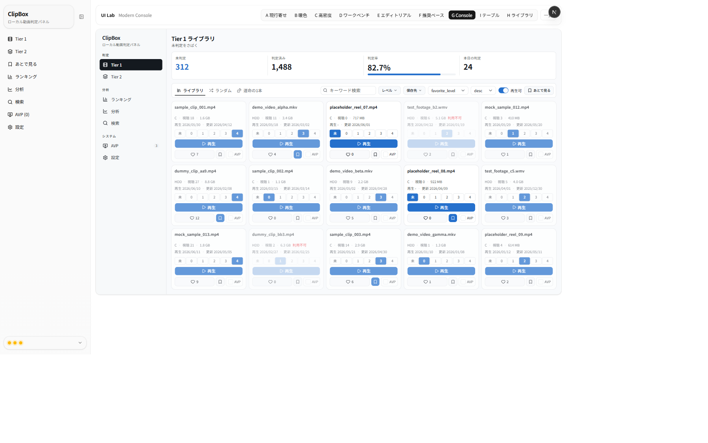
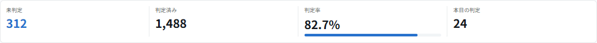
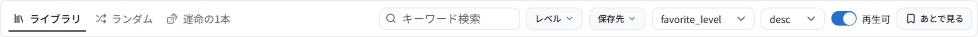
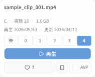
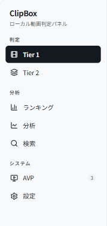
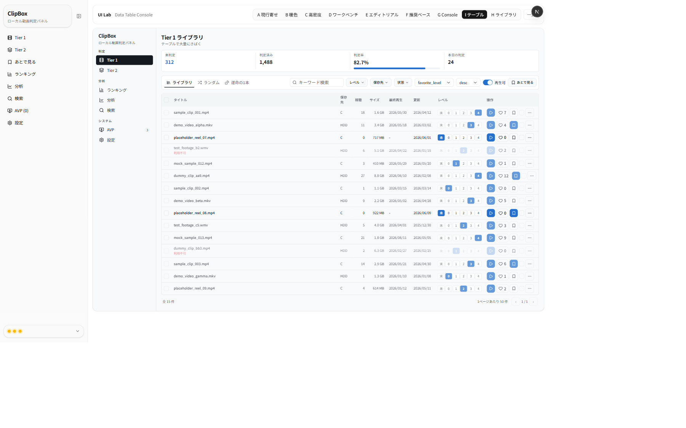
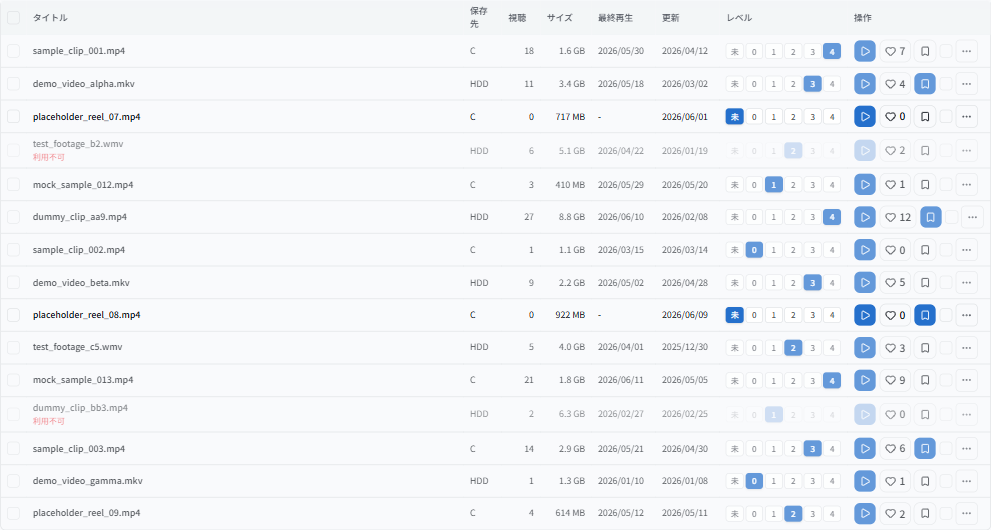
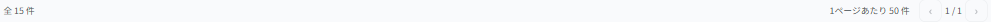
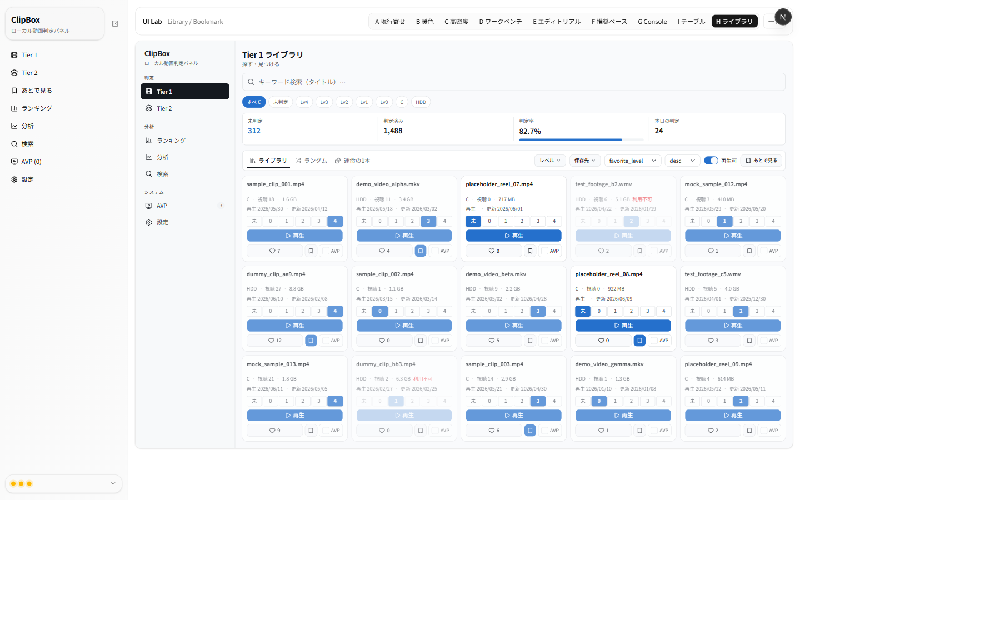

# UIラボ Variant G / I / H 比較 ＋ レビュー依頼（2026-06-14）

A〜F のフィードバック（寒色・高密度・横長カード・数値レベルボタン・タブ/フィルタ1段・判定率バー・判定済みは薄く）を反映した
**モダン3案（G/I/H）**のまとめです。各案の「全体」と「工夫したパーツの切り抜き」を併記しています。
最後に**いくつかの論点を選択肢付き**で挙げます。各論点に番号で回答ください（最終統合案 Variant J に反映します）。

- 対象タスク: Tier1「未判定をさばく（判定）」＋「探す」。サムネなし情報カード前提。
- 制約: 実DB/API非接続・本体無変更・既存A〜F無変更（モック専用）。

---

## 反映した A〜F フィードバック（チェック）
- ✅ 横長・**縦に詰めた短いカード**／文字小さめ・高密度／**5列固定**
- ✅ **寒色のみ**（暖色排除。色合いは後調整可）
- ✅ **タブ段とフィルタ段を1段に統合**
- ✅ レベルは **D の数値ボタン（未/0–4）の単一表現**（バッジ＋プルダウンの重複・濃淡ドットを廃止）
- ✅ アクションは **D 流3グループ（レベル / 再生 / その他）**
- ✅ **未判定の色付けはやめ、判定済みを薄く**（利用不可はグレーアウト）
- ✅ **KPI を目立たせ、判定率はバーで同一段に集約**

---

## Variant G — Modern Console（寒色・高密度・本命）
URL: `/lab/variant-g`

**工夫したパーツ**

KPI を1段に集約し、**判定率をコンパクトな横バー**で可視化（全幅にしない）:

**タブ（ライブラリ/ランダム/運命の1本）とフィルタ7項目を1段に統合**（縦スペース節約）:

**縦に詰めた短いカード**：タイトル2行＋メタ詰め＋D流の3グループ操作:

レベルは**数値ボタンの単一表現**（未/0–4、アクティブを寒色で強調。バッジ/濃淡ドットは廃止）:

セクション見出しでグルーピングしたサイドバー（7項目維持・アクティブは塗りピル）:

---

## Variant I — Data Table Console（最大密度）
URL: `/lab/variant-i`

**工夫したパーツ**

一覧を**高機能テーブル**化：行選択・**行内 数値レベル**・数値右寄せ・行末"…"メニュー・判定済み行は薄く:

下部に**ページネーション**（モック）:

---

## Variant H — Library / Bookmark（検索主役）
URL: `/lab/variant-h`

**工夫したパーツ**

**ヒーロー検索**を主役化（"探す・再発見"）:

レベル/保存先の**フィルタchip**:

（カードは G と同じ高密度カードを使用＝`crop-g-card` 参照）

---

## 3案サマリ

| | 主眼 | 一覧形式 | 密度 | 向いている作業 |
|---|---|---|---|---|
| **G** Modern Console | KPI前面のモダン本命 | カード（5列） | 高 | 日常の判定・全体把握 |
| **I** Data Table Console | 一括処理・走査 | テーブル | 最大 | ランキング/大量確認/インライン判定 |
| **H** Library / Bookmark | 探す・再発見 | カード（5列）＋ヒーロー検索 | 高 | 過去動画の検索・回遊 |

---

## レビュー依頼：論点（選択肢付き）

各論点に「番号: 選んだ記号」で回答ください（複数可・自由記述も歓迎）。**私の推奨は ★**。

**論点1. 最終統合（Variant J）の主軸**
- A. ★ G を主軸にし、**I（テーブル）を「表示モード切替」で内包**（カード⇄テーブル）。H の検索強化も取り込む
- B. G 単独で仕上げる（テーブルは作らない）
- C. I（テーブル）を主軸にする
- D. H（検索主役）を主軸にする

**論点2. 寒色アクセントの方向**（色合い未確定だったので）
- A. ★ 青〜インディゴ（現状の G の青を微調整）
- B. スレート／ティール（青緑寄り・落ち着き）
- C. 濃紺（ネイビー・コントラスト強め）
- D. もっと無彩色（ニュートラル基調＋黒アクティブ中心、色は最小）

**論点3. 一覧のデフォルト表示**
- A. ★ カード／テーブルの**モード切替**（既定はカード）
- B. カード固定
- C. テーブル固定

**論点4. カードの操作レイアウト**（D流3グループ＝レベル/再生/その他）
- A. ★ 3グループ維持（評価が良かったため）
- B. レベルと再生を1行に詰めて**さらに短く**
- C. その他（♡/🔖/AVP）を**hover表示**にして省スペース

**論点5. 判定済みの見せ方**（ライブラリには判定済みも混在）
- A. ★ 薄く（現状＝opacity 70%）
- B. もっと薄く＋小さな「済」マーク
- C. 薄くしない（レベル数値だけで識別）

**論点6. サイドバーのグルーピング見出し（判定/分析/システム）**
- A. ★ 採用（視覚のグルーピングのみ・7項目と順序は不変）
- B. 不採用（フラットのまま）

**論点7. 文字密度**
- A. ★ 現状（11–13px）
- B. もう一段小さく（さらに高密度）
- C. 少し大きく（可読性優先）

**論点8. 次の一手**
- A. ★ この方向で **Variant J（最終統合）** を作る（論点1〜7の回答を反映）
- B. まず G だけ細部を詰める
- C. もう少し別方向も見たい（提案します）

---

_本ドキュメントは確認・レビュー用で、ラボ/本体のコードは変更していません。_
_スクショは本ラボ（モック専用・合成データ）のもので、個人情報・実動画名は含みません。_
