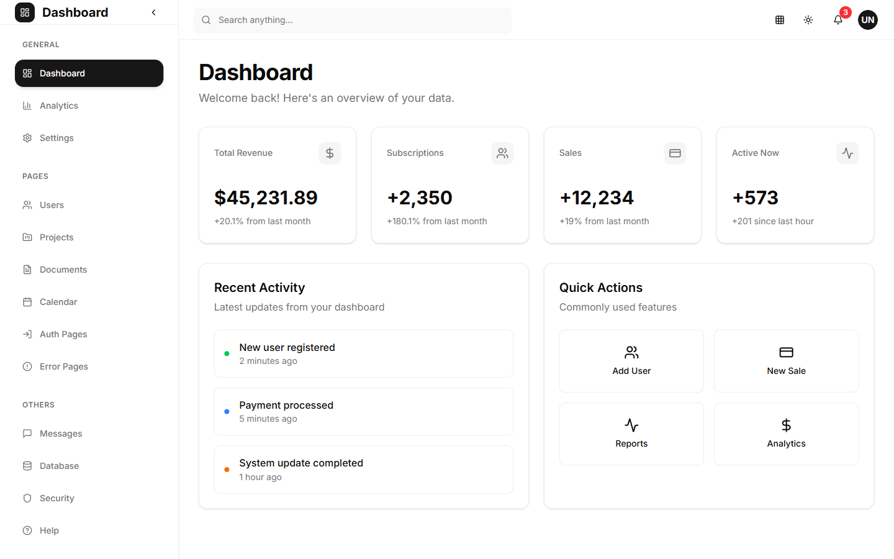
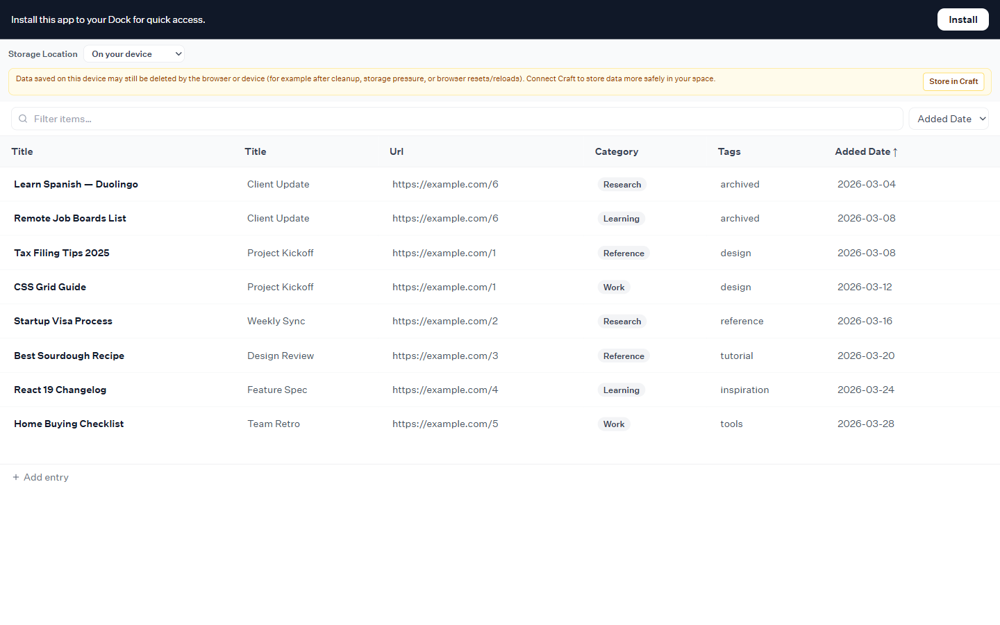
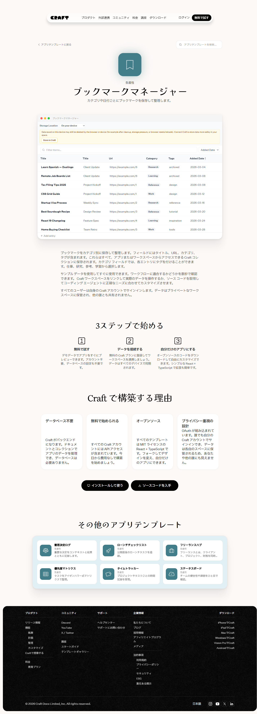
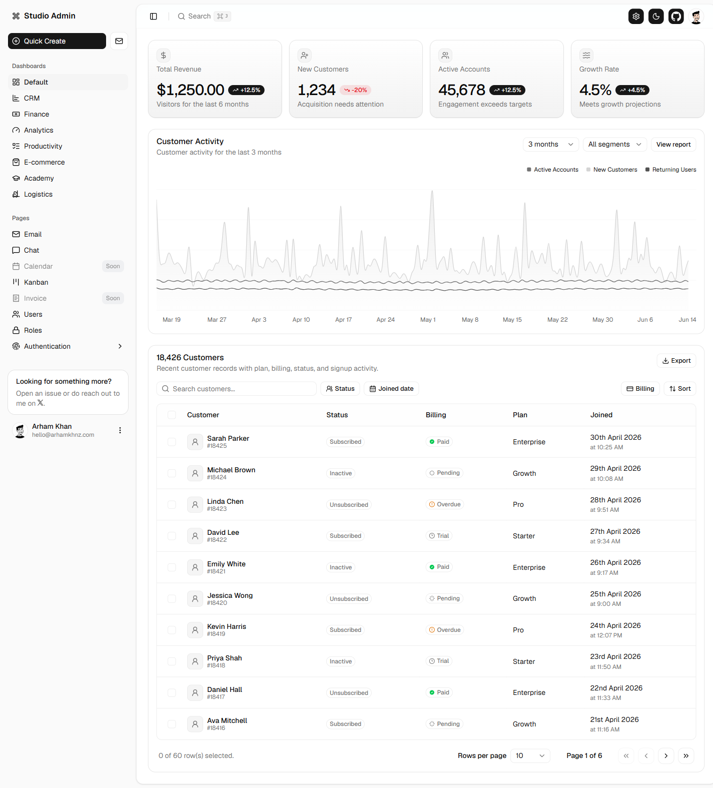
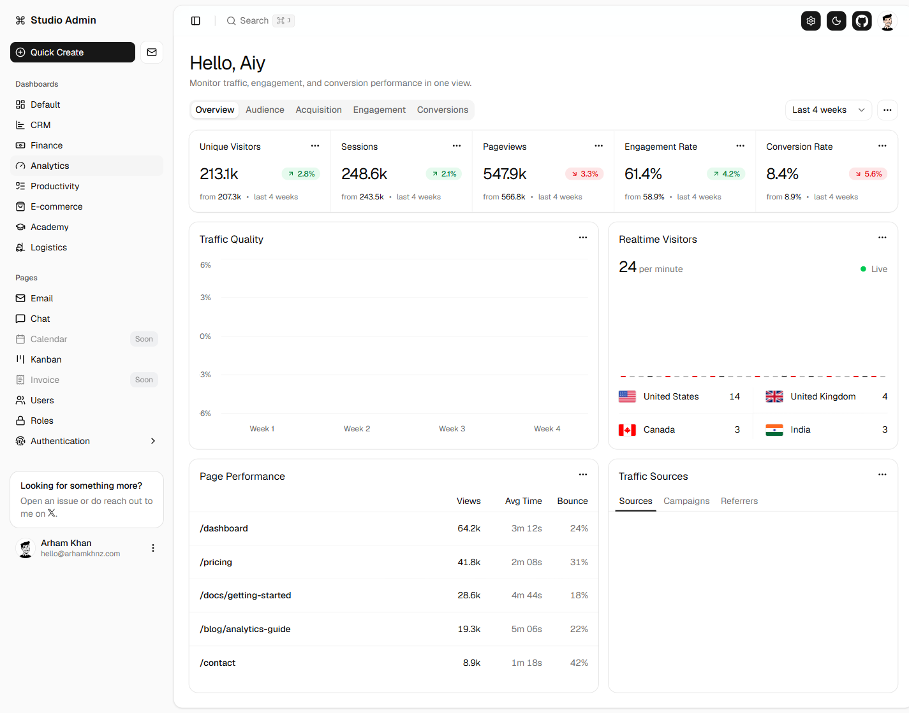
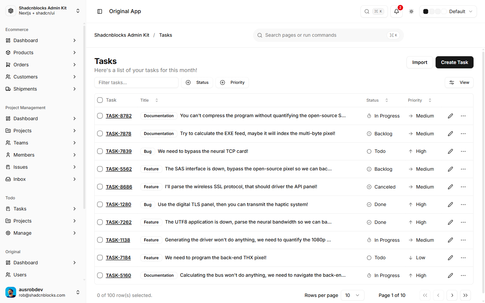
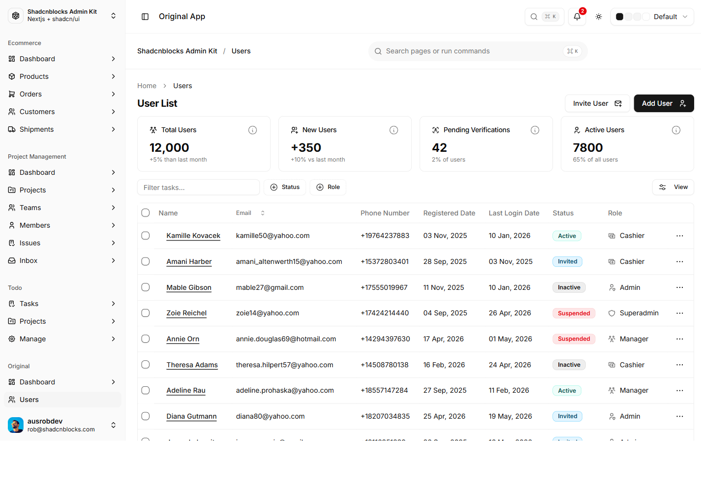
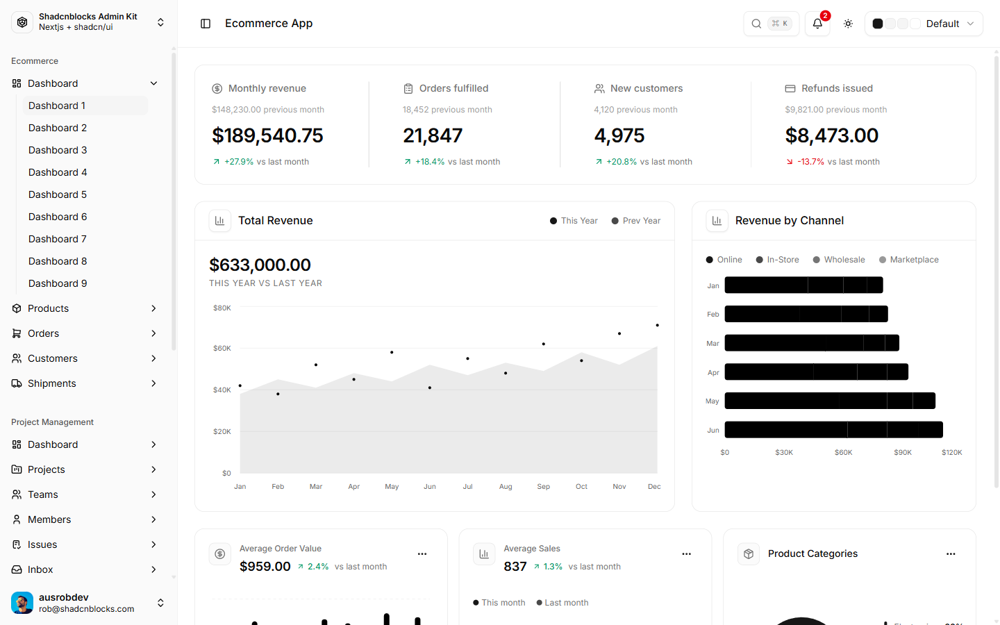

# ClipBox Modern UI Design Brief（2026-06-14）

UIラボ A〜F は「使いやすさ＝情報設計」は改善したが、**パッと見のビジュアルがモダンでない**。
本ブリーフは、参考サイト（ユーザー提供10URL）を撮影・分析し、ClipBox を**モダンに見せる**ための
具体的なデザイン方針と、次に作る **Variant G / H / I** を定義する。

- 対象タスク: Tier1「未判定を大量にさばく（判定）」＋「過去の動画を探す」。**サムネなし情報カード**前提。
- 制約: 実DB/API非接続・本体無変更・サムネ/画像枠/16:9なし・重複バッジなし・AVPはチェックボックス・
  運命の1本はTier1タブのまま・サイドバー7項目据え置き。
- 本ブリーフは**設計方針のみ**（コード未変更）。

---

## 1. なぜ A〜F は「便利だがモダンに見えない」のか

A〜F の実スクショ（`../variant-a.png` 〜 `../variant-f.png`）に共通する10の弱点。

| # | 弱点 | 内容 | モダンUIの正解 |
|---|---|---|---|
|1|素のテンプレ感|トークン色替え止まり。影/角丸/罫線/余白/タイポの**スケール設計**が未着手|スケールを設計し"意図"を出す|
|2|余白不足|カードが詰まり"呼吸"がない|generous whitespace（大胆な余白）|
|3|囲みだらけ(boxy)|カード枠＋バッジ枠＋ボタン枠＋区切り線が重なる|罫線を減らし**余白・極薄背景差・微影**で分ける|
|4|アクション常時露出|各カードに 再生/レベル/♡/🔖/AVP が常に5個|**primary 1つ強調**＋副次は hover/メニュー退避|
|5|タイポ階層が平坦|タイトル/メタ/数値の差が小さい|見出し・数値を大きく、補助を小さく薄く|
|6|色が単調 or 過剰|A=色が散る / B・E=全面に色|**ニュートラル基調＋1アクセントを点で**|
|7|KPIが弱い|数値が小さく単位/トレンド演出なし|大数値＋小ラベル＋**前比トレンド**|
|8|エレベーション無し|フラット or ベタ影|ring＋極薄影＋hover lift の段階設計|
|9|スケール不統一|角丸/spacing が案ごとにバラつく|トークンで統一|
|10|フレームの古さ|（ラボ特有）本体サイドバー併存ノイズ|—|

参考（現行 A〜F）:

| A 現行寄せ | B 暖色 | C 高密度 |
|---|---|---|
|  |  |  |

| D ワークベンチ | E エディトリアル | F 推奨ベース |
|---|---|---|
|  |  |  |

→ 結論: **情報設計は良くなったが「視覚設計（余白・階層・抑制・エレベーション）」が未着手**。これが G/H/I の主眼。

---

## 2. 参考サイトから取り入れる要素（スクショ＋採用ポイント）

### 2-1. shadcn-nextjs-dashboard（G: Modern Console 参考）

**Dashboard** — 
- **採用**: ①上部に**検索バー**＋右端アイコン群（テーマ/通知/アバター）。②サイドバーは**セクション見出し(GENERAL/PAGES/OTHERS)＋アイコン＋ラベル**、アクティブは**黒の塗りピル**。③ページ見出し（大）＋ミュート副題。④**KPIカード=小ラベル＋小アイコン＋特大数値＋小さな前月比**。⑤**たっぷりの余白・細い罫線・影はほぼ無し**。⑥「Quick Actions」=アイコン＋ラベルの2×2。

**Analytics** — 
- **採用**: ①ページ見出しの**右にアクション群（Filter / 期間 / Export）**＝アウトラインボタン＋アイコン。②KPIに**色付きアイコンの淡い円**＋**↑↓トレンド色（緑/赤）**。③**セグメント型タブ**（Overview/Revenue/Users）。④**横バー＋数値のランキングリスト**（Traffic Sources）＝ClipBoxのレベル分布/保存先内訳に転用可。

**Settings** — 
- **採用**: ①**左に縦サブナビ**（Profile/Account/…）＋右にフォーム。②各フィールドが**ラベル＋入力＋説明文（helper text）**。③見出し＋副題、十分な余白、primaryボタン。→ ClipBox 設定画面の手本。

### 2-2. craft.do Bookmark Manager（H: Library / Bookmark 参考）

**実デモ** — 
- **採用**: ①**検索バーを最上段に大きく**（"探す"主役）＋右に**並び替え（Added Date ↕）**。②一覧は**テーブル**で、**Category=淡いピル / Tags=ミュート文字 / 日付=右寄せ**。③列見出しがソート可。→ ClipBox の「探す体験」と**レベル/状態をタグ的に静かに**見せる手本。

**テンプレ紹介** — （主にマーケ用。アプリ本体は上記H2を参照）

### 2-3. Studio Admin / Shadcnblocks Admin（I: Data Table Console 参考）

**Studio Admin / Default** — 
- **採用**: ①KPI行＋②アクティビティチャート＋③**フル機能テーブル**（行チェックボックス / 名前＋ID / Status・Plan バッジ / 日付 / **行末"…"メニュー** / **ページネーション**「Rows per page」「Page 1 of 8」/ Filter・Sort・Export）。→ ランキング/大量確認/インライン判定の手本。

**Studio Admin / Analytics** — 
- **採用**: ①**下線型タブ**（Overview/Audience/…）＋右に期間セレクタ。②KPIに**トレンドバッジ＋"from X • 期間"の比較副文**。③カード内**ミニテーブル**（Views/Avg Time/Bounce・数値右寄せ）。

**Shadcnblocks / Tasks** — 
- **採用**: ①**ファセットフィルタ**（Status/Priority ドロップダウン）＋Filter入力＋View切替。②Type/Status/Priority を**アイコン付きバッジ**。③行選択・ページネーション・選択件数表示。→ ClipBox の「テーブル表示」決定版。

**Shadcnblocks / Users** — 
- **採用**: コンパクトKPI＋**一覧テーブル**（アバター/メール/日付/Status/Role/行メニュー）＋primary「Add User」。KPIとテーブルの同居レイアウト。

**Shadcnblocks / Ecommerce** — 
- **採用**: ①KPIを**1枚の枠＋縦罫線で4分割**（小ラベル＋小アイコン＋"previous month"参照＋特大数値＋↑↓色）。②⌘K検索ヒント。③**横バーのチャネル別ランキング**。→ ClipBox サマリーバーの進化形。

---

## 3. 取り入れない要素（ClipBox には不要 / 不可）

- **チャート/グラフの多用**（ClipBoxの主役でない。分析の一部に最小限のみ）。
- **サムネ・画像ギャラリー・マゾンリー・大プレビュー**（規約で**不可**）。
- **重厚なマーケ用ヒーロー/ランディング要素**（craftテンプレ紹介ページ的なもの。業務ツールに不要）。
- **eコマース系の派手KPIや多色チャート**（情報過多。KPIは4つ＋控えめトレンドで十分）。
- **多色アクセントの散在**（B/E の反省）。色は**1アクセント＋状態の少数色**に限定。
- **収益/売上系の語彙・ダミー指標**（ClipBoxの語彙＝未判定/判定済み/判定率/本日 に置換）。
- **ダーク一辺倒**（ClipBoxは明色基調。暖色・目に優しい配色も選択肢として残す）。

---

## 4. ClipBox Modern UI Design Brief（設計方針）

### 4-1. デザイン原則（7か条）
1. **余白優先**: セクション間・カード内に大きめ余白。情報量は減らさず"間"で整理。
2. **罫線は最小**: 囲みを減らし、**余白＋極薄背景差＋微影**で領域を示す。
3. **タイポ階層を効かせる**: タイトル>数値>メタの差を明確に。数値は大きく `tabular-nums`。
4. **1アクセント原則**: ニュートラル基調＋**1アクセント**。状態色（未判定/利用不可/レベル）は少数のドット/淡ピルに限定。
5. **primary最小・副次退避**: カードの主操作は **再生 or 判定** の1つを強調。いいね/あとで/AVP は**hover表示 or "…"メニュー**へ。
6. **エレベーションの段階**: 既定= border＋`ring-1 ring-foreground/5`＋極薄影。hover= 影を一段＋ `-translate-y-0.5`。
7. **数値とトレンドの存在感**: KPIは大数値＋小ラベル＋（あれば）前日比/前月比の↑↓色。

### 4-2. レイアウト
- **サイドバー**: 7項目維持。**セクション見出し（任意）でグルーピング**（例: 判定=Tier1/Tier2、分析=ランキング/分析/検索、システム=AVP/設定）。アクティブ=塗りピル。※項目は増減しない。
- **上部ヘッダー（新規）**: ページ見出し（大）＋副題、**右側に検索＋操作群（フィルタ/並び替え/期間/表示切替）**。本体のキーワード検索をヘッダーへ昇格。
- **KPI**: 4指標（未判定/判定済み/判定率/本日）を **G1風カード** か **I5風の1枠4分割**で。特大数値＋小ラベル＋（任意）トレンド。未判定にアクセント。
- **タブ**: ライブラリ/ランダム/運命の1本 を**下線型 or セグメント型**に（現行のボタン的タブより軽い）。
- **一覧**: **カード表示 ⇄ テーブル表示のトグル**（comfortable / compact / table）。ランキング・大量確認は table。

### 4-3. カラー / トークン
- **基調**: ニュートラル（明色）。暖色ペーパー（F系）も選択可。**純黒は避ける**。
- **アクセント**: 1色（F のインディゴ #4f46e5 か、G1風の "near-black" アクティブ）。状態色＝レベル(同系ドット)/利用不可(赤)/未判定(控えめ強調)。
- **エレベーション**: `border + ring-1 ring-foreground/5 + shadow-xs` → hover `shadow-sm + -translate-y-0.5`。
- **半径/余白**: `--radius` 統一（0.625〜0.75rem）。spacing は 4/8/12/16/24 スケールで統一。

### 4-4. タイポスケール（目安）
- ページ見出し 24–28px / セクション 16–18px semibold / **KPI数値 28–32px** / カードタイトル 15–16px semibold /
  メタ 12–13px muted / ラベル 11–12px **uppercase tracked** muted。すべて `tabular-nums` を数値に。

### 4-5. カード仕様（サムネなし情報カード・モダン版）
- 構成: **タイトル主役** → **ミュートのメタ1行**（レベル=同系色ドット＋名称 / 視聴 / サイズ / 保存先）→ 日付（最終再生/更新, ラベル小）。
- 操作: **主操作（再生 or 判定）を1つ常時表示**。いいね/あとで見る/AVP候補チェックは **hover で出現 or "…" メニュー**（モバイルは常時）。
- 状態: レベル/利用不可は**静かなピル/ドット**。**重複バッジは出さない**。AVP は**チェックボックス**（tooltip「AVPで再生する候補に追加」）。
- 余白多め・角丸統一・hover lift。**5列維持**（密度トグルで compact/table も）。

### 4-6. 密度トグル & テーブル表示
- comfortable（既定）/ compact（C系）/ **table（I系）**。
- table: 行ホバー / 整列数値（右寄せ `tabular-nums`）/ スティッキーヘッダ / ファセットフィルタ（レベル/保存先/状態）/ **インライン判定（行内レベル選択）** / 行末"…"メニュー / ページネーション。

### 4-7. アクセシビリティ
- 本文 AA（4.5:1）・大文字/数値 3:1 を満たす。フォーカスリング統一。キーボード操作（タブ送り・行選択・判定）。
- 状態色は色のみに依存せず**アイコン/ラベル併用**。`prefers-reduced-motion` で hover lift を抑制。

---

## 5. 次に作る Variant G / H / I

| | 名称 | 寄せる参考 | 主眼 | 一覧形式 |
|---|---|---|---|---|
| **G** | Modern Console | G1/G2/G3（shadcn-nextjs-dashboard） | 上部ヘッダー＋検索、グルーピング・サイドバー、特大KPI、下線/セグメントタブ、余白多め・罫線最小、hoverで副次アクション、1アクセント | カード（5列・comfortable） |
| **H** | Library / Bookmark | H2（craft bookmark） | 検索を主役化、"探す"体験、レベル/状態を**タグ的に静か**に、クリップカードの洗練 | カード or 軽量リスト |
| **I** | Data Table Console | I1/I3/I4（Studio/Shadcnblocks Admin） | **高機能テーブル**（行選択・ファセットフィルタ・整列数値・スティッキーヘッダ・インライン判定・ページネーション・行メニュー） | テーブル |

- **G = モダン本命**（出荷狙い）。F の骨格＋本ブリーフの視覚原則を全面適用。
- **H = 探す体験**特化（ライブラリ回遊・再発見）。
- **I = さばく/ランキング**特化（大量確認・分析・インライン判定）。
- 3案とも制約継承（サムネなし・重複バッジなし・AVPチェックボックス・運命の1本タブ・実DB/API非接続・本体無変更）。

> 推奨着手順: **G → I → H**（Gで視覚言語を確立 → Iで大量処理 → Hで回遊体験）。

---

## 6. 出典URL（撮影: 2026-06-14, 1440×900, fullPage）

| 画像 | URL | 取得 |
|---|---|---|
| ref-g1-dashboard.png | https://shadcn-nextjs-dashboard.vercel.app/dashboard | ✅ |
| ref-g2-analytics.png | https://shadcn-nextjs-dashboard.vercel.app/dashboard/analytics | ✅ |
| ref-g3-settings.png | https://shadcn-nextjs-dashboard.vercel.app/dashboard/settings | ✅ |
| ref-h1-craft-template.png | https://www.craft.do/app-templates/bookmark-manager | ✅（主にマーケ） |
| ref-h2-craft-demo.png | https://www.craft.do/app/bookmark-manager | ✅（実デモ＝テーブル） |
| ref-i1-default.png | https://next-shadcn-admin-dashboard.vercel.app/dashboard/default | ✅ |
| ref-i2-analytics.png | https://next-shadcn-admin-dashboard.vercel.app/dashboard/analytics | ✅ |
| ref-i3-tasks.png | https://shadcnblocks-admin.vercel.app/original/tasks | ✅ |
| ref-i4-users.png | https://shadcnblocks-admin.vercel.app/original/users | ✅ |
| ref-i5-ecommerce.png | https://shadcnblocks-admin.vercel.app/ecommerce/dashboard-1 | ✅ |

> 参考スクショは**第三者サイト**の画面（社内デザイン参考目的）。出典は上表のとおり。
> 本ステップはコード未変更（追加は `_review/modern/` のみ）。次段で G/H/I を実装予定。
