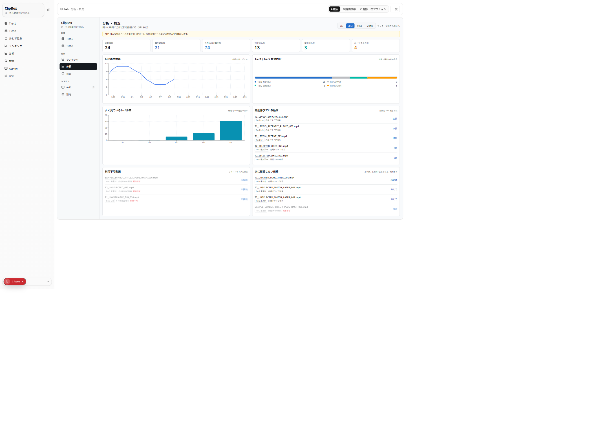
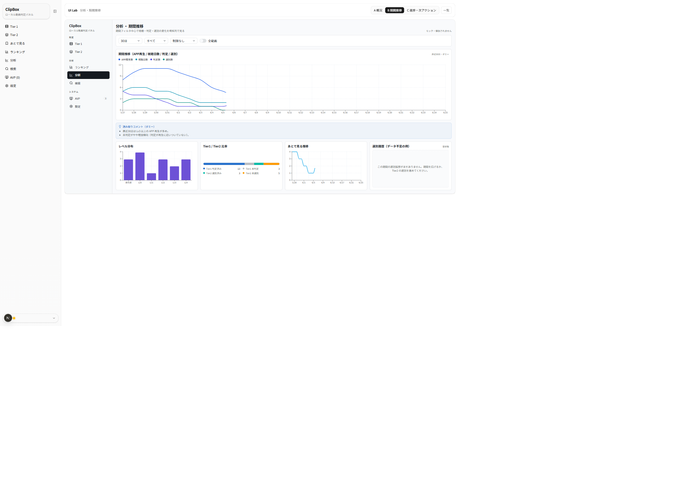
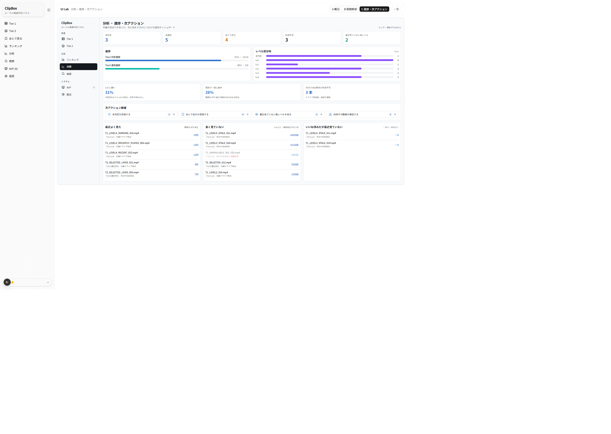

# UIラボ 分析画面 — 3案 比較レビュー（2026-06-25）

## 目的

ClipBox Next.js 版「分析」画面の UI 改修にあたり、本体実装の前段として**比較候補**をモック専用で作成しました。
既存グラフをそのまま綺麗にするのではなく、**KPIカード＋グラフ中心のダッシュボード**として「ClipBox の使い方を振り返りやすい画面」を
3方向（概況 / 期間推移 / 進捗・次アクション）で比較し、Variant K 候補を選ぶ材料にします。本体 `/analysis` の置き換えではありません。

## 前提（モック・必読）

> ★表示している **KPI・グラフ・順位・進捗・偏りはすべて UI 表示確認用のダミー**です。本体の**分析ロジック・集計SQL・APP_PLAYBACK 計算式ではありません**。
> APP_PLAYBACK の考え方（アプリ内再生を視聴指標とする）を踏まえた「表示例」に過ぎません。本体反映時は**既存 API・既存仕様との整合確認**が必要です。
> 本レビューで本体の分析仕様・集計・ランキング計算式・履歴の扱いは一切変更していません。

- URL: `/lab/analysis`（索引）／ `/lab/analysis/variant-a` ・ `/variant-b` ・ `/variant-c`
- 対象タスク: 分析ダッシュボード（KPI・推移グラフ・分布・進捗・次アクション）。サムネなしの情報カード前提。
- 制約: 実 DB/API/localStorage 非接続・本体無変更・**新規依存なし**（チャートは既存 Recharts ＋依存なしの div バー）。寒色（Variant J の THEME 流用）。
  匿名ダミーデータのみ（実動画名・実パス・個人情報なし）。保存場所は匿名化分類（内蔵ドライブ相当 / 外付けHDD相当）。API 風フィールドは snake_case。

## 参照した正本・方針メモ

- `docs/context/SPEC_NEXTJS.md`（画面・状態の挙動の正本）
- `docs/context/ACCEPTANCE_CRITERIA.md`（受け入れ基準）
- `docs/nextjs-ui-renovation-master-memo.md` §3-B/§4-10（分析は視聴中心 / 判定・選別進捗 / ランキング連動 / 期間フィルタ重視の比較。Recharts と既存集計前提は維持）
- `docs/nextjs-ui-renovation-feedback.md`（フィードバック記録）

> 注: スクショ左端の細いナビは**本体 `SidebarNav`**（ルートレイアウト由来）。各案の本体は中央の枠内（`ModernSidebar`＋main）で、サイドバーの「分析」項目が点灯します。
> 「1 Issue」表示は本体 Runtime control が FastAPI（停止中）をポーリングした開発時の通知で、ラボ表示には影響しません。

---

## 3案の概要

| 案 | 名称 | 比重 | 狙い | 一言 |
|---|---|---|---|---|
| **A** | 概況ダッシュボード型 | KPI | 開いた瞬間に全体状態を把握 | 最初の1画面に向く |
| **B** | 期間推移・グラフ重視型 | グラフ | 視聴・判定・選別の変化を時系列で深掘り | 分析ツール寄り |
| **C** | 進捗・偏り・次アクション型 | 次アクション | 作業の詰まりを見つけ次の一手につなぐ | 運用ダッシュボード |

共通: 寒色モダンテーマ、`ModernSidebar active="分析"`、サムネなし。期間切替（7/30/90/全期間）。状態キャプションで Tier1/Tier2・判定/選別を明示。利用不可は淡色＋「利用不可」。

---

## 案A: 概況ダッシュボード型

上部に KPIカード6枚（総動画数 / 再生可能数 / 今月のAPP再生数 / 判定済み数 / 選別済み数 / あとで見る件数）。中段に APP再生推移（line）と Tier1/Tier2 状態内訳（割合バー）。
下段に「よく見ているレベル帯（bar）」「最近伸びている動画」「利用不可動画」「次に確認したい候補」。冒頭に「APP_PLAYBACK ベースの集計例（ダミー）」の補足。

**良い点**
- 開いた瞬間に**全体像が KPI で掴める**。最初の分析画面として分かりやすい。
- 推移・内訳・洞察が1枚に収まり、ランキング/あとで見る/各 Tier 画面への**入口（次に確認したい候補）**を持てる。
- KPI の優先順位（再生可能数・今月のAPP再生をアクセント色で強調）が自然。

**懸念点**
- 要素が多く**下段カードが縦に伸びる**（情報過多になりやすい）。グラフは1枚ずつが小さめ。
- 期間切替が KPI/推移に効く範囲の見せ方が要検討（どの KPI が期間依存かを明示したい）。
- 「最近伸びている」「次に確認したい」の選定ロジックは本体実装時に要定義（ダミーは period_view_count 等で代用）。

---

## 案B: 期間推移・グラフ重視型

大きめ期間フィルタ（期間 / Tier / レベル / 再生可能だけ・全動画）。メインに APP再生数・視聴日数・判定数・選別数の**4指標時系列**（凡例つき）。
読み取りコメント（ダミー）を添え、サブグラフに「レベル分布」「Tier1/Tier2 比率」「あとで見る推移」「選別履歴（データ不足の例）＝空状態」を並べます。

**良い点**
- **分析らしさが最も強い**。期間フィルタ中心で視聴傾向の変化を時系列で読める。
- 4指標を1枚に重ねて**相関（再生に判定が追いつくか等）**が見やすい。読み取りコメントで示唆を補助。
- 空状態（データ不足）の見せ方を明示でき、実データが薄い期間でも破綻しにくい。

**懸念点**
- 4本の折れ線は**色凡例頼み**で、値が近いと重なって読みにくい（凡例・ツールチップ前提）。
- サブグラフ4枚で**情報密度が高め**。グラフが多く「重い」印象になりやすい。
- フィルタはモック（期間以外は実際に絞り込まない）。本体では Recharts 集計前提・API との整合が要る。

---

## 案C: 進捗・偏り・次アクション型

KPIカード5枚（未判定 / 未選別 / あとで見る / 利用不可 / 最近見ていない高レベル）。進捗（Tier1 判定進捗・Tier2 選別進捗のバー＋レベル別分布）。
偏りカード3枚（Lv0 偏り・再生の集中・外付けHDD相当の利用不可）。次アクション候補（未判定を処理 / あとで見るを整理 / 高レベルを見る / 利用不可を確認、各件数つき）。
下部に小ランキング連動（最近よく見た / 長く見ていない / いいね済みだが最近見ていない）。

**良い点**
- 数字を見るだけでなく**「次に何をするか」**につながる。作業の詰まり（未判定/未選別/利用不可）を発見しやすい。
- 進捗バー＋偏りカードで**ClipBox を継続利用するための気づき**が得られる。次アクション導線が便利。
- ランキング連動で「最近よく見た／長く見ていない／いいね済みだが最近見ていない」を一望でき、再視聴のきっかけになる。

**懸念点**
- **作業画面に寄りすぎ**の懸念（「分析」というより「運用ダッシュボード」）。分析の純粋なデータ探索は弱め。
- 次アクションの遷移先・件数の定義を本体で固める必要（ダミーは件数のみ）。
- 偏りの閾値（Lv0 偏り何 % で警告か等）は要決定。

---

## 評価観点まとめ

| 観点 | 案A 概況 | 案B 期間推移 | 案C 進捗・次アクション |
|---|---|---|---|
| モダンさ | ○ | ◎ | ○ |
| 余白 | ○ やや密 | △ 密 | ◎ 整理 |
| 情報密度 | △ 多い | △ 高い | ○ 中 |
| KPIカードの分かりやすさ | ◎ 6枚で全体像 | ○（フィルタ主役） | ◎ 詰まり指標 |
| グラフの読みやすさ | ○ 小さめ | ○ 多重線は凡例頼み | ◎ 軽量バー |
| 期間フィルタの使いやすさ | ○ タブ切替 | ◎ 大きめフィルタ | △（期間より状態軸） |
| Tier1 / Tier2 の混同しにくさ | ◎ 内訳＋キャプション | ◎ 比率＋フィルタ | ◎ 進捗を Tier 別に |
| 判定済み/未判定・選別済み/未選別の見分け | ◎ | ◎ | ◎ |
| あとで見る・利用不可・APP_PLAYBACK の扱い | ◎ KPI＋洞察 | ○ 推移 | ◎ 次アクション化 |
| ランキング・あとで見る・検索とのつながり | ◎ 次に確認したい候補 | △ | ◎ 小ランキング連動 |
| Variant K へ統合しやすいか | ◎ ベース向き | ○ 詳細タブ向き | ◎ 導線向き |
| 匿名サンプルで破綻しにくいか | ◎ | ○（薄い期間は空状態） | ◎ |

凡例: ◎ 強い / ○ 良い / △ 注意。

---

## ClipBox 現行仕様との整合性

- **分析ロジック・集計SQL・APP_PLAYBACK 計算は不変**。本案は表示例で、本体反映時は既存 API（`getAnalysisData` ほか）・既存集計を使う前提。
- **ランキング計算式・履歴の扱いは変更しない**（小ランキング連動も見た目都合で式を変えない）。
- **Tier/状態語**: 「未判定 / Lv0–4」「未選別 / 選別済み」を踏襲（`GLOSSARY.md`）。「ライブラリ」語はタブ名予約のため分析の別概念へ流用していない。
- 日付は本体カードと同じ感覚で表示。内部集計の `yyyy-mm-dd` と表示の `yyyy/mm/dd` を混同しない（本体注意点）。
- サムネイル不使用（情報カード方針）。保存場所は匿名化分類のみ。

---

## Variant K 候補としての評価（推奨案・採用判断は未確定）

- **有力候補は案A（概況）をベース**にしつつ、**案C の「次アクション導線・進捗・偏り」を取り込む**方向。最初の1画面で全体像（A）→ 詰まりと次の一手（C）へ自然につながり、ランキング/あとで見る/検索との回遊が作れます。
- **案B（期間推移）は「詳細・深掘りタブ」**としての有力候補。日常は A/C、傾向を追いたいときに B、という二段が無理がありません。
- いずれも**見た目のみ**の反映を想定し、分析ロジック・集計・APP_PLAYBACK には触れません。**最終採用はユーザーレビュー後に決定**します（本書では決定しません）。

## どのユーザー判断が必要か

1. **基線**: 案A / 案A＋案C / 案B のどれを分析画面の基線にするか（または A=概況・B=詳細・C=運用の3タブ構成にするか）。
2. **分析 vs 運用**: 案C の「次アクション導線」をどこまで分析画面に入れるか（分析は純データ探索に留めるか）。
3. **期間フィルタの効き方**: どの KPI/グラフが期間依存かの明示、Tier/レベル/利用可否フィルタの実装範囲。
4. **指標定義**: 「最近伸びている」「最近見ていない高レベル」「偏り」の閾値・選定ロジック。
5. **テーマ**: 寒色モダン（Variant J 系）を本採用とするか（master-memo では確定度「要再確認」）。

## 本体実装前に確認すべき仕様

- 既存 API（`getAnalysisData` / `getViewingTrend` / `getAnalysisRankings` 等）で必要な KPI・系列が取れるか、追加集計が要るか。
- APP_PLAYBACK 基準の視聴指標・ランキング式・タイブレークを**変えずに**表示へマッピングできるか。
- 期間プリセット・カスタム日付・バケット（日/週/月）・削除済み含む等、現行フィルタ仕様との対応。
- 「次に確認したい候補」「次アクション」の遷移先（Tier1/Tier2/あとで見る/AVP）の責務分担と `displayContext` 3値固定。

## 次に改善するなら

- 案A: 下段カードの優先順位づけ（折りたたみ・件数バッジ）で情報過多を緩和。期間依存 KPI の明示。
- 案B: 多重線を「主指標1本＋切替」に整理、サブグラフを2枚に絞って密度を下げる。
- 案C: 次アクションの遷移先プレビュー、偏り閾値の設定可能化。

---

_本ドキュメントは確認・レビュー用です。スクリーンショットは本ラボ（モック専用・合成データ）のもので、個人情報・実動画名・実パスは含みません。
KPI・グラフ・進捗・偏りはすべて UI 確認用のダミーで、本体の分析ロジック・集計SQL・APP_PLAYBACK 計算結果ではありません。保存場所は匿名化分類のみで表示しています。_
