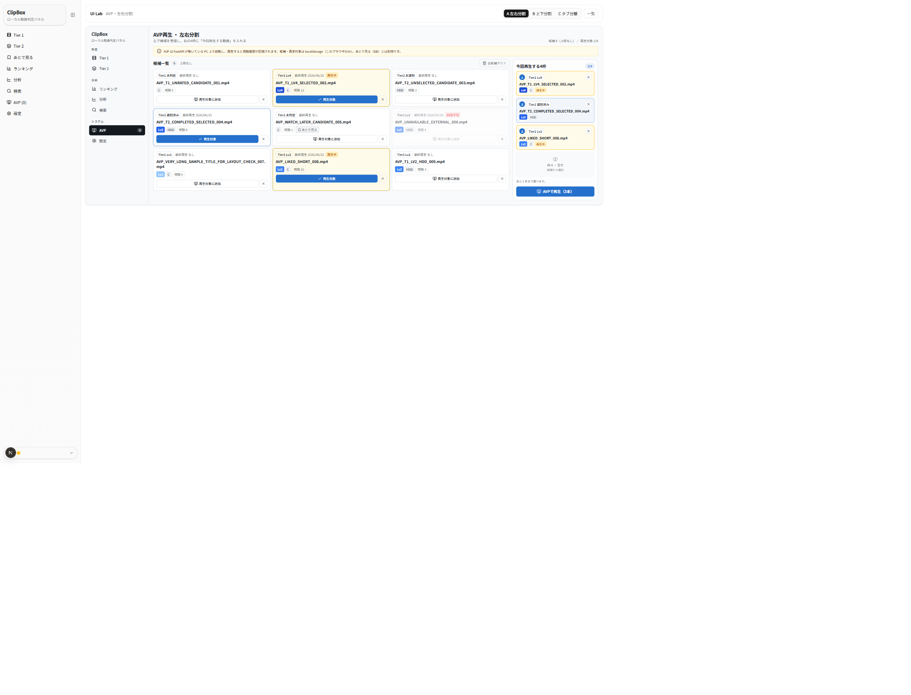
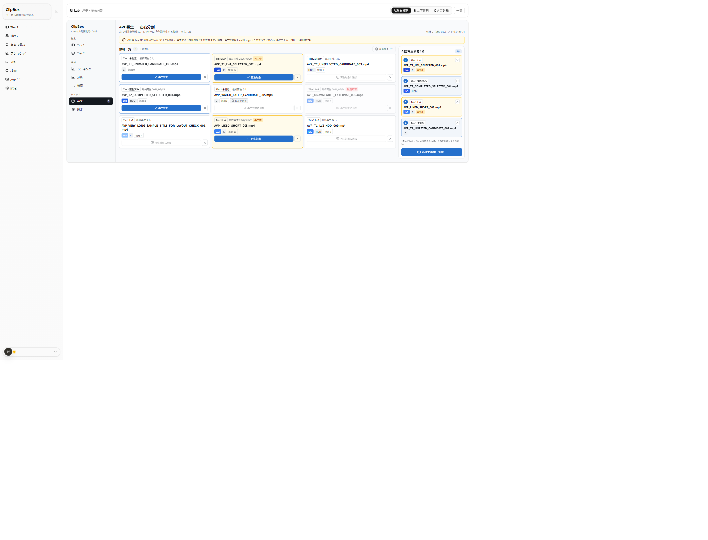
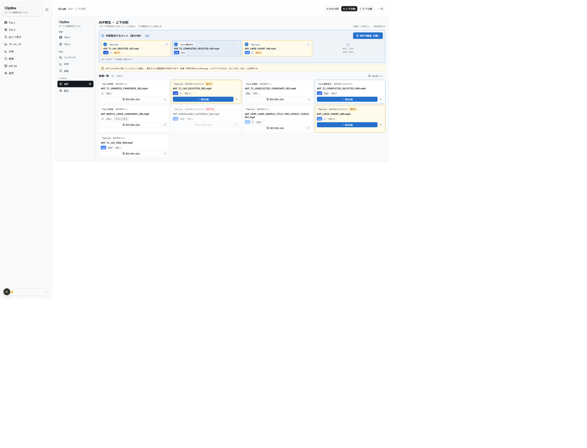
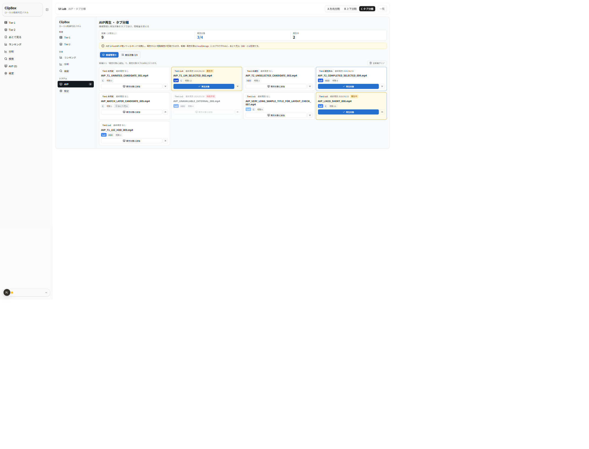
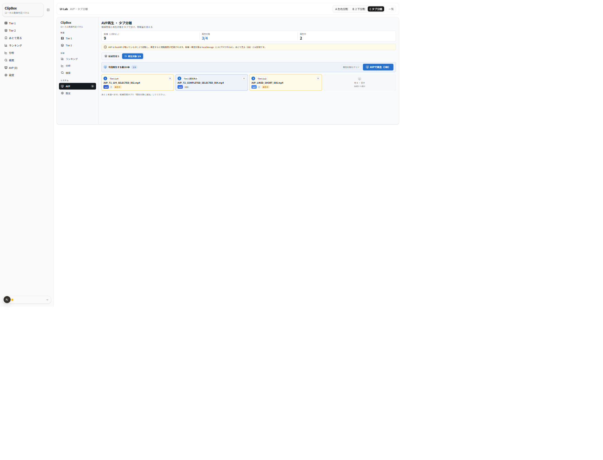
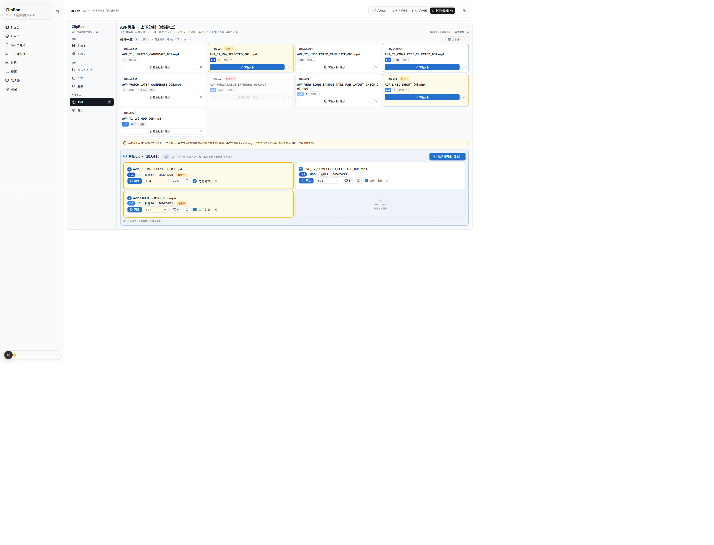
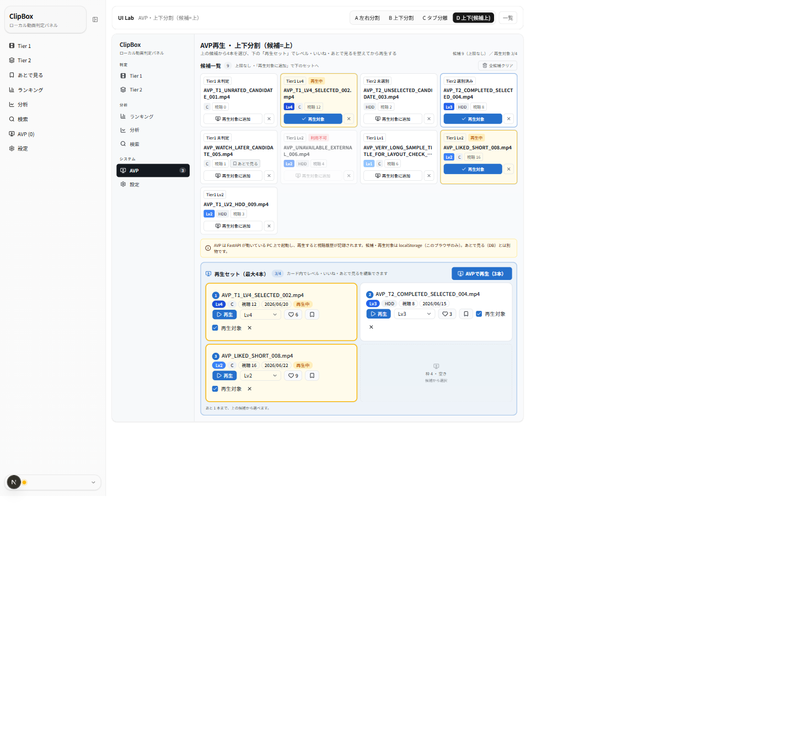

# UIラボ AVP画面 — 4案 比較レビュー（2026-06-24 / 案D 追記 2026-06-25）

ClipBox Next.js 版「AVP（並列再生）」画面の UI 改修にあたり、本体実装の前段として**比較候補**をモック専用で作成しました。
現行本体は「候補一覧」だけの単一面で、再生対象（最大4本）を候補カードのチェックで管理しており、**候補プールと「今回再生する4枠」の区別が視覚的に弱い**のが課題です。本案は master-memo が挙げる4レイアウトのうち、現行（候補一覧中心）を除く **左右分割(A) / 上下分割(B) / タブ分離(C)** を比較し、ユーザー要望により **上下分割の派生＝案D（候補=上 / 再生セット=下・リッチカード）** を追加しました。
本レビューは、ユーザーが各案を見比べ、今後本体へ反映する方向性（**候補管理と再生対象選択を同一面に置くか分けるか**）を選ぶための資料です。

> 追記（2026-06-25）: ユーザーが「上下分割を採るが**候補一覧を上**にしたい。**下の再生セットは他画面と同じ動画カード**でレベル判定・いいね・あとで見るができるようにしたい」と要望。これを**案D**として追加しました（案A/B/C は変更していません）。下部カードは本体 `VideoCard` を**そのまま import すると実 DB/API・本体 AVP localStorage を書き換える**ため、ラボのモック専用原則に従い「**見た目・操作が同一のモック複製カード `AvpRichCard`**（操作はページ内 useState のみ・保存しない）」で実現しています。

- URL: `/lab/avp`（索引）／ `/lab/avp/variant-a` ・ `/variant-b` ・ `/variant-c` ・ `/variant-d`
- 対象タスク: AVP（候補プール管理＋今回再生する最大4本の選択＋AVP起動）。サムネなしの情報カード前提。
- 制約: 実 DB/API/localStorage 非接続・本体無変更・本体 `/avp`・`VideoCard`・`store.ts` 無変更（モック専用・合成データ）。寒色（Variant J の THEME 流用）。

## 参照した正本・方針メモ

- `docs/context/SPEC_NEXTJS.md` §0（永続境界）・§6（AVP候補/再生対象/再生中の3状態・最大4本・候補上限なし）・§14（不変ルール） — **挙動仕様の正本**
- `docs/context/ACCEPTANCE_CRITERIA.md`「AVP 再生（並列再生）」（候補上限なし／再生対象最大4本／5本目制限／全候補クリア／再生後クリア）
- `docs/context/GLOSSARY.md`（AVP / AVP候補 / AVP再生対象 / 再生中ハイライト / Tier1·Tier2 / 未判定·判定済み / 未選別·選別済み / いいね / あとで見る / ライブラリ）
- `docs/nextjs-ui-renovation-master-memo.md` L119/L149（AVP は候補一覧中心/左右分割/上下分割/候補管理・再生対象タブの比較。候補上限なし・再生対象最大4本・localStorage 永続は不変）
- 既存ラボ規約: `frontend/src/app/lab/watch-later/_review/COMPARISON.md` 等

> 注: スクショ左端の細いナビは**本体 `SidebarNav`**（ルートレイアウト由来）。各案の本体は中央の枠内（`ModernSidebar`＋main）です。サイドバーの「AVP」項目が点灯します。
> モック専用のため、再生対象の追加/解除・全候補クリア・再生対象クリア・AVP起動はすべて画面内ローカル状態のみで、保存されません。

---

## 4案の概要

| 案 | 名称 | 狙い | 一言 |
|---|---|---|---|
| **A** | 左右分割型 | 左＝候補一覧、右＝今回再生する4枠。候補管理と再生対象管理を空間で分ける | 分離が最も明快 |
| **B** | 上下分割型 | 上＝再生対象4枠コックピット、下＝候補一覧。「再生するセット」を主役に | 縦フローで横幅非依存 |
| **C** | タブ分離型 | タブで候補管理／再生対象を切替＋上部 KPI。情報密度を抑える | 候補多数でも破綻しにくい |
| **D** | 上下分割型（候補=上 / 再生セット=下・リッチカード） | 上＝候補一覧（再生対象にするか選ぶボタン操作）、下＝今回再生する最大4本を**他画面と同じ動画カード**で表示。下のカード内でレベル判定・いいね・あとで見る・再生ができる | 候補は選ぶだけ、再生する4本は仕上げてから |

共通: 寒色モダンテーマ、`ModernSidebar active="AVP"`、サムネなし情報カード、`AVPで再生` 主導線。
カードのバッジは **レベル（青スケール）／ストレージ（C・HDD）／視聴数／あとで見る／利用不可（赤）／再生中（amber）**。
候補と再生対象を**別概念**として見せ、`全候補クリア`は候補側、`AVPで再生`は再生対象側に置きます。再生対象は **最大4本** で、満杯時は非選択カードの「再生対象に追加」を無効化、利用不可は常に追加不可。状態キャプションは本体 `statusLabel` と同じ文言（`Tier1 未判定` / `Tier1 Lv4` / `Tier2 未選別` / `Tier2 選別済み`）。

---

## 案A: 左右分割型

左に AVP候補一覧（グリッド・上限なし・各カードに「再生対象に追加」と「候補から外す(×)」）、右に**今回再生する4枠**を縦に並べます。埋まった枠は要約＋枠番号＋外すボタン、空き枠は点線プレースホルダ「枠 N ・ 空き」で **0〜4 の状態が一目**で分かります。右下に `AVPで再生（N本）`。

4枠が埋まると、非選択カードの「再生対象に追加」が**無効化**され、「4本に達しました」と表示されます（5本目を選べないことが自然に分かる）。

**良い点**
- 候補管理（左）と再生対象管理（右）が空間で分かれ、混同しない。
- 4枠の埋まり/空き/満杯が右パネルで常に見え、最大4本制限が直感的。
- 右パネルが sticky なので、左をスクロールしても再生対象と `AVPで再生` を見失わない。

**懸念点**
- 横幅が狭いと右パネルが圧迫される（PC幅前提。タブレット幅では下に回り込む設計）。
- 候補が多いと左グリッドが縦に伸び、右の4枠との視線移動がやや増える。

---

## 案B: 上下分割型

上部に「**今回再生するセット（最大4本）**」をコックピット風に横並びで大きく見せ（空き枠も並ぶ）、右に `AVPで再生`。下部に候補一覧。候補カードは再生対象済みなら「再生対象」（塗り）で示し、上下で同じ動画の状態がリンクして見えます。

**良い点**
- 「いま再生するセット」が最上部で主役になり、何を再生するかが明快。
- 横並び4枠は順序・空きが分かりやすく、`AVPで再生` が常に上部で目立つ。
- 上→下の縦フローで、横幅に依存しにくい。

**懸念点**
- 候補一覧を見るには下スクロールが必要で、候補から選ぶ往復がやや増える。
- 上部コックピットが常に高さを取るため、候補の一覧性は案A/Cより低い。

---

## 案C: タブ分離型

上部に状態サマリー（**候補 / 再生対象 N/4 / 再生中**）と方針バナー。タブで「**候補管理**」と「**再生対象**」を切替えます。候補管理タブは候補一覧＋`全候補クリア`、再生対象タブは4枠＋`再生対象をクリア`＋`AVPで再生` を強調。

**良い点**
- 1画面の情報量が最も少なく、候補が多くても破綻しにくい。
- 上部 KPI で候補数・再生対象 N/4・再生中が一目。`全候補クリア`（候補）と`再生対象をクリア`（再生対象）がタブで分かれ、意味を取り違えにくい。
- 「候補を貯める」と「今回の4本を選ぶ」の作業モードが明確に分かれる。

**懸念点**
- 候補と再生対象を**同時に**見られない（タブ切替が要る）。4枠の空きを見ながら候補から足す操作はタブ往復になる。
- タブという階層が1つ増える（初見での発見性は案A/Bより一段落ちる）。

---

## 案D: 上下分割型（候補=上 / 再生セット=下・リッチカード）

案Bの上下を**入れ替えた**派生案です。**上＝候補一覧**は「この動画を AVP再生対象にするか」を選ぶ**ボタン操作がメイン**（コンパクトな候補カード：`再生対象に追加` ／ `候補から外す(×)`）。**下＝再生セット（最大4本）**は、**他画面と同じ動画カード**（の見た目を再現したリッチカード）で、**カード内でレベル判定・いいね・あとで見る・再生**ができます。空き枠は点線プレースホルダで 0〜4 を表現。

下部リッチカードは、本体 `VideoCard`（`displayContext="avp"`）と**同じ shadcn プリミティブ・同じ操作配置**（`再生`・レベル `Select`・`いいね`(♡＋件数)・`あとで見る`トグル・`再生対象`チェック＋外す`×`）を持ちます。ここで変えたレベル/いいね/あとで見るは**上の候補カードのバッジにも反映**（ページ内の単一ソース）。`再生対象から外す`で下のセットから外れ、上の候補に戻ります（候補プールには残る）。

**良い点**
- 「候補は選ぶだけ（上・軽い操作）／再生する4本は仕上げる（下・リッチ操作）」と**作業の段階が縦に分かれて自然**。下に降りるほど操作が濃くなる導線。
- 再生する4本だけを**他画面と同じカードで判定・いいね・あとで見る**まで完結でき、「再生前にレベルを付ける」運用に強い。`VideoCard` 流用前提なので**本体反映時のUIの一貫性が最も高い**。
- 上下で同一動画の状態がリンク（上で追加→下に出現、下で編集→上のバッジ更新）。

**懸念点**
- 下部リッチカードは情報・操作が多く**1枚の高さが大きい**。4本入ると下セクションが縦に伸びる（候補一覧との往復スクロールが案Bより増えやすい）。
- 候補（コンパクト）と再生セット（リッチ）で**カードの見た目が2種類**になり、情報密度の差が大きい。
- 「候補一覧が上」のため、最重要の `AVPで再生` は下までスクロールしないと見えない（案B/Cは上部で常時可視）。

> 実装メモ: 下部カードは本体 `VideoCard` を import せず、見た目を複製した `AvpRichCard`（`@/lib/api`・`@tanstack/react-query`・`useAvpStore` 非 import）で実現。**本体反映時は逆に本体 `VideoCard` をそのまま使えばよい**（ラボがモック専用のため複製しているだけで、レイアウトとしては `VideoCard` の avp コンテキストを下段に並べる構成）。

---

## 評価観点まとめ

| 観点 | 案A 左右分割 | 案B 上下分割 | 案C タブ分離 | 案D 上下(候補上) |
|---|---|---|---|---|
| 現行機能の維持 | ◎ 候補/対象/起動を網羅 | ◎ 同左 | ◎ 同左 | ◎ ＋カード内で判定/いいね/あとで見る |
| 候補と再生対象の非混同 | ◎ 空間で分離 | ○ 上下で分離 | ◎ タブで分離 | ◎ 上下＋カードの種類で分離 |
| 最大4本制限の分かりやすさ | ◎ 4枠＋満杯無効化 | ◎ 横4枠＋無効化 | ○ 4枠（タブ内） | ◎ 4枠＋満杯無効化 |
| 候補上限なしの自然さ | ◎「上限なし」明示＋一覧 | ◎ 同左 | ○ KPI に件数 | ◎ 同左（上に一覧） |
| 追加・解除の分かりやすさ | ◎ 同一面で往復が短い | ○ 上下の往復 | △ タブ往復 | ○ 上下の往復 |
| 全候補クリア / 再生対象クリアの非混同 | ○ 候補側に集約 | ○ 同左 | ◎ タブで明確に分離 | ○ 候補側に集約（全候補クリアのみ） |
| AVP起動ボタン（危険すぎず・見つけやすい） | ○ 右下に主導線 | ◎ 上部で常時可視 | ◎ 再生対象タブで強調 | △ 下部のため要スクロール |
| Tier1 / Tier2 の区別 | ○ 状態キャプション | ○ 同左 | ○ 同左 | ○ 上=キャプション / 下=本体カード準拠 |
| 未判定/判定済み・未選別/選別済みの非混同 | ○ | ○ | ○ | ○ |
| あとで見る（DB）との非混同 | ◎ バナー＋別バッジ | ◎ 同左 | ◎ バナー＋KPI | ◎ バナー＋別バッジ（下でトグル操作可） |
| サムネなしでも寂しくないか | ○ | ◎ コックピットで主役感 | ◎ KPI＋タブで賑やか | ◎ 下のリッチカードで密度感 |
| 情報密度（多すぎないか） | ○ 中 | △ やや高い | ◎ 低め | △ 下が高い（リッチカード） |
| モダンさ | ○ | ◎ | ◎ | ○ |
| 操作の分かりやすさ | ◎ | ○ | ○ | ◎ 段階が縦に分かれて自然 |
| 実装難易度 | ○ 中（2カラム/sticky） | ○ 中（レスポンシブ） | △ 中〜高（タブ状態） | ○ 中（本体 VideoCard を下段に流用） |
| `VideoCard` との共通化余地 | ◎ 大（avp context 流用） | ◎ 大 | ○ カード共通＋外側構成 | ◎ 最大（下段は VideoCard をそのまま流用できる） |

凡例: ◎ 強い / ○ 良い / △ 注意。

---

## ClipBox 現行仕様との整合性

- **候補上限なし / 再生対象最大4本**: モックでも候補一覧に「上限なし」を明示し、再生対象は `MAX_AVP_PLAY_TARGET=4`。満杯時は非選択の追加を無効化（`usePlayTargets` で本体 `store.ts` の no-op を再現）。
- **候補 ⊃ 再生対象**: 再生対象は候補の部分集合。「候補から外す(×)」で再生対象からも外れる（本体 `removeAvpCandidateId` 相当）。`全候補クリア`は候補と再生対象を両方リセット、`再生対象をクリア`は対象のみ（本体 `clearAvp*` の区別を踏襲）。
- **永続境界（§0）**: あとで見る=DB、AVP候補/再生対象=localStorage `clipbox-avp`、再生中=localStorage `clipbox-playback`。バナーとバッジで「あとで見る（DB）とは別物」を明示し、境界を越えない。
- **再生中ハイライト**: 直近再生（`avp_playing`）の動画を amber で強調（§7）。「視聴済み」ではなく「最後に再生した」の意味。
- サムネイル不使用（情報カード方針）。「ライブラリ」語は Tier タブ名予約のため別概念に流用していない。

## localStorage 永続との相性

- 3案とも候補・再生対象は localStorage 前提の見せ方（端末ローカル・件数表示）。DB 由来の状態（レベル/いいね/あとで見る）はカード内バッジに留め、AVP操作（候補/対象）と視覚的に分離。どの案も DB へ状態を移す導線は作っていない。

## 本体反映時の注意点

- 反映は**見た目（レイアウト）**を対象にし、本体 `store.ts` の候補/対象ロジック（4本上限・no-op・cascade・`pruneIds`・再生後クリア）は**変えない**。`displayContext` は tier1/tier2/avp の3値固定（第4値追加は停止案件）。
- カードは本体 `VideoCard`（`displayContext="avp"`）を共通利用。本ラボの `AvpCard` は見た目検証用で、本体反映時は `VideoCard` 側の AVP 操作（再生対象チェック＋候補削除）を流用する。
- `全候補クリア`・AVP起動は本体では確認/エラー導線あり（ファイル不在時は日本語エラーで起動中止＝ACCEPTANCE L233）。モックでは省略しているため、本体では現行どおり確認・エラーを出す。
- 4枠スロット表現を採る場合、本体の `avpPlayTargetIds` の順序をスロット順に対応させる（現状の本体はインラインチェックで順序を持たないため、スロットUIにするなら順序保持の方針確認が要る）。

---

## 推奨案

**案A（左右分割型）をベース**に、画面が狭い場合や候補が多い運用に備えて**案Cのタブ／上部KPIを将来の補助**として残す、を推奨します。

- 理由: AVP の本質的な課題は「候補プールと“今回の4本”の混同」。案Aは両者を**同一画面で空間分離**し、4枠の空き/満杯と `AVPで再生` を常に可視化できるため、最大4本制限と候補上限なしの両方が最も自然に伝わります。追加/解除の往復も最短。
- 段階案: まず**案A相当のレイアウト刷新**を本体反映（リスク中）。候補が増えて一覧が重くなったら、**案Cのタブ＋KPI**を上位に被せて情報密度を制御する、の2段が無理がありません。
- 案Bは「再生セットを主役にしたい」場合の有力候補。上部コックピットは魅力的だが、候補一覧の往復スクロールが増える点が運用次第。

**案D について（ユーザー要望の上下分割・候補=上）**: 「再生する4本だけ、再生前にレベル/いいね/あとで見るまで仕上げたい」運用なら**案D が最有力**です。下段に本体 `VideoCard`（avp コンテキスト）をそのまま並べられるため**本体実装との一貫性が最も高く**、追加コストも小さい。トレードオフは ①下段リッチカードが縦に大きく候補との往復スクロールが増える、②最重要の `AVPで再生` が下部で要スクロール、の2点。①②が気になるなら、**案D の「下=リッチカード」を案A（左右分割）の右パネルに移植**（左=候補の軽い選択 / 右=再生セットを `VideoCard` で縦積み＋上に `AVPで再生`）すると、案D の長所（再生する4本を仕上げられる）を保ちつつ起動ボタンの可視性と往復の短さを得られます。本体反映時の有力な折衷案として推します。

---

## ユーザーに確認したい未決事項

1. **方向性**: 「案A ベース（＋将来 案C 補助）」／「案B（再生セット主役）」／**「案D（候補=上・再生セットを下でリッチに仕上げる）」**／**「案D の折衷＝左右分割の右に再生セットをリッチカードで」**のどれを本体反映の基線にするか。
2. **4枠スロットUIの採否**: 再生対象を「番号付き4スロット」で見せるか、現行どおりカードのチェックのみにするか（スロット採用なら `avpPlayTargetIds` の順序保持を本体に持たせるか）。
3. **再生中ハイライト**: AVP画面でも amber の「再生中」を出すか（一覧の賑やかさ vs ノイズ）。
4. **あとで見る併存の見せ方**: AVP候補カードに「あとで見る」バッジを出すか（別概念の明示 vs 情報量）。
5. **クリア操作**: `全候補クリア` と `再生対象をクリア` を両方出すか（案C）、`全候補クリア`のみにするか（案A/B）。
6. **テーマ**: 寒色モダン（Variant J 系）を本採用とするか（master-memo では確定度「要再確認」）。
7. **下部リッチカード（案D）**: 再生対象だけを `VideoCard`（レベル/いいね/あとで見る/再生つき）で見せる方針を採るか。採る場合、候補側（上）は軽い選択用カードのままにするか、上も同じ `VideoCard` に揃えるか（情報密度との兼ね合い）。

---

_本ドキュメントは確認・レビュー用です。スクリーンショットは本ラボ（モック専用・合成データ）のもので、個人情報・実動画名・実パスは含みません。
`avp-a-full-4` は「再生対象に追加」を1回押して4本満杯（5本目＝追加無効）にした状態、`avp-c-targets-tab` は再生対象タブに切り替えた状態を撮影したものです。
`avp-d-candidates-top-set-bottom` は案D 全体（A/B/C と同じ撮影幅）、`avp-d-rich-card` は下部リッチカードの操作（レベルSelect/いいね/あとで見る/再生対象）が読めるよう、この端末の表示倍率（devicePixelRatio≈0.667）を考慮して実 CSS 幅 1440px 相当で再描画したビューです。案D の下部カードはラボのモック複製（`AvpRichCard`）で、実 DB/API/localStorage には接続していません（操作は画面内ローカルのみ・保存されません）。_
