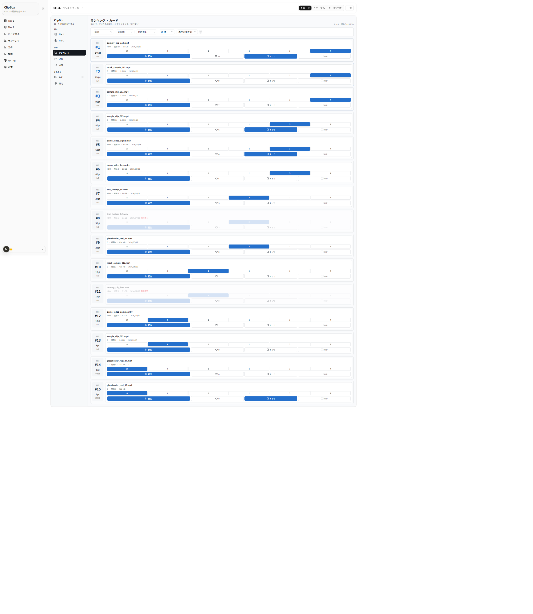
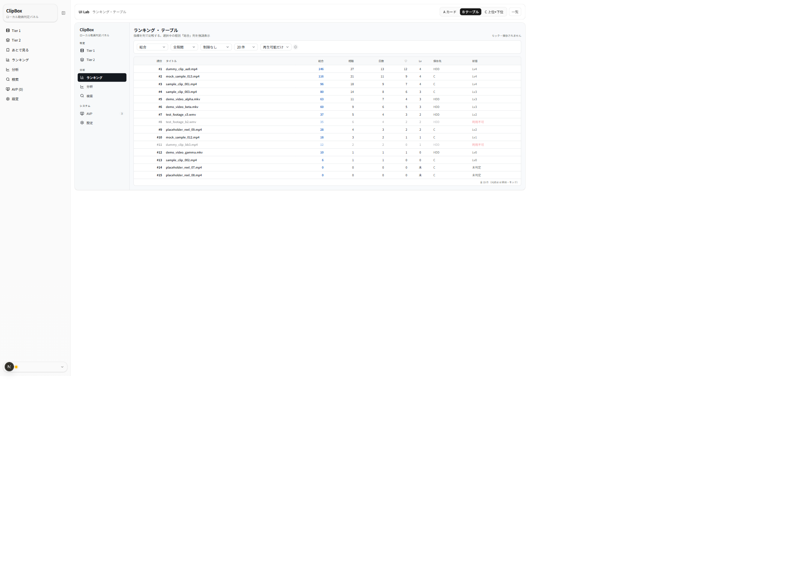
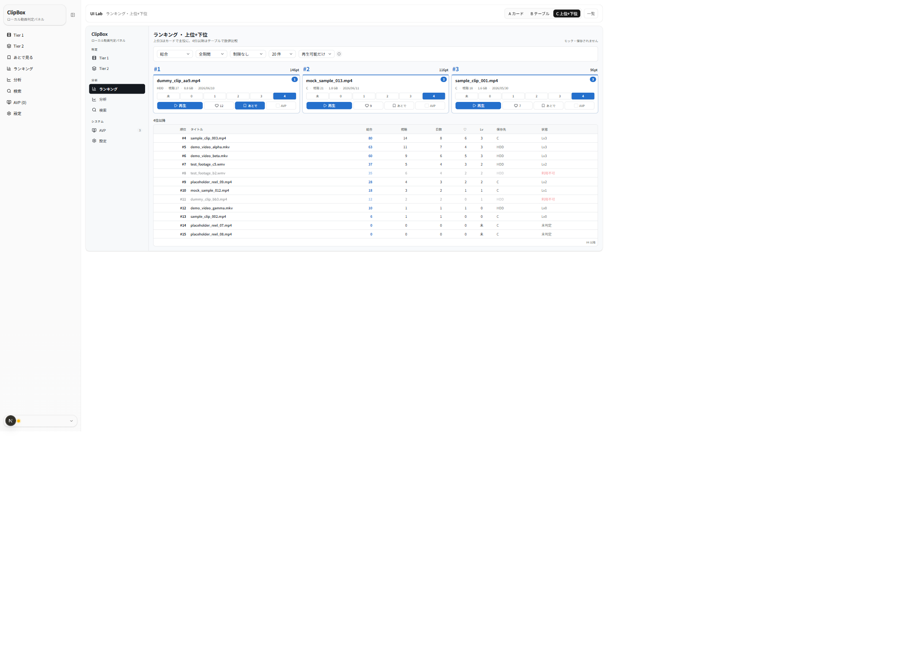

# UIラボ ランキング画面 — 3案 比較レビュー（2026-06-25）

ClipBox Next.js 版「ランキング」画面の UI 改修にあたり、本体実装の前段として**比較候補**をモック専用で作成しました。
現行本体は「順位セル（#順位・スコア・レベル）＋ `VideoCard`」を縦に並べる1形式のみです。本レビューは master-memo §3-B が挙げる
4レイアウト（カードランキング / テーブル / カード＋数値順位 / 上位カード＋下位テーブル）のうち、ユーザー選定の
**カードランキング(A) / テーブル(B) / 上位カード＋下位テーブル(C)** の3案を比較し、順位と指標の見せ方の方向性を選ぶための資料です。

> ★重要（モック前提）: 表示している順位・スコアは **UI 表示確認用のダミー**です。本体の **APP_PLAYBACK ベース総合ランキング計算式ではありません**。
> 本レビューで本体の**ランキング仕様・スコア式・タイブレークは一切変更しません**（見た目の比較のみ）。同点を `id 昇順`で並べるのも、本体ロジックの再実装ではなく「本体と同じ見え方」を再現したモックです。

- URL: `/lab/ranking`（索引）／ `/lab/ranking/variant-a` ・ `/variant-b` ・ `/variant-c`
- 対象タスク: ランキングの一覧表示（種別 / 期間 / 最小レベル / 上位N / 利用可否の絞り込み＋順位・スコア表示）。サムネなしの情報カード前提。
- 制約: 実 DB/API/localStorage 非接続・本体無変更（本体 `/ranking`・`VideoCard`・ランキング計算は変更なし）。寒色（Variant J の THEME 流用）。合成データ・合成ファイル名のみ。

## 参照した正本・方針メモ

- `docs/context/SPEC_NEXTJS.md`（画面・状態の挙動の正本）
- `docs/context/GLOSSARY.md`（ランキング / Tier1·Tier2 / 未判定·判定済み / いいね / APP_PLAYBACK）
- `docs/nextjs-ui-renovation-master-memo.md` §3-B（ランキングはカードランキング / テーブル / カード＋数値順位 / 上位カード＋下位テーブルの比較。スコア式・APP_PLAYBACK 基準・タイブレークは不変）
- 既存ラボ規約: `frontend/src/app/lab/avp/_review/COMPARISON.md` ほか

> 注: スクショ左端の細いナビは**本体 `SidebarNav`**（ルートレイアウト由来）。各案の本体は中央の枠内（`ModernSidebar`＋main）で、サイドバーの「ランキング」項目が点灯します。
> モック専用のため、種別の並べ替え以外の絞り込み（期間/最小レベル/上位N/利用可否）は**見た目だけ**で、計算しません。カードの操作（再生/レベル/いいね/あとで/AVP）も保存されません。

---

## 3案の概要

| 案 | 名称 | 狙い | 一言 |
|---|---|---|---|
| **A** | カードランキング | 順位セル＋情報カードを縦に並べる現行寄せ。各行で判定/いいね/あとで/AVP も可能 | 現行に最も近く操作も可能 |
| **B** | テーブル | 指標を列で並べ、総合/視聴/視聴日数/いいねを数値で直接比較 | 一望性・数値比較が最強 |
| **C** | 上位カード＋下位テーブル | 上位3をカードで主役化、4位以降をテーブルで一覧 | 目立たせと比較の折衷 |

共通: 寒色モダンテーマ、`ModernSidebar active="ランキング"`、サムネなし。ランキングは**順序が情報そのもの**なので `#番号`を構造装置として明示。
種別セレクトを変えると並べ替えが切り替わり（モック）、選択中の種別を強調表示します。利用不可は淡色＋「利用不可」表示。

---

## 案A: カードランキング

左に「#順位・スコア・レベル名」の順位セル、右に共通 `ConsoleCard`。上位3は順位番号を寒色アクセントで強調し、カードに薄い ring を付けます。
各行で**再生・レベル判定・いいね・あとで見る・AVP候補**まで操作できます（現行 `VideoCard` 流用前提）。

**良い点**
- 現行レイアウトに最も近く、学習コストが小さい。順位と動画情報が1行で完結。
- 一覧しながら**その場で判定・いいね・あとで見る**ができる（ランキングを見て手当てする運用に強い）。
- 上位3の順位強調で「トップが誰か」が即わかる。

**懸念点**
- 1行=1カードで**縦に長い**（上位N=20 だと縦スクロールが大きい）。一望性は3案で最も低い。
- PC 幅では各行右側に**余白**が出やすい（情報カードが横幅を使い切らない）。
- 指標は順位セルの1値のみで、**複数指標の横比較には向かない**（総合と視聴回数を同時に見られない）。

---

## 案B: テーブル

順位 / タイトル / 総合 / 視聴 / 視聴日数 / ♡ / Lv / 保存先 / 状態 を列で並べます。選択中の種別（既定=総合）の列を寒色で強調し、利用不可行は淡色＋「利用不可」。

**良い点**
- **一望性が最強**。多数の指標を横並びで**数値比較**でき、「総合は高いが視聴日数は少ない」等の傾向が読める。
- 情報密度が高く、上位N=20〜50 でも縦が短い。順位の連続性も追いやすい。
- 列ソートの将来拡張と相性が良い。

**懸念点**
- カードの**操作（再生/レベル/いいね/あとで/AVP）が無く閲覧専用**。判定の手当ては別画面に移る必要がある。
- サムネなし＋数値主体で**硬い印象**（一覧性と引き換えに賑やかさは下がる）。
- 列が多く、狭い幅では横詰まりしやすい（モバイルは要別レイアウト）。

---

## 案C: 上位カード＋下位テーブル

上位3本を順位番号＋スコア付きの**カード**（`featured`・順位バッジ）で主役化し、4位以降を案Bと同じ**テーブル**で一覧します。

**良い点**
- 「目立たせたい上位」と「数値で追いたい下位」を**1画面で両立**。トップの視認性が高い。
- 上位はカードで操作可能、下位はテーブルで比較。役割分担が明快。
- ランキングの“表彰台”感が出て、サムネなしでも寂しくない。

**懸念点**
- 上位（カード=操作可）と下位（テーブル=閲覧専用）で**操作が非対称**。4位以降を手当てしたい時に一手増える。
- 「上位3固定」の根拠が要検討（5件にするか、種別で変えるか）。
- 上位カード＋下位テーブルで**2つの見た目**が同居し、情報密度差が大きい。

---

## 評価観点まとめ

| 観点 | 案A カード | 案B テーブル | 案C 上位+下位 |
|---|---|---|---|
| 現行機能の維持（順位/スコア/絞り込み） | ◎ | ◎ | ◎ |
| 一覧性（多件の一望） | △ 縦に長い | ◎ | ○ |
| 複数指標の数値比較 | △ 1値のみ | ◎ | ◎（下位） |
| 順位の分かりやすさ | ◎ #番号強調 | ○ 数値のみ | ◎ 表彰台＋番号 |
| その場で判定/いいね/あとで | ◎ 全行 | ✕ 閲覧専用 | △ 上位のみ |
| 情報密度（多すぎないか） | ○ 中 | △ 高め | △ 上カード/下高め |
| サムネなしでも寂しくないか | ○ | △ 硬い | ◎ 上位カード |
| モダンさ | ○ | ○ | ◎ |
| 実装難易度 | ○ 低（現行寄せ） | ○ 中（テーブル） | △ 中（2形式同居） |
| `VideoCard` 共通化余地 | ◎ そのまま流用 | △ 別レンダリング | ○ 上位のみ流用 |

凡例: ◎ 強い / ○ 良い / △ 注意 / ✕ 非対応。

---

## ClipBox 現行仕様との整合性

- **スコア式・指標源は不変**: 表示スコアはモックのダミー。本体反映時も **APP_PLAYBACK 基準の総合スコア式・タイブレーク（`id ASC`）は変更しない**（見た目のみ反映）。
- **利用可否**: 既定「再生可能だけ」を踏襲（モックは表示のみ）。「全動画」でも論理削除は除外、の本体仕様は不変。
- **状態語**: 「未判定 / Lv0–4」に統一（`GLOSSARY.md`）。「ライブラリ」語はタブ名予約のため流用していない。
- サムネイル不使用（情報カード方針）。

---

## 推奨案（ユーザー確認待ち・採用判断は未確定）

- **有力候補は案C（上位カード＋下位テーブル）**。ランキングの本質「上位を目立たせる」と「下位まで数値で追う」を1画面で両立でき、サムネなしでも見栄えがします。
- 「一覧でその場で判定まで完結したい」運用重視なら**案A**、「とにかく数値比較・一望性」重視なら**案B**が有力。
- 折衷の実装順としては、まず**案B のテーブルを共通部品化** → 上位だけ `VideoCard` をカードで載せると**案C** に発展できます（段階実装しやすい）。
- いずれも**見た目のみ**の反映を想定し、ランキング計算には触れません。**最終採用はユーザーレビュー後に決定**します。

## ユーザーに確認したい未決事項

1. **基線**: 案A / 案B / 案C のどれを本体反映の基線にするか。
2. **テーブルの操作**: テーブル行から再生/判定/いいね/あとで/AVP を**できるようにするか**（閲覧専用のままか）。
3. **上位カードの本数**: 案C の上位を3本固定にするか（5本・種別で可変も検討）。
4. **モバイル時のテーブル**: 列が多いテーブルを狭幅でどう畳むか（カードへフォールバックするか）。
5. **テーマ**: 寒色モダン（Variant J 系）を本採用とするか（master-memo では確定度「要再確認」）。

---

_本ドキュメントは確認・レビュー用です。スクリーンショットは本ラボ（モック専用・合成データ）のもので、個人情報・実動画名・実パスは含みません。
順位・スコアは UI 確認用のダミーで、本体のランキング計算結果ではありません。_
