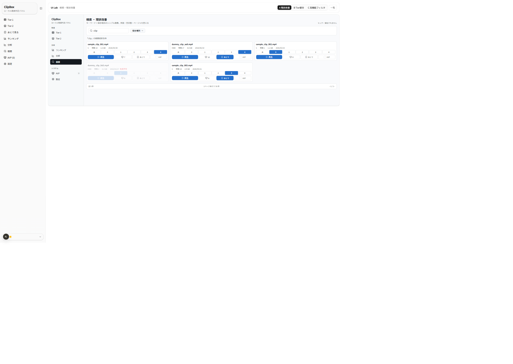
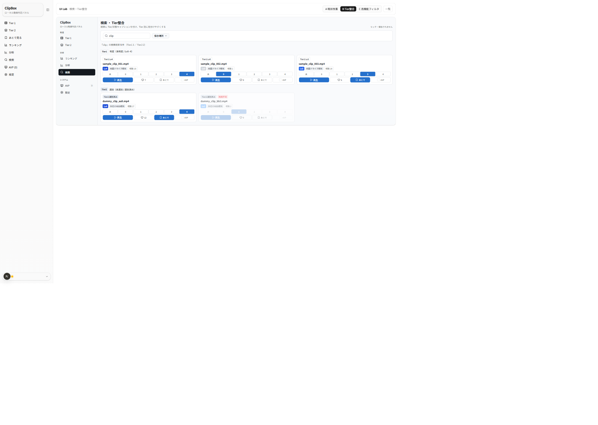
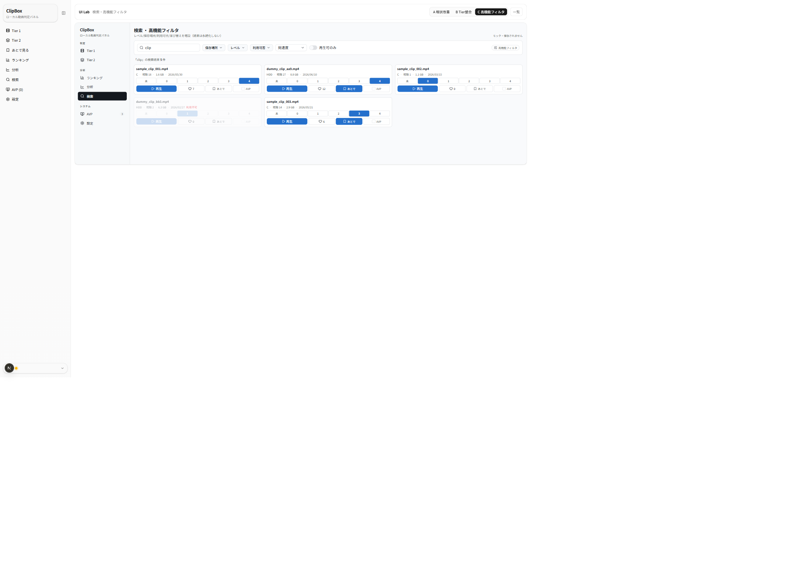

# UIラボ 検索画面 — 3案 比較レビュー（2026-06-25）

ClipBox Next.js 版「検索」画面の UI 改修にあたり、本体実装の前段として**比較候補**をモック専用で作成しました。
現行本体は「キーワード＋保存場所マルチセレクト → カードグリッド（クライアントページング）」の1形式です。本レビューは master-memo §3-B が挙げる
4案（現状改善 / Tier1・Tier2カード整合 / 高機能フィルタ / 検索結果作業台）のうち、ユーザー選定の
**現状改善(A) / Tier1・Tier2カード整合(B) / 高機能フィルタ(C)** の3案を比較し、結果の見せ方と絞り込みの幅の方向性を選ぶための資料です。

> ★重要（モック前提）: 検索は**キーワードの簡易部分一致（ファイル名のみ）**で動かしており、保存場所/レベル/利用可否/並び替えは**見た目だけ**です（計算しません）。
> また **検索結果を別状態として永続化しません**（本体の検索仕様＝unpaged 取得→クライアントページング・結果は保存しない、を踏襲）。高機能フィルタ・作業台化は**見た目提案**であり、採用時は仕様変更可能性（中）として再合意が要ります。

- URL: `/lab/search`（索引）／ `/lab/search/variant-a` ・ `/variant-b` ・ `/variant-c`
- 対象タスク: キーワード検索の結果表示（カード）と絞り込み。サムネなしの情報カード前提。既定クエリ「clip」で Tier1/Tier2・利用不可が混在。
- 制約: 実 DB/API/localStorage 非接続・本体無変更（本体 `/search`・`VideoCard` は変更なし）。寒色（Variant J の THEME 流用）。
  **保存場所は匿名化分類のみ**（内蔵ドライブ相当 / 外付けHDD相当）で、実パス・実フォルダ名・実動画名は出しません。合成ファイル名のみ。

## 参照した正本・方針メモ

- `docs/context/SPEC_NEXTJS.md`（画面・状態の挙動の正本。検索結果は別状態として永続化しない）
- `docs/context/GLOSSARY.md`（検索 / Tier1·Tier2 / 未判定·判定済み / 未選別·選別済み / あとで見る / AVP / ライブラリ）
- `docs/nextjs-ui-renovation-master-memo.md` §3-B（検索は現状改善 / Tier1·Tier2カード整合 / 高機能フィルタ / 検索結果作業台の比較。結果状態の永続化は仕様変更になり得る）
- 既存ラボ規約: `frontend/src/app/lab/avp/_review/COMPARISON.md` ほか

> 注: スクショ左端の細いナビは**本体 `SidebarNav`**。各案の本体は中央の枠内（`ModernSidebar`＋main）で、サイドバーの「検索」項目が点灯します。
> 操作（再生/レベル/いいね/あとで/AVP）は画面内ローカル状態のみで保存されません。

---

## 3案の概要

| 案 | 名称 | 狙い | 一言 |
|---|---|---|---|
| **A** | 現状改善 | 現行のキーワード＋保存場所＋カードグリッドを踏襲し、件数・空状態・ページャを整える | 学習コスト最小・堅実 |
| **B** | Tier1・Tier2 カード整合 | 結果カードに Tier/状態キャプションを付け、Tier 別に区切って見分けやすく | Tier 横断で迷わない |
| **C** | 高機能フィルタ | キーワードにレベル/保存場所/利用可否/並び替えを増設 | 絞り込みの幅が広い |

共通: 寒色モダンテーマ、`ModernSidebar active="検索"`、サムネなし。件数表示（「{クエリ}」の検索結果 N 件）と空状態（キーワード未入力 / 一致なし）を整備。利用不可は淡色＋「利用不可」。

---

## 案A: 現状改善

現行に近い構成。キーワード入力（虫眼鏡アイコン付き）＋保存場所ドロップダウン、件数表示、`ConsoleCard` グリッド、下部にページャ footer（全N件 / 1ページあたり / ‹ 1/1 ›）。空状態は「キーワードを入力してください」「一致する動画がありません」を中央に明示。

**良い点**
- 現行とほぼ同じで**学習コストが最小**。実装も軽い（カードは現行流用）。
- **空状態・件数・ページャ**が明確になり、現行の素っ気なさを解消。
- カードからその場で再生/判定/いいね/あとで/AVP まで操作できる。

**懸念点**
- 絞り込みが**保存場所のみ**で弱い（レベルや利用可否で絞れない）。
- Tier1/Tier2 の**区別が出ない**（混在結果でどの Tier か分かりにくい）。
- 大量ヒット時の体験は現行同様（クライアントページング前提）。

---

## 案B: Tier1・Tier2 カード整合

結果を **Tier1（判定: 未判定/Lv0–4）/ Tier2（選別: 未選別/選別済み）** の区切り見出しでグルーピングし、各カードに状態キャプション（例: `Tier1 Lv4` / `Tier2 選別済み`）を付けます。保存場所は匿名化分類（内蔵ドライブ相当 / 外付けHDD相当）。利用不可カードは淡色＋「利用不可」。

**良い点**
- Tier 横断の検索でも「**どの Tier の何の状態か**」が一目でわかる（判定済み/未判定・選別済み/未選別を取り違えない）。
- 本体カードの見え方に整合し、検索→各 Tier 画面への往復で違和感が少ない。
- Tier 別件数（Tier1 N / Tier2 N）が把握できる。

**懸念点**
- 区切り見出しで**縦に伸びやすい**（両 Tier に結果があると2セクション分）。
- クエリ次第で片 Tier が0件だと**セクションが消える**（一貫した枠が見えない）。
- カードにキャプションが増え、1枚の情報量がやや多い。

---

## 案C: 高機能フィルタ

キーワードに加え、保存場所 / レベル / 利用可否 / 並び替え（関連度ほか）/「再生可のみ」トグルを増設。右肩に「高機能フィルタ」ピル。結果は `ConsoleCard` グリッド。

**良い点**
- **絞り込みの幅が広い**。レベルや利用可否で素早く目的の動画に到達できる。
- ツールバーに機能を集約し、検索を“探す作業台”に寄せられる。
- 並び替えで結果の見え方を調整できる（将来の実フィルタ化と相性良）。

**懸念点**
- 現状は**キーワード以外がモック（実際に絞り込まない）**。本体実装時に「どれを実フィルタにするか」「結果を永続化しない原則とどう両立するか」を要決定（**仕様変更可能性=中**）。
- ツールバーの情報量が増え、**現行よりとっつきにくい**（初見の発見性は案Aに劣る）。
- フィルタが多いと「検索」と「フィルタ一覧」の境界が曖昧になりやすい。

---

## 評価観点まとめ

| 観点 | 案A 現状改善 | 案B Tier整合 | 案C 高機能フィルタ |
|---|---|---|---|
| 現行機能の維持 | ◎ | ◎ | ◎ |
| 学習コスト（とっつきやすさ） | ◎ | ○ | △ |
| 結果のスキャン性 | ○ | ◎ Tier別 | ○ |
| Tier1/Tier2 の見分け | △ 出ない | ◎ | △ 出ない |
| 絞り込みの幅 | △ 保存場所のみ | △ 同左 | ◎ 多条件 |
| 空状態・件数の明確さ | ◎ | ◎ | ◎ |
| 情報密度（多すぎないか） | ◎ 低め | ○ 中 | △ ツールバー高め |
| カード操作（再生/判定/いいね/あとで/AVP） | ◎ | ◎ | ◎ |
| サムネなしでも寂しくないか | ○ | ◎ キャプション | ○ |
| 実装難易度 | ○ 低 | ○ 中 | △ 中（フィルタ設計） |
| 仕様変更リスク | 低 | 低 | 中（フィルタ/永続化） |

凡例: ◎ 強い / ○ 良い / △ 注意。

---

## ClipBox 現行仕様との整合性

- **検索結果を別状態として永続化しない**（本体: unpaged 取得→クライアントページング）。3案とも結果を保存する導線は作っていません。
- **Tier/状態語**: 「未判定 / Lv0–4」「未選別 / 選別済み」を踏襲（`GLOSSARY.md`）。判定済み/未判定・選別済み/未選別を混同しません。
- **保存場所**: 匿名化分類のみ（実パス・実フォルダ名・実動画名を出さない）。
- **あとで見る=DB / AVP候補=localStorage** の境界はカードの操作内に留め、検索結果側へ状態を移しません。
- サムネイル不使用（情報カード方針）。「ライブラリ」語はタブ名予約のため流用していません。

---

## 推奨案（ユーザー確認待ち・採用判断は未確定）

- **基線は案A（現状改善）を推奨**。現行を壊さず空状態・件数・ページャを整える低リスクな一歩で、まず本体に入れやすい。
- そこに**案B の Tier/状態キャプション**を重ねると、検索の弱点（Tier が分からない）を低コストで解消できます（**案A＋案B の合流**が有力候補）。
- **案C（高機能フィルタ）**は「検索を作業台化したい」場合の発展案。ただしフィルタの実装範囲と「結果を永続化しない」原則の両立を**先に決める**必要があり、段階としては後段が無難です。
- いずれも**見た目のみ**の反映を想定し、検索仕様（非永続）には触れません。**最終採用はユーザーレビュー後に決定**します。

## ユーザーに確認したい未決事項

1. **基線**: 案A / 案A＋案B / 案C のどれを本体反映の基線にするか。
2. **Tierキャプションの常時表示**: 案B のキャプションを検索結果に常に出すか（情報量とのバランス）。
3. **Tier 別グルーピング**: 区切り見出し（案B）にするか、1グリッド＋バッジのみにするか。
4. **高機能フィルタの実装範囲**: レベル/保存場所/利用可否/並び替えのどれを**実フィルタ化**するか（残りは出さない）。
5. **検索の位置づけ**: 単純検索に留めるか、作業台（一括操作）まで広げるか（後者は仕様変更）。
6. **テーマ**: 寒色モダン（Variant J 系）を本採用とするか（master-memo では確定度「要再確認」）。

---

_本ドキュメントは確認・レビュー用です。スクリーンショットは本ラボ（モック専用・合成データ）のもので、個人情報・実動画名・実パスは含みません。
既定クエリ「clip」での結果（Tier1 3 / Tier2 2・うち1件は利用不可）を撮影しています。保存場所は匿名化分類のみで表示しています。_
