# UIラボ Variant J — 設定コンソール レビュー（2026-06-14）

Tier1「ライブラリ」の **Variant J（ライブラリ・コンソール）** と同じテイストで、**設定メニュー画面**を再設計したモック案です。
現行の素朴な縦積み（ライブラリ／動画カード表示／再生／DB ＋下部アクション）を、**左カテゴリレール＋右フォーム**に再編し、
**現行機能を一切落とさず**「迷わない・目的ごとにまとまる・危険と日常が分かれる」構成にしました。設定画面なのでライブラリより**余白は広め**です。

- URL: `/lab/settings/variant-j`
- 対象: ClipBox 設定画面（現行レイアウトは踏襲せず／機能は維持）。サムネ・画像枠なし前提。
- 制約: 実 DB/API/localStorage 非接続・本体無変更・既存 A〜J 無変更（モック専用・合成データ）。寒色（ライブラリ J の THEME 流用）。
- 参考サイトの厳選は別ドキュメント [`SETTINGS_REFERENCE_RESEARCH.md`](./SETTINGS_REFERENCE_RESEARCH.md)。

> 注: スクショ左端の細いナビは**本体 `SidebarNav`**（ルートレイアウト由来）。本案は中央の枠内（`ModernSidebar`＋main）です。

---

## 全体
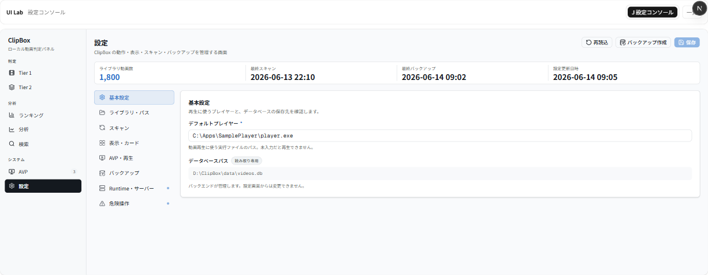

左に **`ModernSidebar`（設定＝アクティブ）**、上に **状態サマリー（KPI）**、その下が **左カテゴリレール＋右フォーム**。
右上に主要アクション **保存／再読込／バックアップ作成**。「変更あり」バッジで未保存を示します。

---

## 工夫ポイント（パーツ）

### 1. 状態サマリー（KPI ストリップ）
ライブラリ J の `ConsoleKpi` を流用。**ライブラリ動画数／最終スキャン／最終バックアップ／設定更新日時**をコンパクトに。
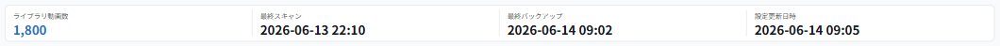

### 2. 設定カテゴリナビ（左レール）
**基本設定／ライブラリ・パス／スキャン／表示・カード／AVP・再生／バックアップ／Runtime・サーバー／危険操作**。
右肩の小さな点は **「UI 検討（現行機能なし／別所在）」** を示します（Runtime・危険操作）。
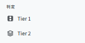

### 3. フォームセクション（label＋入力＋helper text）
現行の各項目を `SettingsSection`／`SettingsField` で再構成。必須印（*）と helper text を重視。
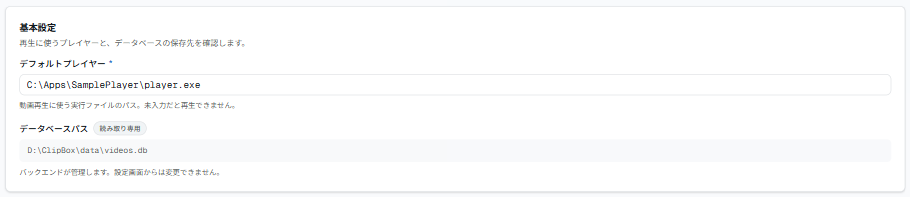

ライブラリ・パスは、ライブラリルート（複数行・絶対パス注記）／セレクションフォルダに加え、**保存先一覧**（C/HDD・本数）を `UI 検討` 付きで提示。
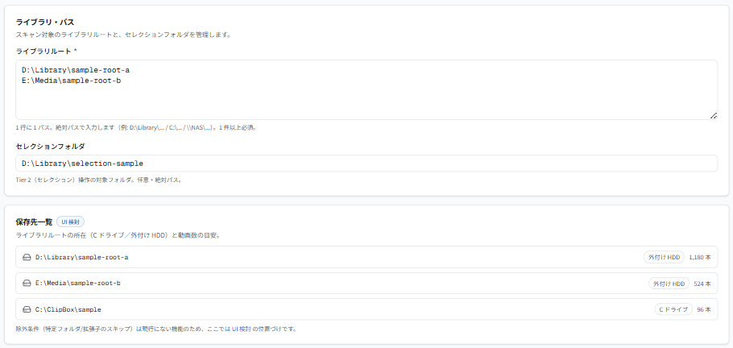

### 4. スキャン（危険と日常を分離＋バックアップ必須ガード）
**セレクションスキャン**（通常操作）と、**ライブラリスキャン**（amber 注意・**このセッションでバックアップ未作成なら強調**）を分離。
下に `UI 検討` の **スキャン履歴・状態**テーブル（成功/失敗バッジ）。
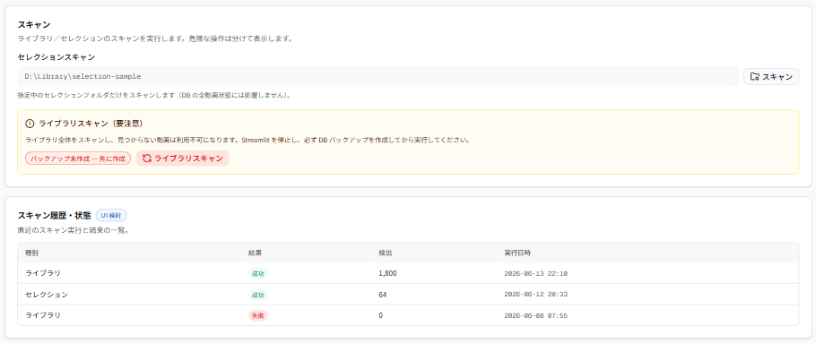

ライブラリスキャンの確認ダイアログは現行同様。**バックアップを作るまで「スキャン実行」は無効**（現行のセッション内バックアップガードを再現）。
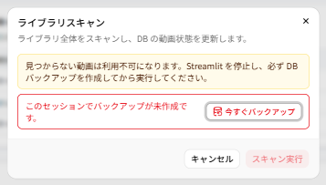

### 5. 動画カード表示設定（＋表示密度は UI 検討）
現行の4トグル（ストレージ／ファイルサイズ／最終再生日／ファイル更新日）。
**表示密度・既定表示モード**は現行になく、`UI 検討` バッジ＋helper で「実装前提ではない」旨を明記。
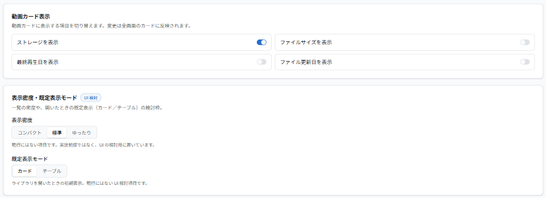

### 6. バックアップ（履歴は UI 検討）
バックアップ作成／バックアップ先／最終バックアップ（現行）＋ `UI 検討` の **バックアップ履歴**テーブル。
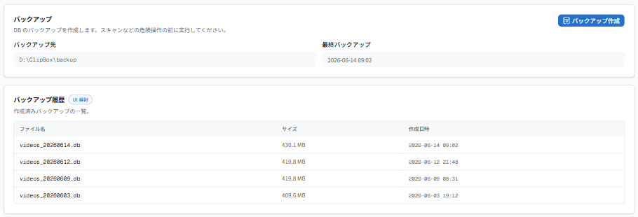

### 7. Runtime・サーバー（現行は SidebarNav に実在）
3層（Next.js / FastAPI / Streamlit）の状態ランプ＋停止ボタン。`UI 検討（現行は SidebarNav に実在）` を明記。停止は確認ダイアログ前提。
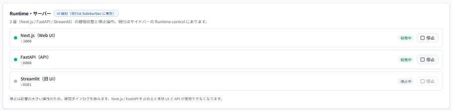

### 8. 危険操作（danger zone）
設定リセット／キャッシュ削除を**赤系で分離**＋誤操作防止文。`UI 検討（現行機能なし）` を明記（モックでは実際には何もしません）。
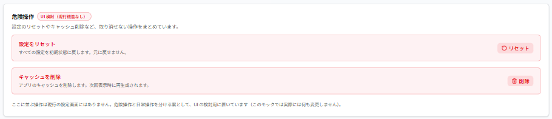

---

## 現行設定機能の維持チェック

| 現行機能（`app/settings/page.tsx`） | 本案での所在 | 状態 |
|---|---|---|
| ライブラリルート（複数行・絶対パス・1件以上必須） | ライブラリ・パス | ✅ 維持 |
| セレクションフォルダ（任意・絶対パス） | ライブラリ・パス／スキャン | ✅ 維持 |
| デフォルトプレイヤー（必須） | 基本設定（AVP からも導線） | ✅ 維持 |
| AVP 実行ファイルパス（任意） | AVP・再生 | ✅ 維持 |
| DB パス（読み取り専用・「既定値」） | 基本設定 | ✅ 維持 |
| 動画カード表示 4 トグル | 表示・カード | ✅ 維持 |
| 設定保存（確認ダイアログ） | ヘッダ「保存」＋確認 | ✅ 維持 |
| 再読込 | ヘッダ「再読込」 | ✅ 維持 |
| バックアップ作成 | ヘッダ／バックアップ | ✅ 維持 |
| セレクションスキャン（確認・検出件数） | スキャン | ✅ 維持 |
| ライブラリスキャン（destructive・amber 警告・**セッション内バックアップ必須**） | スキャン＋確認ダイアログ | ✅ 維持（ガード再現） |
| 検証エラー一覧／結果ボックス | 結果ボックス（ローカル） | ✅ 維持（モック文言） |
| hidden config（fate×2・card_title_max_length・card_show_score） | — | ⏸ **現行同様 非掲載**（設定画面に出さない仕様） |

**UI 検討として追加（現行機能なし or 別所在）**: バックアップ履歴／スキャン履歴テーブル・表示密度/既定表示モード・Runtime サーバー制御（現行は SidebarNav）・危険操作 danger zone。各所に `UI 検討` を明記。

---

## ライブラリ J から継承した点
- 寒色アクセント＋クールニュートラルの THEME（同一値）。
- `ModernSidebar`（設定＝アクティブの黒ピル）／`ConsoleKpi`（簡略 KPI ストリップ）を **read-only 再利用**。
- セグメント・helper text・トークン配色・日本語ラベル・サムネなし。
- 判定済みのような「薄く」表現は danger/UI 検討バッジに置換（設定向け）。

## 設定画面として新しく工夫した点
- **左カテゴリレール＋右フォーム**（ref3 settings 準拠）。項目が増えても迷わない。
- **状態サマリー**で保存/スキャン/バックアップ/更新日時を一望（ref1/ref6）。
- **危険と日常の分離**: スキャンは通常/危険を枠で分け、危険操作は赤系 danger zone に隔離。
- **バックアップ必須ガードの見える化**: ダイアログで「未作成なら実行不可」を現行どおり再現。
- **UI 検討の明示**: 現行にない要素は必ず `UI 検討` バッジ＋helper で「実装前提ではない」と分かる。
- 設定画面なので **余白を広め**（`p-5`・カードに `shadow-sm`）。

---

## レビュー観点（調整できる点）
気になる箇所があれば番号でご指摘ください。微調整します。

1. **カテゴリの粒度/順序**: 8カテゴリ。統合（例: スキャン⊂ライブラリ）や並べ替えも可。
2. **Runtime を設定に置くか**: 現行は SidebarNav。設定へ集約するか両建てかは要相談（今は UI 検討）。
3. **危険操作の範囲**: リセット/キャッシュ削除は現行になし。本当に必要なものだけ残す/全て見送るも可。
4. **履歴テーブルの実装可否**: バックアップ/スキャン履歴は現行データなし。記録を足すなら別途設計が必要。
5. **表示密度・既定表示モード**: 現行になし。採用するか UI 検討止まりかは要判断。
6. **保存の単位**: いまは全体保存（ヘッダ）。セクション単位保存（ref3 風）にするかは好み。
7. **状態サマリーの項目**: 4セル。サーバー状態セルの追加なども可。

---

_本ドキュメントは確認・レビュー用です。スクショは本ラボ（モック専用・合成データ）のもので、個人情報・実動画名・実パスは含みません。
確認ダイアログは Radix Dialog がルート直下へ portal される都合上、当該クロップのみ既定テーマ（寒色 THEME 外）で表示されます。
外部参考サイトの撮影は [`SETTINGS_REFERENCE_RESEARCH.md`](./SETTINGS_REFERENCE_RESEARCH.md)（`references/`）に分離しています。_
