# UIラボ Variant scan-first — スキャン中心の設定画面レビュー（2026-06-16）

設定画面を「単なる設定フォーム」ではなく、ClipBox の運用で定期的に使う **「スキャン」を中心にした画面**として再設計したモック案です。
壁打ち結果を反映し、Variant J の管理コンソール感（左カテゴリレール／KPI／危険操作／保存先一覧／UI検討バッジ多用）を外して、
**情報量を絞り・高頻度を上に・低頻度を折りたたみ**に整理しました。さらに、同じ中身を **左カテゴリレールで切り替える版**・**上部タブで切り替える版**も用意し、3レイアウトを見比べられます。

- URL: `/lab/settings/variant-scan-first`（単一カラム） / `/lab/settings/variant-scan-rail`（カテゴリレール） / `/lab/settings/variant-scan-tabs`（上部タブ）
- 対象: ClipBox 設定画面。サムネ・画像枠なし前提。
- 制約: 実 DB/API/localStorage 非接続・本体無変更・既存 Variant J 無変更（モック専用・合成データ）。寒色（ライブラリ／設定 J の THEME 流用）。
- サンプルカードは **tier1-library の共有カード `ConsoleCard` のデザイン**（タイトル→メタ1行→レベルボタン→操作1行）に整合。

> 注: スクショ左端の細いナビは**本体 `SidebarNav`**（ルートレイアウト由来）。本案は中央の枠内（`ModernSidebar`＋main）です。

---

## 全体（単一カラム）
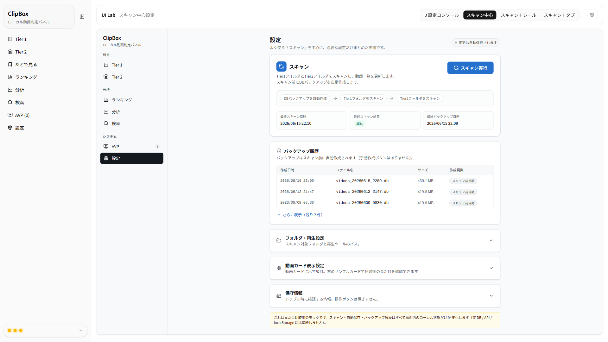

開いた直後に **スキャン（主操作）→ バックアップ履歴** が見え、フォルダ・再生／カード表示／保守情報は折りたたみ。保存ボタンはなく、右上に自動保存ステータス。

## 全体（カテゴリレール）
同じ中身を Variant J 風の **左カテゴリレール**で切り替える版。既定選択はスキャン。折りたたみの代わりにレールで移動します。
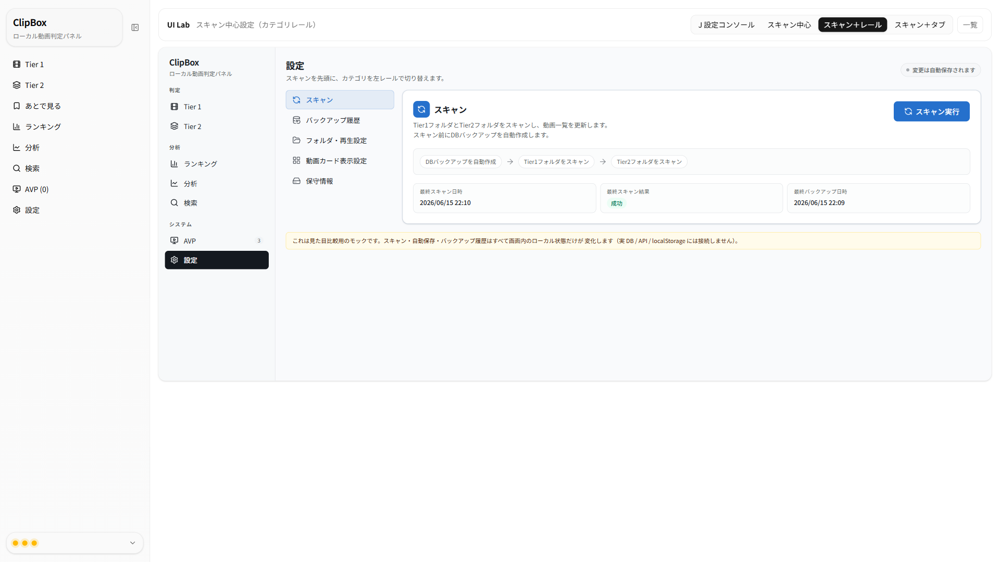

## 全体（上部タブ）
左カテゴリレールの代わりに **上部タブ**でセクションを切り替える版。既定タブはスキャン。横幅を広く使え、カテゴリ数が少ないときに見通しが良い。
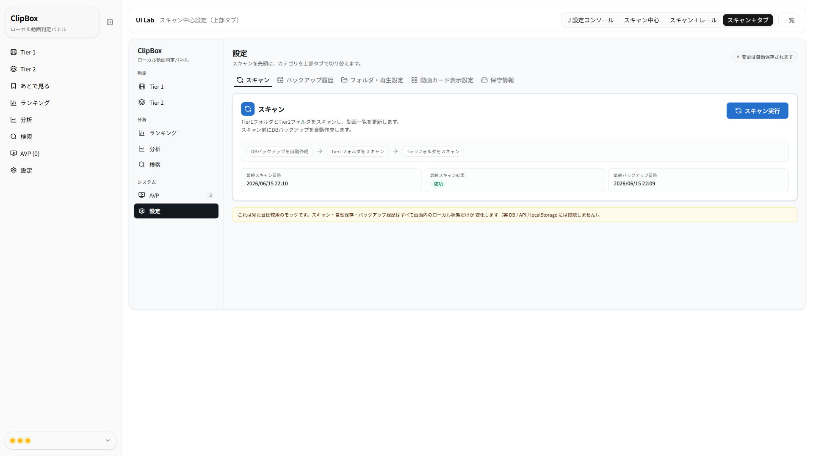

---

## 工夫ポイント（パーツ）

### 1. スキャンカード（最上部・主操作＋自動バックアップのフロー）
主ボタン **「スキャン実行」** を大きく配置。説明2行で「Tier1/Tier2 をスキャンして一覧更新」「スキャン前にDBバックアップを自動作成」を明示。
フロー可視化（`DBバックアップを自動作成 → Tier1 → Tier2`）で、実行すると各ステップが進行。**Tier2 未設定時は「スキップ」**表示。下に最終スキャン日時／結果／最終バックアップ日時。
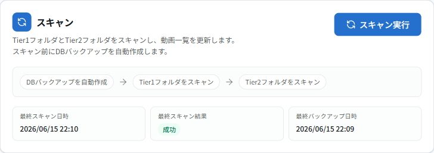

### 2. バックアップ履歴（スキャン直下）
**手動バックアップボタンは置かない**（スキャン前に自動作成される前提）。最新3件のみ常時表示＋「さらに表示」。列は 作成日時／ファイル名／サイズ／**作成契機（スキャン前自動）**。
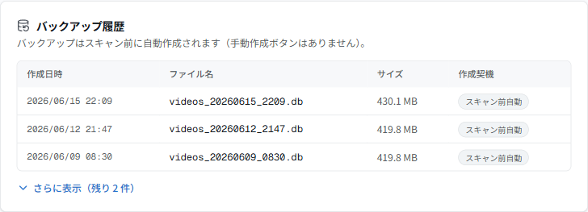

### 3. フォルダ・再生設定（Tooltip で補足）
Tier1フォルダ／Tier2フォルダ／デフォルトプレイヤー／AVP実行ファイルパス。長い説明は本文に出さず **`?` の Tooltip** で補足（「Tier1として扱う動画フォルダです。」等）。絶対パス等のバリデーションは入力欄の近くにインライン表示。
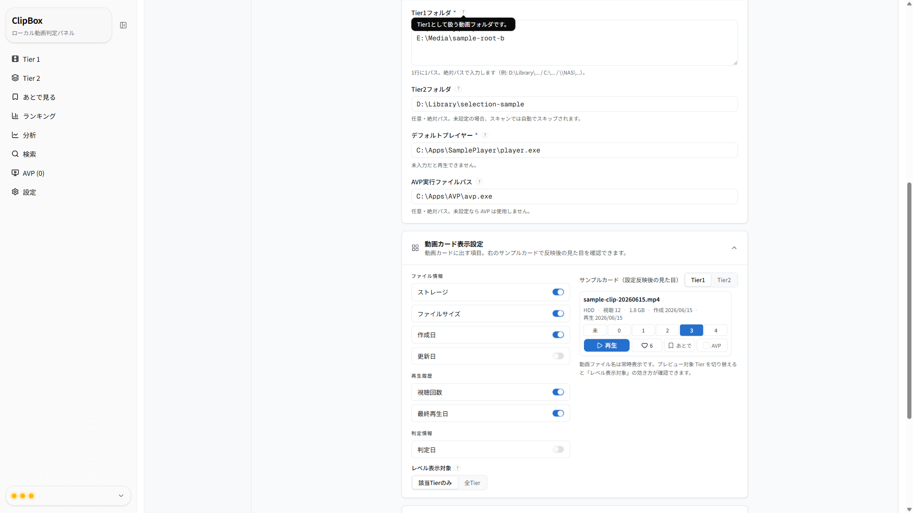

### 4. 動画カード表示設定（サンプルカードで反映確認）
左に表示グループ別トグル（ファイル情報／再生履歴／判定情報）＋レベル表示対象、右に **サンプルカード**。トグルやプレビュー対象 Tier の切替で、設定反映後の見た目がその場で変わります。
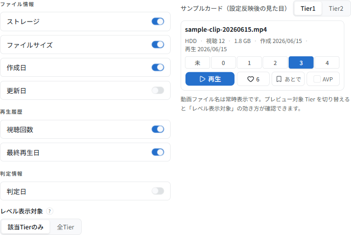

サンプルカードは tier1-library の共有カード `ConsoleCard` と同デザイン（タイトル → ドット区切りメタ1行 → 数値レベルボタン → 操作1行 再生/♡/あとで/AVP）。日付は `yyyy/mm/dd`・ラベル付き・Tooltip。
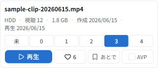

### 5. 保守情報
トラブル時に確認する読み取り専用情報（DBパス／設定ファイル／システム情報／アプリバージョン／API接続状態）。**Runtime 操作は置かない**（現行どおりサイドバー下部に残す想定）。
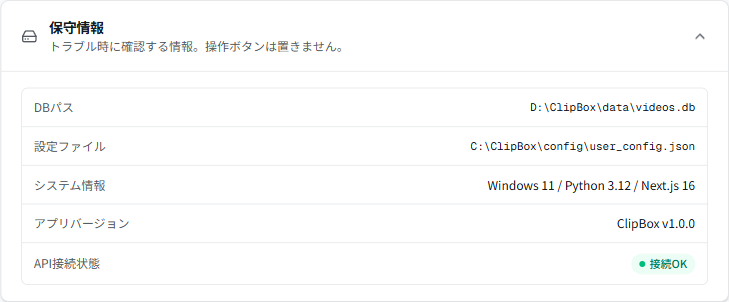

### 6. 自動保存ステータス（保存ボタンなし）
入力・トグル変更で自動保存。ヘッダのステータスが `変更は自動保存されます → 保存中… → 保存しました` と遷移。入力エラー時は保存せず `未保存（入力エラー）`＋入力欄近くに赤エラー。

### 7. カテゴリレール（レール版）
スキャン／バックアップ履歴／フォルダ・再生設定／動画カード表示設定／保守情報を左レールに配置し、右に選択セクションを表示。中身（状態・部品・サンプルカード）は単一カラム版と完全共有。
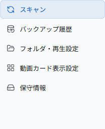

レール版でカード表示設定を選んだ状態（サンプルカードも同じ ConsoleCard デザイン）。
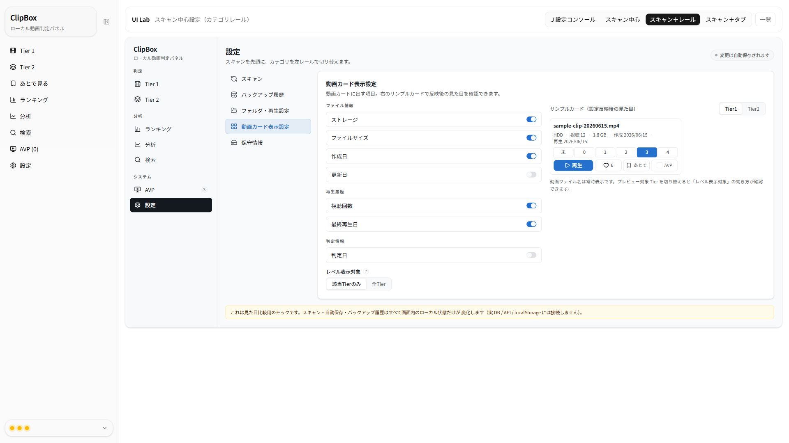

### 8. 上部タブ（タブ版）
左カテゴリレールの代わりに **上部タブ**で同じ5セクションを切り替える版。横幅を広く取れ、カテゴリ数が少ないときに見通しが良い。中身は他レイアウトと完全共有。
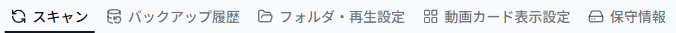

タブ版でカード表示設定を選んだ状態（サンプルカードも同じ ConsoleCard デザイン）。
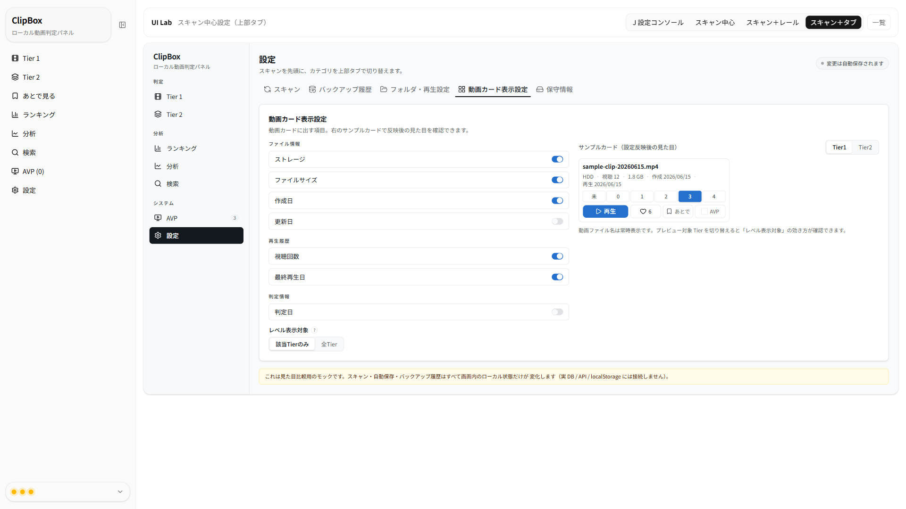

---

## 壁打ち要件の反映チェック

| 壁打ちでの要望 | 本案での対応 |
|---|---|
| スキャンを最上部に常時表示・主操作にする | スキャンカードを最上部に固定・大きな「スキャン実行」 ✅ |
| スキャン前にDBバックアップを自動作成と分かる | 説明文＋フロー先頭が「DBバックアップを自動作成」 ✅ |
| Tier2 未設定時は自動スキップ | フローで「Tier2フォルダ（未設定・スキップ）」を表示 ✅ |
| バックアップ履歴をスキャン直下・最新3件＋さらに表示 | スキャン直下に配置・3件＋「さらに表示」 ✅ |
| 手動バックアップボタンは置かない | 置かず「スキャン前に自動作成」と明記 ✅ |
| 低頻度は折りたたみ | フォルダ・再生／カード表示／保守情報を折りたたみ（レール版はレール） ✅ |
| 旧名称を廃し Tier1/Tier2 フォルダに再定義・Tooltip 補足 | ラベルを Tier1/Tier2 フォルダに統一・`?` Tooltip ✅ |
| カード表示はサンプルカードで反映確認 | 左設定＋右サンプルカード（即時反映） ✅ |
| サンプルカードを tier1-library のカードデザインに合わせる | `ConsoleCard` 構造（メタ1行＋レベルボタン＋操作1行）に整合 ✅ |
| 保存ボタンなしの自動保存（状態表示） | 保存中／保存しました／未保存・入力エラー をヘッダ表示 ✅ |
| Runtime 操作は設定画面に置かない | 保守情報は情報のみ・Runtime なし ✅ |
| カテゴリレールで並べた案も追加 | `variant-scan-rail` を追加（5カテゴリ） ✅ |
| 左レールの代わりに上部タブの案も追加 | `variant-scan-tabs` を追加（5タブ・中身は共有） ✅ |
| レポートのスクショが横幅つぶれ | ブラウザ最大化（1920×1080）で全画像を撮り直し ✅ |

---

## 命名再定義

| 旧UI名（使わない） | 新UI名（本案） | 本体 config キー |
|---|---|---|
| ライブラリルート | **Tier1フォルダ** | `library_roots`（複数行・1行1パス） |
| セレクションフォルダ | **Tier2フォルダ** | `selection_folder` |
| （変更なし） | デフォルトプレイヤー | `default_player` |
| （変更なし） | AVP実行ファイルパス | `avp_exe_path` |

「ライブラリ」という語は設定画面で別概念に使っていません（ClipBox では Tier ごとの「ライブラリ／ランダム／運命の一本」タブ名を指すため）。

## 今回 入れていない要素

保存先一覧 / 手動バックアップボタン / 再読込ボタン / 危険操作（danger zone）/ Runtime停止ボタン /
表示密度設定 / 既定表示モード設定 / スコア表示設定 / 旧名称（ライブラリルート・セレクションフォルダ）/ UI検討バッジの多用 /
動画ファイル名のオン・オフ（ファイル名＝カードタイトルは常時表示）。

---

## レビュー観点（調整できる点）
気になる箇所があれば番号でご指摘ください。微調整します。

1. **3レイアウトの採否**: 単一カラム（折りたたみ）／カテゴリレール／上部タブ のどれを主案にするか。両建ても可。
2. **スキャンフローの粒度**: 現在は バックアップ→Tier1→Tier2 の3段。進捗バーや所要時間表示の追加も可。
3. **カードのメタ項目**: いまは ストレージ／視聴／サイズ／作成／更新／再生／判定。並び順・初期 ON/OFF の調整可。
4. **レベル表示対象**: 「該当Tierのみ／全Tier」の意味づけ。文言や既定値は調整可。
5. **自動保存の体感**: 保存中→保存しましたのディレイ（現状約0.7秒）。デバウンス時間や表示位置は調整可。
6. **保守情報の項目**: DBパス／設定ファイル／システム／バージョン／API。項目の増減可。
7. **折りたたみの初期状態**: 現在は全閉。よく使う「フォルダ・再生設定」だけ初期展開、なども可。

---

## 本体反映時の注意点

1. **スキャンの本実装**: `スキャン実行 → DBバックアップ自動作成 → Tier1 → Tier2` の順。Tier2 未設定なら自動スキップ。現行 API（`createBackup`/`scanLibrary`/`scanSelection`）の組み合わせだが「スキャン前に必ずバックアップ」を1操作にまとめる導線は新規。
2. **自動保存**: 入力ごとの保存＝デバウンス保存＋バリデーション・部分保存の設計が必要（現行はフル保存＋確認ダイアログ）。
3. **命名移行**: `library_roots`/`selection_folder` は内部キーのまま、UI ラベルのみ Tier1/Tier2 に統一。
4. **スキャン状態・バックアップ履歴**: 最終スキャン日時/結果・履歴（作成契機つき）は現行データに無いため記録の追加設計が必要（本案はモック値）。
5. **サンプルカード**: 本案は表示確認用に `ConsoleCard` を写経。本体反映時は実 `ConsoleCard`/`VideoCard` に設定を流し込む形が自然。

---

_本ドキュメントは確認・レビュー用です。スクショは本ラボ（モック専用・合成データ）のもので、個人情報・実動画名・実パスは含みません。_
