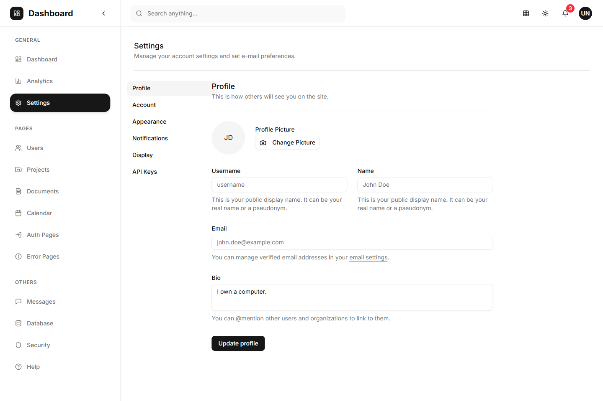
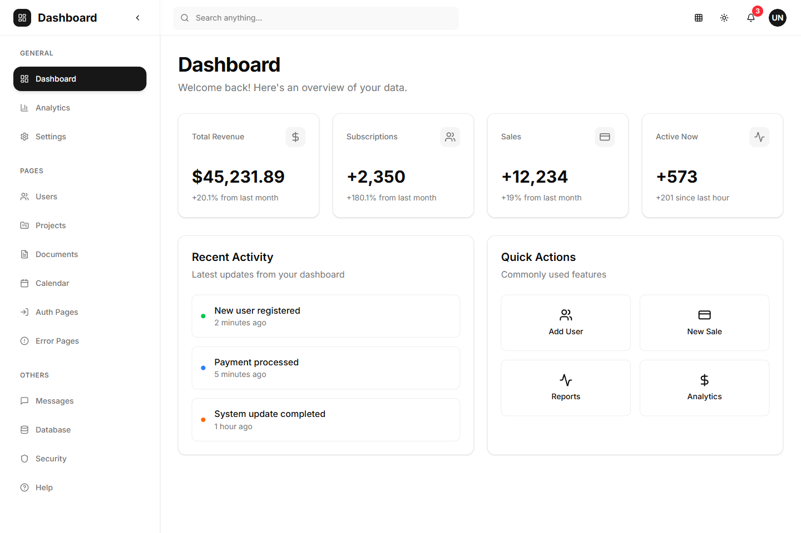
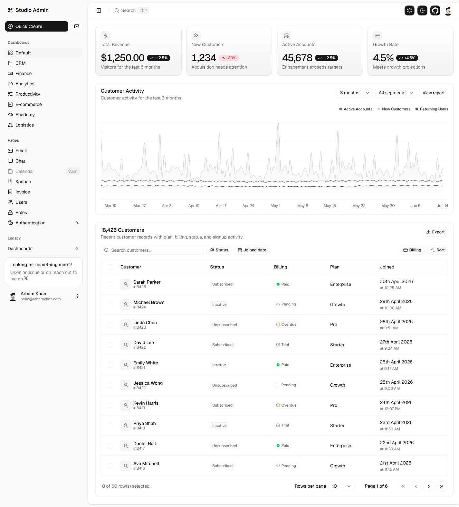
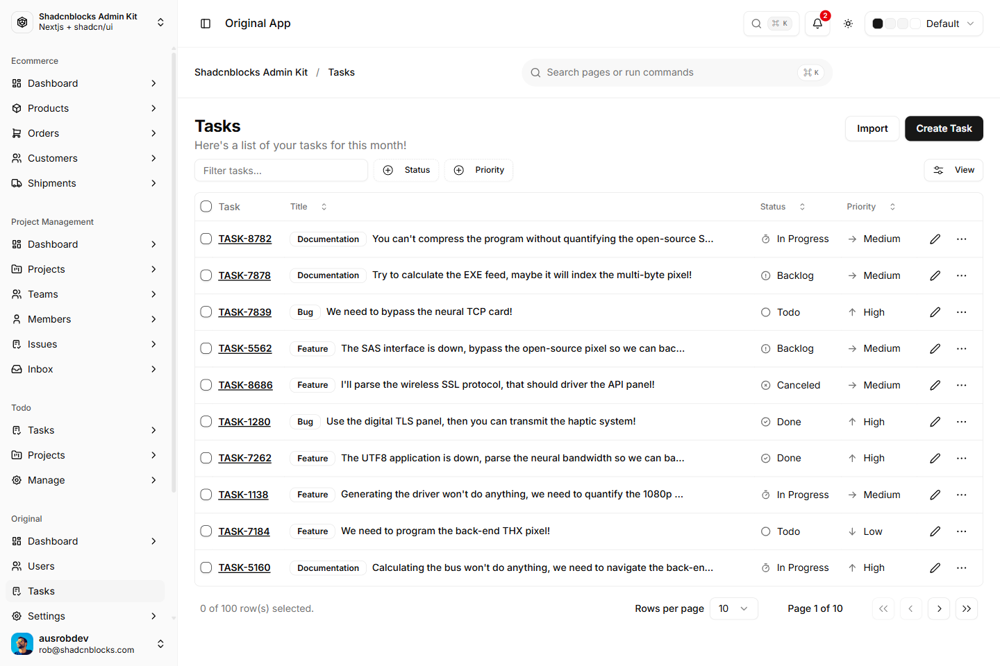
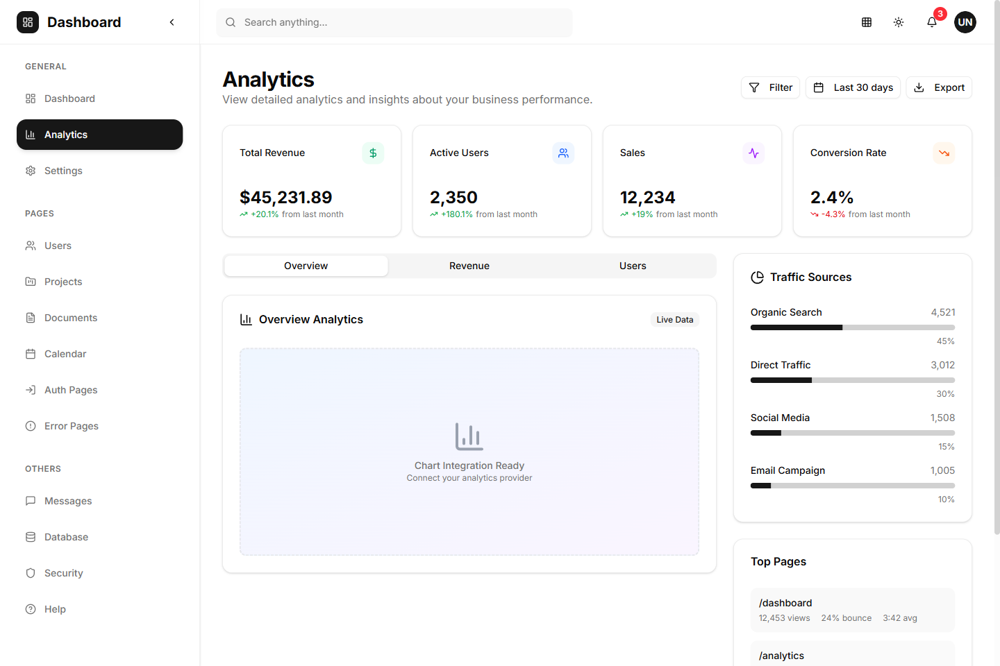
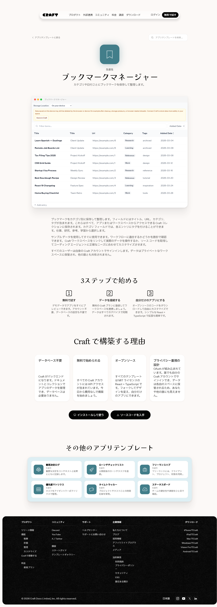
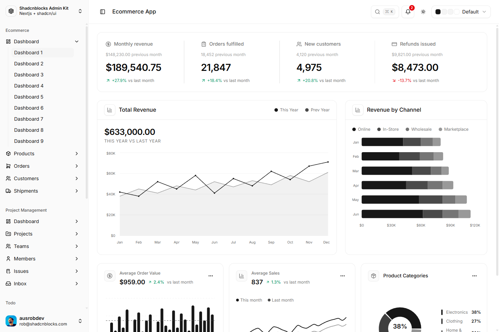

# 設定画面 UIラボ — 参考サイト収集・厳選（2026-06-14）

ClipBox の設定画面を Variant J テイスト（寒色・モダンコンソール）で再設計するにあたり、外部の
shadcn 系ダッシュボード/設定テンプレートを Playwright で撮影し、**「設定画面のレイアウト参考として本当に使えるもの」だけ**を厳選しました。

- 撮影画像は本フォルダの `references/` に置いています（**ClipBox 設定画面のスクショ `COMPARISON_J/` とは別フォルダで分離**：混同防止）。
- 各サイトは公開デモ。撮影は読み取りのみで、ClipBox の実 DB/API には一切関与しません。

> 注: ここに並ぶ画像は**外部参考サイト**です。ClipBox 設定画面のモックは [`COMPARISON_J.md`](./COMPARISON_J.md) を参照してください。

---

## 厳選の方針

- **採用候補**: 入力欄・説明文・保存ボタンの配置／設定カテゴリの整理／スキャン・バックアップ・履歴・状態の見せ方に転用でき、寒色・高密度・モダンコンソール感と相性がよいもの。
- **不採用**: マーケ色が強い・画像主体・派手すぎ・設定に無関係・重い/開けない・他参考と重複。

---

## 採用した参考

### ⭐ ref3 — shadcn dashboard / **settings**（最重要）
`https://shadcn-nextjs-dashboard.vercel.app/dashboard/settings`

- **左に設定カテゴリナビ（Profile/Account/Appearance/Notifications/Display/API Keys）＋右に詳細フォーム**。
- フォームは **ラベル＋入力＋helper text** の3点セット、末尾に **保存ボタン（Update profile）**。
- **ClipBox への転用**: 設定コンソールの骨格そのもの。左カテゴリレール＋右フォーム、helper text 重視、セクション末/ヘッダに保存を採用。

### ref1 — shadcn dashboard（概要）
`https://shadcn-nextjs-dashboard.vercel.app/dashboard`

- 上部に **KPI カード4枚**、下に **Recent Activity** と **Quick Actions**（アイコン＋ラベルのグリッド）。
- **ClipBox への転用**: 設定トップの **状態サマリー（KPI ストリップ）** と、ヘッダ右の **主要アクション（保存／再読込／バックアップ作成）** の発想に反映。

### ref6 — admin dashboard / default
`https://next-shadcn-admin-dashboard.vercel.app/dashboard/default`

- **KPI 行 ＋ ステータスバッジ付きの一覧テーブル ＋ ページネーション**。
- **ClipBox への転用**: **バックアップ履歴／スキャン履歴**テーブル（成功/失敗のステータスバッジ・行ホバー）に反映。

### ref8 — shadcnblocks admin / tasks
`https://shadcnblocks-admin.vercel.app/original/tasks`

- **フィルタ・ステータス/優先度バッジ・行ホバー・行メニュー・ページネーション**の高機能テーブル。
- **ClipBox への転用**: 履歴系テーブルの**簡略版**（件数が少ないためページネーション/行メニューは省き、ステータスバッジと行ホバーのみ採用）。

### ref2 — shadcn dashboard / analytics（部分採用）
`https://shadcn-nextjs-dashboard.vercel.app/dashboard/analytics`

- KPI カード＋**セグメントタブ（Overview/Revenue/Users）**＋右上の **Filter / 期間 / Export** ＋ 横バーメーター。
- **ClipBox への転用**: **ヘッダ右のアクション配置**とセグメント表現の参考（チャート部分は不採用）。

---

## 不採用の参考

### ref4 — craft.do ブックマークマネージャ（テンプレート）
`https://www.craft.do/app-templates/bookmark-manager`

- **不採用**: 実体は**マーケティング LP**（ヒーロー・「3ステップで始める」・装飾・フッター主体）。設定 UI のレイアウト参考にはならない。

### ref10 — shadcnblocks admin / ecommerce dashboard-1
`https://shadcnblocks-admin.vercel.app/ecommerce/dashboard-1`

- **不採用（KPI カードの「値＋前回比」概念のみ参考）**: **チャート主体・EC 色・密度過多**で、寒色・高密度の設定画面には重い。状態サマリーは ref1/ref6 の方が素直。

### 撮影を見送った URL（厳選により除外）
- **#5 craft.do/app/bookmark-manager**（実デモ）— 認証/未公開で開けない可能性があり、ブックマークのカード一覧は設定 UI に無関係のため見送り。
- **#7 admin / analytics** — ref6（admin/default）・ref2（analytics）と**重複**する分析ダッシュボードのため見送り。
- **#9 admin / users** — ref8 の**テーブルパターンと重複**のため見送り。

---

## まとめ（ClipBox 設定画面への落とし込み）

| 参考 | 取り入れた要素 | 反映先（設定コンソール） |
|---|---|---|
| ref3 settings | 左カテゴリナビ＋右フォーム／label+input+helper／保存配置 | 全体骨格・各 `SettingsSection`／`SettingsField` |
| ref1 dashboard | KPI ストリップ／Quick Actions | 状態サマリー（`ConsoleKpi`）／ヘッダ主要アクション |
| ref6 admin/default | KPI＋ステータスバッジ付きテーブル | バックアップ／スキャン履歴テーブル |
| ref8 tasks | 行ホバー・ステータスバッジ | 履歴テーブルの簡略版 |
| ref2 analytics | ヘッダ右アクション・セグメント | ヘッダ／表示密度・既定表示モードのセグメント |

寒色・高密度・helper text 重視という Variant J の方向性は維持しつつ、**設定画面なので余白はライブラリより広め**に調整しています。

_本ドキュメントの画像は外部公開デモの参考撮影です。ClipBox の実データ・個人情報は含みません。_
