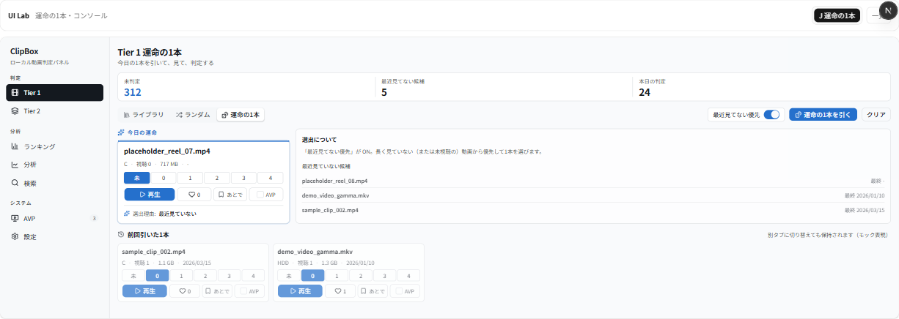
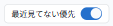
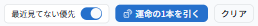
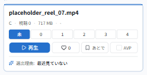
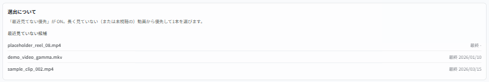

# UIラボ Variant J — 運命の1本・コンソール レビュー（2026-06-14）

Tier1「ライブラリ」の **Variant J（ライブラリ・コンソール）** と同じテイストで、Tier1 内タブの
**「運命の1本」** を再設計したモック案です。ライブラリ J の高密度・寒色・数値レベルボタン・情報カード方式と
整合させつつ、**1本を引く体験に控えめな特別感**を与えました（動画アプリ風に派手にしすぎない）。

- URL: `/lab/tier1-fate/variant-j`
- 対象タスク: Tier1「運命の1本」（1本だけ引いて見る）。サムネなし情報カード前提。
- 制約: 実 DB/API/localStorage 非接続・本体無変更・既存 A〜J 無変更（モック専用・合成データ）。寒色（ライブラリ J の THEME 流用）。

> 注: スクショ左端の細いナビは**本体 `SidebarNav`**（ルートレイアウト由来）。J 本体は中央の枠内（`ModernSidebar`＋main）です。

---

## 全体

KPI は**簡略表示**（未判定／最近見てない候補／本日の判定）。タブは左にセグメントで強調し、
右に **「最近見てない優先」トグル・「運命の1本を引く」・「クリア」**。主役カードの下に
**選出理由**と**補助情報**、さらに **「前回引いた1本」** を置きました。

---

## 工夫ポイント（パーツ）

### 1. 「最近見てない優先」トグル
ツールバー右にチップ型で常設。ON のとき、長く見ていない（または未視聴の）動画から優先して選ぶ、という選び方の切替を見せます。

### 2. 「運命の1本を引く」操作エリア
タブ（運命の1本＝強調）の右に、**優先トグル＋引くボタン（サイコロ）＋クリア**。引く操作を主役にしつつ、派手な演出は避けています。

### 3. 引いた主役カード（控えめな特別感）
ライブラリと同じ情報カードに、**上端の細いアクセント帯＋淡い ring** だけを足した主役表現。
**「今日の運命」** の小さな見出しと、カード下の **選出理由** チップで“引いた1本”だと伝えます（再生／♡／あとで／AVP はライブラリと同一）。

### 4. 選出理由・補助情報
主役の隣に「選出について」を置き、**現在の選び方の説明**と **「最近見ていない候補」** リスト（タイトル＋最終視聴）を補助表示。次の1本の手掛かりにします。

### 5. 「前回引いた1本」（保持される想定の表現）
画面下に、前に引いた1本を**薄めのカード**で残しています。`localStorage` には触れないため、
**「別タブに切り替えても保持されます（モック表現）」** のキャプションで、引いたカードが画面遷移で消えない想定を静的に示しました。
（全体スクショの下段を参照）

---

## ライブラリ J から継承した点
- 寒色アクセント＋クールニュートラルの THEME（同一値）。
- サムネなしの情報カード（タイトル主役→メタ1行→数値レベルボタン→操作1行）。
- レベルは**数値ボタンの単一表現**。
- **あとで／AVP を等幅**・あとで見るは「あとで」ラベル。
- KPI は低め・コンパクト（セルを絞って簡略表示）。
- タブを左にセグメントで強調。
- 判定済み/利用不可は薄く（前回引いた1本も薄め）。
- `ModernSidebar`／`LevelButtons`／`useMockCard`／`labMock` を **read-only 再利用**。

## 運命の1本画面として新しく工夫した点
- **控えめな特別感**: 主役カードは上端アクセント帯＋ring のみ。ヒーロー画像や大きな装飾は使わず、密度・寒色を崩さない。
- **「今日の運命」見出し＋選出理由チップ**: 1本に意味づけを与えつつ、情報カードの体裁は維持。
- **「最近見てない優先」の見える化**: トグル＋補助パネルの説明文で、選び方の違いがその場で分かる。
- **「最近見ていない候補」リスト**: 次に引かれそうな手掛かりを軽く提示（サムネなし・タイトル＋最終視聴のみ）。
- **「前回引いた1本」＋保持キャプション**: 「引いた1本は画面を切り替えても消えない」という本体想定を、モックで自然に表現。

---

## レビュー観点（調整できる点）
気になる箇所があれば番号でご指摘ください。微調整します。

1. **特別感の強さ**: いまは上端アクセント帯＋ring のみ。もう少し出す／さらに地味に、いずれも可。
2. **トグルの位置**: ツールバー右にチップ。引くボタンの近接配置や、補助パネル側へ移すのも可。
3. **選出理由の文言**: 「最近見ていない／ランダム選出」の2種。理由をもっと具体化（最終視聴◯日前 等）も可。
4. **補助情報の量**: 「最近見ていない候補」3件。件数・項目（視聴回数等）の増減は可。
5. **前回引いた1本の保持表現**: いまはキャプション＋薄カード。実装時は `clipbox-fate-picks`（sessionStorage）想定だが、ここでは非接続。
6. **クリアの扱い**: いまは主役と履歴を消す。確認ダイアログの要否などは要相談。

---

_本ドキュメントは確認・レビュー用です。スクショは本ラボ（モック専用・合成データ）のもので、個人情報・実動画名は含みません。_
