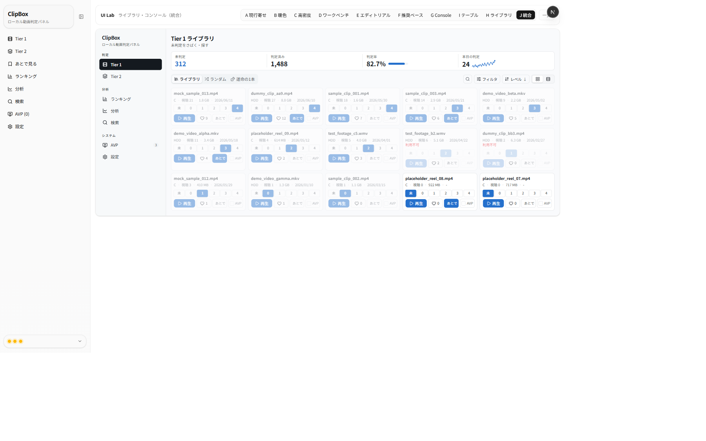
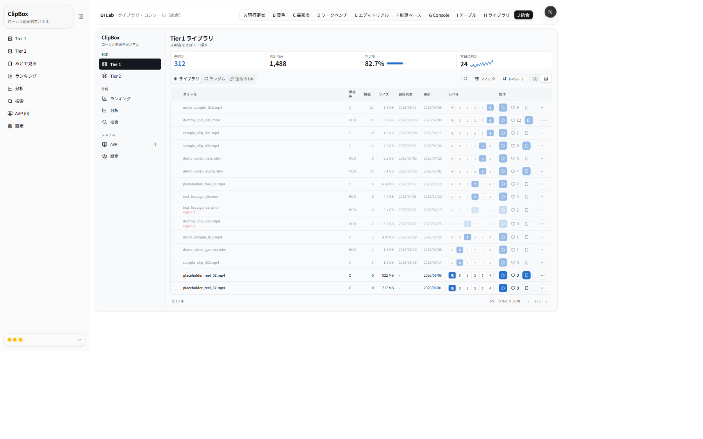
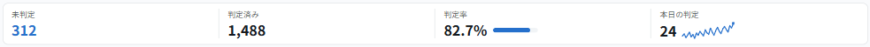
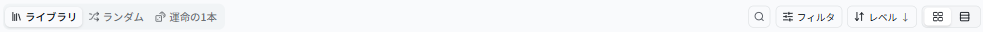
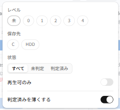
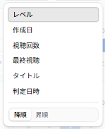
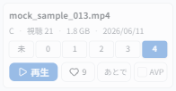

# UIラボ Variant J — ライブラリ・コンソール（最終統合）レビュー（2026-06-14）

G/I/H の詳細レビューを反映した **最終統合案**。**G を主軸**に、**I（テーブル）を表示モードとして内包**し、
**H のフィルタ chip 概念をフィルタパネルへ畳み込み**ました。各「工夫ポイント」をパーツ切り抜きで併記します。

- URL: `/lab/tier1-library/variant-j`
- 対象タスク: Tier1「未判定をさばく（判定）」＋「探す」。サムネなし情報カード前提。
- 制約: 実 DB/API/localStorage 非接続・本体無変更・既存 A〜I 無変更（モック専用・合成データ）。寒色（G の THEME 流用）。

> 注: スクショ左端の細いナビは**本体 `SidebarNav`**（ルートレイアウト由来）。J 本体は中央の枠内です。

---

## 全体（カード表示）

## 全体（テーブル表示）
表示モードを切り替えると I 相当の高機能テーブルになります（同じ KPI/ツールバーのまま中身だけ差し替え）。

---

## 工夫ポイント（パーツ）

### 1. KPI（配置は G 踏襲・率は右バー・本日は折れ線）
判定率＝**数値の右にコンパクトな横バー**、本日の判定＝**数値の右に直近30日の折れ線（軸なしスパークライン）**。全体の高さは少し低く。

### 2. 1段ツールバー（タブを左に分離・強調／右に操作群）
タブ（ライブラリ/ランダム/運命の1本）は使用頻度が高いので**左にセグメントで強調**。右は
**検索＝虫眼鏡のみ**・**フィルタ＝漏斗**・**並び替え（現在値＋昇降矢印）**・**カード/テーブル切替**。あとで見るフィルタは廃止。

### 3. フィルタ（漏斗 → Popover パネル・全表示しない）
レベル(未/0–4)・保存先(C/HDD)・状態(すべて/未判定/判定済み) の chip（H の概念をここへ）＋**再生可のみ**＋
**「判定済みを薄くする」トグル**。有効なフィルタ数は漏斗にバッジ表示。

### 4. 並び替え（2段 Popover）
1段目に項目（レベル/作成日/視聴回数/最終視聴/タイトル/判定日時・**日本語**）、2段目に**降順／昇順**。

### 5. カード（縦に詰めた短いカード・あとで／AVP 同サイズ）
タイトル→メタ1行→数値レベルボタン→**操作1行（再生／♡／あとで／AVP）**。
**あとで見るは「あとで」ラベル**にして **AVP と等幅**。判定済み（このカードは Lv4）は薄く表示。

---

## G/I/H レビューの反映チェック

| レビュー（G/I/H） | J での対応 |
|---|---|
| KPI のサイズ・配置は good | 4セル1段・大きな数値の配置を維持 ✅ |
| 判定率は数値の右にバー | 数値＋右に横バー ✅ |
| 本日の判定は数値の右に直近1ヶ月の折れ線 | 数値＋右に30日スパークライン ✅ |
| タブは検索/フィルタより高頻度 → 分けて強調 | タブを左にセグメントで分離・強調 ✅ |
| キーワード検索は枠線が強い・虫眼鏡だけで良い | アイコンのみ→Popover で入力 ✅ |
| フィルタはアイコン→パネルで選ぶ（全表示しない） | 漏斗→Popover（レベル/保存先/状態）＋有効数バッジ ✅ |
| フィルタ輪郭は Analytics 参考 | `crop-g2-headeractions`（アウトライン＋アイコン）に倣う ✅ |
| あとで見るフィルタは不要 | 削除 ✅ |
| 並び替えは日本語＋2段（項目＋昇降） | 2段 Popover・日本語ラベル ✅ |
| パネルに「判定済みを薄く」トグル | フィルタ Popover 内に配置（既定 ON） ✅ |
| 判定済みはもっと薄く・利用不可も同程度 | 両方 opacity≈45（判定済みはトグル連動・利用不可は常時＋disabled） ✅ |
| カードを縮め縦4枚入るサイズ感／KPI も少し縮める | カード圧縮・KPI 高さ縮小 ✅ |
| あとで見るボタンと AVP を同サイズ・あとで見る→「あとで」 | 等幅トグル・「あとで」ラベル ✅ |
| I はライブラリの表示モードとして内包 | カード⇄テーブルの表示モード切替で内包 ✅ |
| H のレベル/保存先 chip 概念を取り込む | フィルタ Popover の chip として実装 ✅ |

---

## レビュー観点（調整できる点）
気になる箇所があれば番号でご指摘ください。微調整します。

1. **カードの詰め具合**: いまは「タイトル2行＋メタ1行＋レベル＋操作1行」。もう一段詰める／少し余裕を持たせる、いずれも可。
2. **あとで／AVP の幅**: 等幅（再生はやや広め）。両者と再生の比率は調整可。
3. **薄表示の濃さ**: 判定済み/利用不可ともに約45%。もっと薄く／少し濃く 調整可。
4. **フィルタ項目**: 現状 レベル/保存先/状態/再生可。並び順や項目の増減は可。
5. **スパークライン**: 折れ線のみ（モック30日）。点・面・直近差分の併記なども可。
6. **既定の表示モード**: 既定はカード。テーブル既定や、モード記憶（モックの範囲）も可。

---

_本ドキュメントは確認・レビュー用です。スクショは本ラボ（モック専用・合成データ）のもので、個人情報・実動画名は含みません。_
