# ClipBox Modern UI Design Brief（2026-06-14 / rev.2 画像強化版）

UIラボ A〜F は「使いやすさ＝情報設計」は改善したが、**パッと見のビジュアルがモダンでない**。
本ブリーフは参考サイト（ユーザー提供10URL）を撮影・分析し、ClipBox を**モダンに見せる**具体方針と
次に作る **Variant G / H / I** を定義する。

**この文書の読み方**: 各参考は「**全体スクショ**（画面の文脈）」と「**採用パーツの切り抜き**（取り入れる箇所を拡大）」を併記する。
切り抜き画像のキャプション＝**ClipBox に取り入れる箇所**。

- 対象タスク: Tier1「未判定を大量にさばく（判定）」＋「過去の動画を探す」。**サムネなし情報カード**前提。
- 制約: 実DB/API非接続・本体無変更・サムネ/画像枠/16:9なし・重複バッジなし・AVPはチェックボックス・
  運命の1本はTier1タブのまま・サイドバー7項目据え置き。
- 本ブリーフは**設計方針のみ**（コード未変更）。

---

## 1. なぜ A〜F は「便利だがモダンに見えない」のか

| # | 弱点 | 内容 | モダンUIの正解 |
|---|---|---|---|
|1|素のテンプレ感|トークン色替え止まり。影/角丸/罫線/余白/タイポの**スケール設計**が未着手|スケールを設計し"意図"を出す|
|2|余白不足|カードが詰まり"呼吸"がない|generous whitespace（大胆な余白）|
|3|囲みだらけ(boxy)|カード枠＋バッジ枠＋ボタン枠＋区切り線が重なる|罫線を減らし**余白・極薄背景差・微影**で分ける|
|4|アクション常時露出|各カードに 再生/レベル/♡/🔖/AVP が常に5個|**primary 1つ強調**＋副次は hover/メニュー退避|
|5|タイポ階層が平坦|タイトル/メタ/数値の差が小さい|見出し・数値を大きく、補助を小さく薄く|
|6|色が単調 or 過剰|A=色が散る / B・E=全面に色|**ニュートラル基調＋1アクセントを点で**|
|7|KPIが弱い|数値が小さく単位/トレンド演出なし|大数値＋小ラベル＋**前比トレンド**|
|8|エレベーション無し|フラット or ベタ影|ring＋極薄影＋hover lift の段階設計|
|9|スケール不統一|角丸/spacing が案ごとにバラつく|トークンで統一|
|10|フレームの古さ|（ラボ特有）本体サイドバー併存ノイズ|—|

現行 A〜F（全体）:

| A 現行寄せ | B 暖色 | C 高密度 |
|---|---|---|
|  | 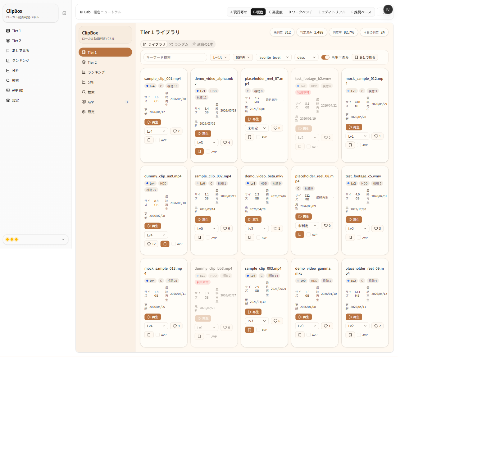 |  |

| D ワークベンチ | E エディトリアル | F 推奨ベース |
|---|---|---|
|  |  |  |

→ 結論: **情報設計は良くなったが「視覚設計（余白・階層・抑制・エレベーション）」が未着手**。これが G/H/I の主眼。

---

## 2. 参考サイトから取り入れる要素（全体＋採用パーツ切り抜き）

### 2-1. shadcn-nextjs-dashboard（G: Modern Console 参考）

#### Dashboard（全体）

**▼ 取り入れるパーツ**

上部ヘッダー（左に幅広検索／右にテーマ・通知・アバター）
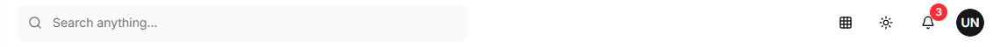

セクション見出し(GENERAL/PAGES/OTHERS)＋アイコン＋ラベル、**アクティブ＝黒の塗りピル**
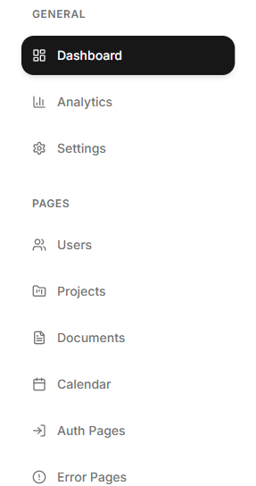

KPIカード＝**小ラベル＋小アイコン＋特大数値＋小さな前月比**（罫線細・影ほぼ無し・余白広い）
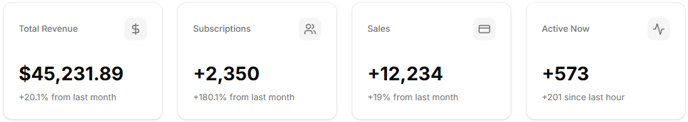

Quick Actions＝アイコン＋ラベルの 2×2（よく使う操作を集約）
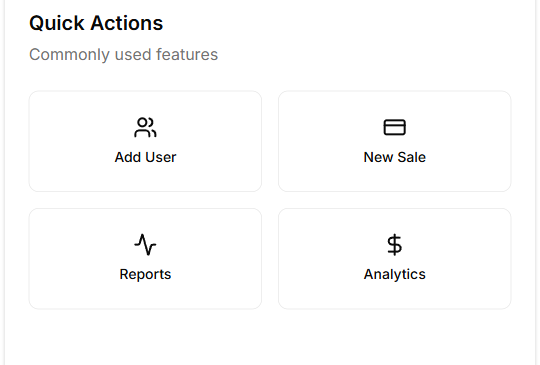

#### Analytics（全体）
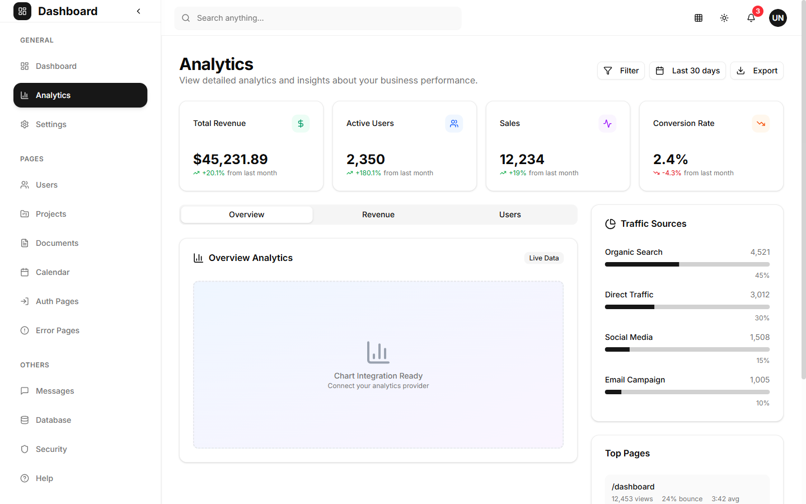

**▼ 取り入れるパーツ**

見出し右の**アクション群（Filter / 期間 / Export）**＝アウトラインボタン＋アイコン
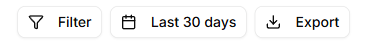

KPIに**色付きアイコンの淡い円**＋**↑↓トレンド色（緑=改善 / 赤=悪化）**
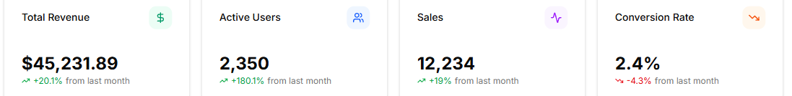

**セグメント型タブ**（軽い切り替え。現行のボタン的タブより視覚ノイズが少ない）
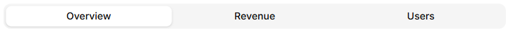

**横バー＋数値＋％のランキングリスト**（→ ClipBoxのレベル分布/保存先内訳に転用可）
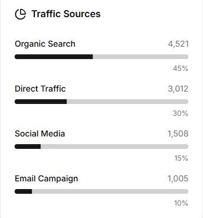

#### Settings（全体）
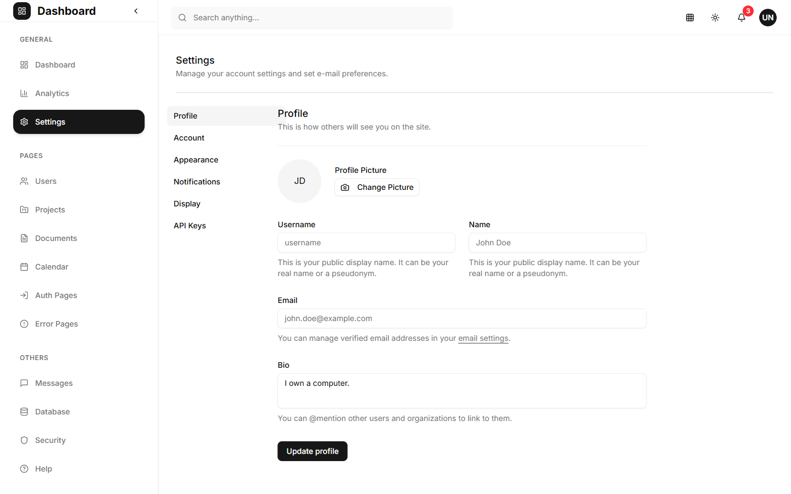

**▼ 取り入れるパーツ**

設定の**縦サブナビ**（Profile/Account/…）
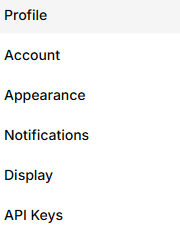

各フィールド＝**ラベル＋入力＋説明文(helper text)**、2カラム＋全幅の使い分け
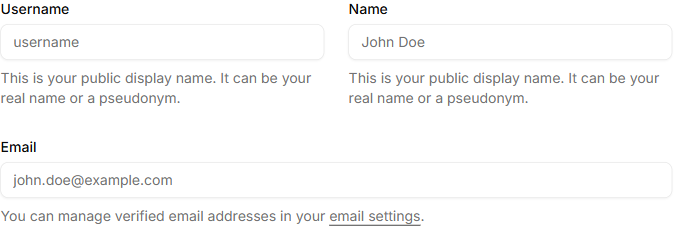

### 2-2. craft.do Bookmark Manager（H: Library / Bookmark 参考）

#### 実デモ（全体）

**▼ 取り入れるパーツ**

**最上段に幅広の検索＋並び替え**（"探す"を主役に）
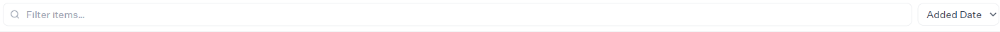

一覧テーブル＝**Category＝淡いピル / Tags＝ミュート文字 / 日付＝右寄せ / 列見出しソート可**
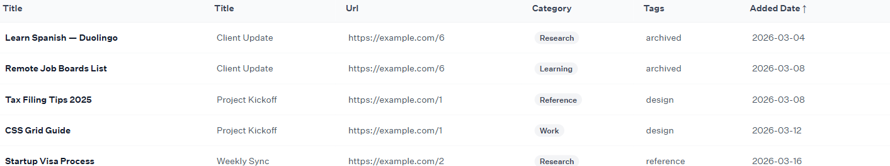

> 参考（テンプレ紹介ページ・主にマーケ）: `./MODERN_UI_DESIGN_BRIEF/ref-h1-craft-template.png`

### 2-3. Studio Admin / Shadcnblocks Admin（I: Data Table Console 参考）

#### Studio Admin / Default（全体）

**▼ 取り入れるパーツ**

**フル機能テーブル**＝行チェックボックス / Status・Plan バッジ / 行末"…"メニュー / **ページネーション**（Rows per page・Page x of y）/ Filter・Sort・Export
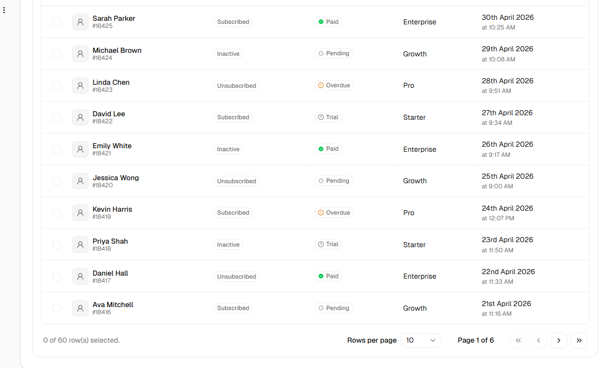

#### Shadcnblocks / Tasks（全体）

**▼ 取り入れるパーツ**

テーブル上部ツールバー＝**Filter入力＋ファセット（Status/Priority）＋View切替＋primary（Create）**
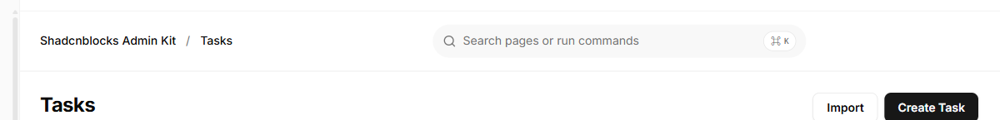

#### Shadcnblocks / Ecommerce（全体）

**▼ 取り入れるパーツ**

KPIを**1枚の枠＋縦罫線で4分割**（小ラベル＋小アイコン＋"previous month"参照＋特大数値＋↑↓色）
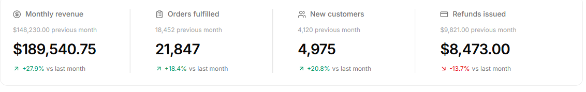

> 参考（同系・全体のみ）: 分析 `./MODERN_UI_DESIGN_BRIEF/ref-i2-analytics.png`（下線型タブ＋KPIトレンド＋カード内ミニ表）／
> ユーザー一覧 `./MODERN_UI_DESIGN_BRIEF/ref-i4-users.png`（コンパクトKPI＋一覧テーブル＋"Add User"）

---

## 3. 取り入れない要素（ClipBox には不要 / 不可）

- **チャート/グラフの多用**（ClipBoxの主役でない。分析の一部に最小限のみ）。
- **サムネ・画像ギャラリー・マゾンリー・大プレビュー**（規約で**不可**）。
- **重厚なマーケ用ヒーロー/ランディング要素**（craftテンプレ紹介ページ的なもの）。
- **eコマース系の派手KPIや多色チャート**（情報過多。KPIは4つ＋控えめトレンドで十分）。
- **多色アクセントの散在**（B/E の反省）。色は**1アクセント＋状態の少数色**に限定。
- **収益/売上系の語彙・ダミー指標**（ClipBoxの語彙＝未判定/判定済み/判定率/本日 に置換）。
- **ダーク一辺倒**（ClipBoxは明色基調。暖色・目に優しい配色も選択肢として残す）。

---

## 4. ClipBox Modern UI Design Brief（設計方針・参考パーツ付き）

### 4-1. デザイン原則（7か条）
1. **余白優先**: セクション間・カード内に大きめ余白。情報量は減らさず"間"で整理。
2. **罫線は最小**: 囲みを減らし、**余白＋極薄背景差＋微影**で領域を示す。
3. **タイポ階層を効かせる**: タイトル>数値>メタ。数値は大きく `tabular-nums`。
4. **1アクセント原則**: ニュートラル基調＋**1アクセント**。状態色（未判定/利用不可/レベル）は少数のドット/淡ピルに限定。
5. **primary最小・副次退避**: カードの主操作は **再生 or 判定** の1つを強調。いいね/あとで/AVP は**hover or "…"メニュー**へ。
6. **エレベーションの段階**: 既定= border＋`ring-1 ring-foreground/5`＋極薄影。hover= 影を一段＋ `-translate-y-0.5`。
7. **数値とトレンドの存在感**: KPIは大数値＋小ラベル＋（あれば）前日比/前月比の↑↓色。

### 4-2. レイアウト
**上部ヘッダー（新規）**: ページ見出し（大）＋副題、**右側に操作群**（フィルタ/並び替え/期間/表示切替）。本体のキーワード検索はヘッダーへ昇格。
例（右寄せアクション群 / 幅広検索ヘッダー）:

**サイドバー**: 7項目維持。**セクション見出しでグルーピング**（例: 判定=Tier1/Tier2、分析=ランキング/分析/検索、システム=AVP/設定）。アクティブ=塗りピル。※項目は増減しない。
例（セクション見出し＋塗りアクティブ）:

**KPI**: 4指標（未判定/判定済み/判定率/本日）。**特大数値＋小ラベル＋（任意）トレンド**。「4カード型」か「1枠4分割型」。未判定にアクセント。
例（4カード型 / 1枠4分割型 / トレンド付き）:

**タブ**: ライブラリ/ランダム/運命の1本 を**セグメント型 or 下線型**に（現行のボタン的タブより軽い）。
例（セグメント型タブ）:

### 4-3. カラー / トークン
- **基調**: ニュートラル（明色）。暖色ペーパー（F系）も選択可。**純黒は避ける**。
- **アクセント**: 1色（F のインディゴ #4f46e5 か、G1風の near-black アクティブ）。状態色＝レベル(同系ドット)/利用不可(赤)/未判定(控えめ強調)。
- **エレベーション**: `border + ring-1 ring-foreground/5 + shadow-xs` → hover `shadow-sm + -translate-y-0.5`。
- **半径/余白**: `--radius` 統一（0.625〜0.75rem）。spacing は 4/8/12/16/24 スケールで統一。

### 4-4. タイポスケール（目安）
ページ見出し 24–28px / セクション 16–18px semibold / **KPI数値 28–32px** / カードタイトル 15–16px semibold /
メタ 12–13px muted / ラベル 11–12px **uppercase tracked** muted。数値は `tabular-nums`。

### 4-5. カード仕様（サムネなし情報カード・モダン版）
- 構成: **タイトル主役** → **ミュートのメタ1行**（レベル=同系色ドット＋名称 / 視聴 / サイズ / 保存先）→ 日付（最終再生/更新, ラベル小）。
- 操作: **主操作（再生 or 判定）を1つ常時表示**。いいね/あとで見る/AVP候補チェックは **hover で出現 or "…" メニュー**（モバイルは常時）。
- 状態: レベル/利用不可は**静かなピル/ドット**。**重複バッジは出さない**。AVP は**チェックボックス**（tooltip「AVPで再生する候補に追加」）。
- 余白多め・角丸統一・hover lift。**5列維持**（密度トグルで compact/table も）。

レベル/タグを"静かに"見せる例（Category=淡ピル・Tags=ミュート・日付右寄せ）:

### 4-6. 密度トグル & テーブル表示
comfortable（既定）/ compact（C系）/ **table（I系）**。
- table: 行ホバー / 整列数値（右寄せ `tabular-nums`）/ スティッキーヘッダ / **ファセットフィルタ**（レベル/保存先/状態）/
  **インライン判定（行内レベル選択）** / 行末"…"メニュー / ページネーション。

例（フル機能テーブル＋ページネーション / 上部ツールバー＝Filter＋ファセット＋primary）:

### 4-7. ランキング / 分布の見せ方
レベル分布・保存先内訳・総合ランキングは**横バー＋数値＋％のリスト**が軽量で読みやすい。
例:

### 4-8. 設定画面
**縦サブナビ＋（ラベル＋入力＋helper text）**で整理。
例:

### 4-9. アクセシビリティ
- 本文 AA（4.5:1）・大文字/数値 3:1。フォーカスリング統一。キーボード操作（タブ送り・行選択・判定）。
- 状態色は色のみに依存せず**アイコン/ラベル併用**。`prefers-reduced-motion` で hover lift を抑制。

---

## 5. 次に作る Variant G / H / I

| | 名称 | 寄せる参考 | 主眼 | 一覧形式 | 目標イメージ |
|---|---|---|---|---|---|
| **G** | Modern Console | G1/G2/G3 | 上部ヘッダー＋操作群、グルーピング・サイドバー、特大KPI、セグメント/下線タブ、余白多め・罫線最小、hover副次アクション、1アクセント | カード（5列・comfortable） | KPI＋サイドバー（下記） |
| **H** | Library / Bookmark | H2 | 検索を主役化、"探す"体験、レベル/状態を**タグ的に静か**に | カード or 軽量リスト | テーブル/タグ（下記） |
| **I** | Data Table Console | I1/I3/I4 | **高機能テーブル**（行選択・ファセット・整列数値・スティッキー・インライン判定・ページネーション・行メニュー） | テーブル | フル機能テーブル（下記） |

G の目標イメージ（KPI／サイドバー）:

H の目標イメージ（検索主役＋タグ的一覧）:

I の目標イメージ（フル機能テーブル）:

- **G = モダン本命**（出荷狙い）。F の骨格＋本ブリーフの視覚原則を全面適用。
- **H = 探す体験**特化（ライブラリ回遊・再発見）。
- **I = さばく/ランキング**特化（大量確認・分析・インライン判定）。
- 3案とも制約継承（サムネなし・重複バッジなし・AVPチェックボックス・運命の1本タブ・実DB/API非接続・本体無変更）。

> 推奨着手順: **G → I → H**（Gで視覚言語を確立 → Iで大量処理 → Hで回遊体験）。

---

## 6. 出典URL & 画像索引（撮影: 2026-06-14, 1440×900, fullPage）

### 全体スクショ
| 画像 | URL |
|---|---|
| ref-g1-dashboard.png | https://shadcn-nextjs-dashboard.vercel.app/dashboard |
| ref-g2-analytics.png | https://shadcn-nextjs-dashboard.vercel.app/dashboard/analytics |
| ref-g3-settings.png | https://shadcn-nextjs-dashboard.vercel.app/dashboard/settings |
| ref-h1-craft-template.png | https://www.craft.do/app-templates/bookmark-manager |
| ref-h2-craft-demo.png | https://www.craft.do/app/bookmark-manager |
| ref-i1-default.png | https://next-shadcn-admin-dashboard.vercel.app/dashboard/default |
| ref-i2-analytics.png | https://next-shadcn-admin-dashboard.vercel.app/dashboard/analytics |
| ref-i3-tasks.png | https://shadcnblocks-admin.vercel.app/original/tasks |
| ref-i4-users.png | https://shadcnblocks-admin.vercel.app/original/users |
| ref-i5-ecommerce.png | https://shadcnblocks-admin.vercel.app/ecommerce/dashboard-1 |

### 採用パーツ切り抜き（上記スクショから生成）
| 切り抜き | 元 | 内容 |
|---|---|---|
| crop-g1-header.png | g1 | 上部ヘッダー（検索＋右アイコン） |
| crop-g1-sidebar.png | g1 | グルーピング・サイドバー＋塗りアクティブ |
| crop-g1-kpi.png | g1 | KPIカード4枚（特大数値） |
| crop-g1-quickactions.png | g1 | Quick Actions 2×2 |
| crop-g2-headeractions.png | g2 | 見出し右のアクション群 |
| crop-g2-kpitrend.png | g2 | KPI＋↑↓トレンド |
| crop-g2-tabs.png | g2 | セグメント型タブ |
| crop-g2-ranking.png | g2 | 横バー・ランキングリスト |
| crop-g3-nav.png | g3 | 設定の縦サブナビ |
| crop-g3-field.png | g3 | フィールド＋helper text |
| crop-h2-search.png | h2 | 幅広検索＋並び替え |
| crop-h2-table.png | h2 | タグ的一覧テーブル |
| crop-i1-table.png | i1 | フル機能テーブル＋ページネーション |
| crop-i3-filters.png | i3 | テーブル上部ツールバー（ファセット） |
| crop-i5-kpi.png | i5 | 1枠4分割KPI |

> 参考スクショ・切り抜きは**第三者サイト**の画面（社内デザイン参考目的）。出典は上表のとおり。
> 個人情報・実動画名は含まない（参考データも合成）。本ステップはコード未変更（追加は `_review/modern/` のみ）。
