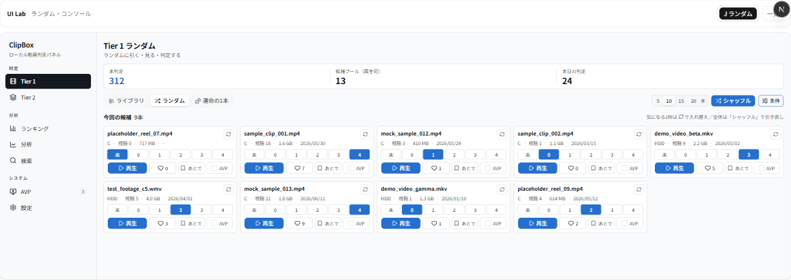
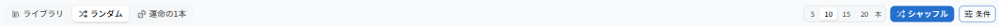
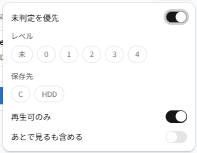
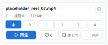

# UIラボ Variant J — ランダム・コンソール レビュー（2026-06-14）

Tier1「ライブラリ」の **Variant J（ライブラリ・コンソール）** と同じテイストで、Tier1 内タブの
**「ランダム」** を再設計したモック案です。ライブラリ J のカード表現・数値レベルボタン・寒色アクセント・
高密度レイアウトを保ちつつ、**「引く（シャッフル）／候補を入れ替える／見て判定する」** の主導線を前面に出しました。

- URL: `/lab/tier1-random/variant-j`
- 対象タスク: Tier1「ランダム」（未判定をランダムに引いてさばく）。サムネなし情報カード前提。
- 制約: 実 DB/API/localStorage 非接続・本体無変更・既存 A〜J 無変更（モック専用・合成データ）。寒色（ライブラリ J の THEME 流用）。

> 注: スクショ左端の細いナビは**本体 `SidebarNav`**（ルートレイアウト由来）。J 本体は中央の枠内（`ModernSidebar`＋main）です。

---

## 全体

KPI は**簡略表示**（未判定／候補プール（再生可）／本日の判定）。タブは左にセグメントで強調し、
右クラスタに **本数（5/10/15/20）・シャッフル・条件** を1段で収めました。

---

## 工夫ポイント（パーツ）

### 1. 操作ツールバー（タブ左＋引く操作を右に集約）
ライブラリ J の「タブ左・操作右」を踏襲。右は **引く本数のセグメント**＋**主ボタン「シャッフル」**（＝全体の引き直し）＋
**「条件」Popover**（漏斗バッジで有効条件数を表示）。

### 2. ランダム条件パネル（Popover に畳む）
**未判定を優先**（トグル）／**レベル**(未/0–4 chip)／**保存先**(C/HDD chip)／**再生可のみ**（トグル）／
**あとで見るも含める**（トグル）。普段は畳んでおき、必要時だけ開く（ライブラリ J のフィルタ流儀と同じ）。

### 3. ランダム候補カード（ライブラリと同一表現＋入れ替え）
タイトル→メタ1行→**数値レベルボタン**→操作1行（**再生／♡／あとで／AVP**、あとで・AVP は等幅）。
右上に **入れ替えボタン（↻）** を載せ、**その1枠だけ**別候補へ差し替えできるようにしました。

---

## ライブラリ J から継承した点
- 寒色アクセント＋クールニュートラルの THEME（同一値）。
- サムネなしの情報カード（タイトル主役→メタ1行→数値レベルボタン→操作1行）。
- レベルは**数値ボタンの単一表現**（バッジ/プルダウンの重複なし）。
- **あとで／AVP を等幅**・あとで見るは「あとで」ラベル。
- KPI は低め・コンパクト（ここではセルを絞って簡略表示）。
- タブを左にセグメントで強調・条件は Popover へ畳む。
- 判定済み/利用不可は薄く（カードは `dimJudged`／利用不可は常時＋操作 disabled）。
- `ModernSidebar`／`LevelButtons`／`useMockCard`／`labMock` を **read-only 再利用**。

## ランダム画面として新しく工夫した点
- **「引く」主導線**: 主ボタンを「シャッフル」にして、ライブラリの「探す」より**引いてさばく**動作を前面化。
- **本数セレクタ（5/10/15/20本）** を常設し、1回の引き量をすぐ変えられる。
- **個別の入れ替え（↻）**: 気になる1枠だけ残して他を差し替える、という細かい引き直しを表現。
- **「今回の候補 N本」** の小見出し＋ヒント文で、いま見ているのが「引いた候補セット」であることを明示。
- 条件に **未判定を優先／あとで見るを含める** を追加（ランダム特有の引き方の調整）。

---

## レビュー観点（調整できる点）
気になる箇所があれば番号でご指摘ください。微調整します。

1. **主ボタンの語**: いまは「シャッフル」。本体に合わせるなら踏襲、より直感的にするなら「引き直す／次を引く」なども可。
2. **入れ替えの置き方**: 現状はカード右上の ↻ アイコン。ホバー時のみ表示／ラベル付きボタン化なども可。
3. **本数の既定**: 既定 10本。5本既定や、最後の選択を記憶（モックの範囲）も可。
4. **条件の既定**: いまは「未判定を優先 ON・再生可のみ ON・あとで除外」。本体のランダム（未判定のみ）に寄せるかは要相談。
5. **候補の見せ方**: グリッド5列。1行に絞って大きく見せる／件数バッジを足す等も可。
6. **空状態**: 条件で0件のときの文言・誘導（いまは「条件をゆるめてシャッフル」）。

---

_本ドキュメントは確認・レビュー用です。スクショは本ラボ（モック専用・合成データ）のもので、個人情報・実動画名は含みません。
条件パネルは Radix Popover がルート直下へ portal される都合上、当該クロップのみ既定テーマ（寒色 THEME 外）で表示されます。_
