# 統合 Variant K スクリーンショットレビュー

> 作成日: 2026-06-29 ／ 最終更新: 2026-06-30（Tier1 節を最新フィードバック反映で全面更新）
> 対象: /lab/variant-k/*
> 目的: 統合 Variant K の全画面レビュー用スクリーンショット記録

初回画像は `./variant-k-full-report-20260629/` に保存。**Tier1 の最新画像は `./variant-k-tier1-final-20260630/`**（KPI拡大・いいねインクリメント・状態識別・メタ1行・運命の1本の抽選アニメ/判定固定）に保存。すべて UI LAB モック（合成データ）で、実 API/DB には接続していない。

## Summary

- **全体所感**: 共通シェル（左サイドバー＝判定/消化・再生/探す・俯瞰/システムのグルーピング＋下部 Runtime control）が全画面で一貫。STAGE7 監査（§1/§2/§7・§3-1/§3-2）の修正がすべて画面上で確認できる。視聴日数を主役・視聴回数/更新日/登録日/サムネは非表示の方針も全画面で守られている。
- **2026-06-30 最新反映（本レポートの Tier1 節を全面更新）**: ① KPI はカード枠サイズ据え置きでラベル文字・数値を拡大。② いいねを On/Off トグルから**インクリメント式**（押すたびに +1）へ。③ カード/テーブルの状態識別を統一＝**利用不可はグレーアウト・未判定は左端アクセントバー・判定済みは無印**（「判定済みを薄くする」トグルは廃止）。④ カードのメタ情報を1行に簡素化（ストレージと「判定 Lv●」を削除・「視聴日数○○日」→「視聴○○日」）。⑤ 運命の1本は**当選1本を固定**し、判定してもカードは切り替わらず「引く」押下時のみ入れ替え。引く直後に**約1秒の抽選アニメーション**（候補をちらつかせ減速して1本に当てる）を追加。
- **2026-07-01 最新反映（本レポートの Tier2 節を全面更新）**: **Tier2 を Tier1 流用案で全面リデザイン**。案1/案2 比較トグルと画面上の説明文を全撤去し、KPI拡大・漏斗フィルタ/2段並び替え/カード⇔テーブル/上下ページャ・状態識別（未選別=アクセントバー）・メタ1行（視聴◯日/作成日/選別日）・いいねインクリメント・運命の1本の抽選アニメ/当選固定まで Tier1 と同等にした（語彙だけ Tier2＝選別/選別日）。`09`〜`12c`。
- **特に見てほしい箇所**:
  1. Tier1（2026-06-29 改修反映）: KPI パネルを見出し「Tier1」の右へ移動し横一列（名→数値→バー/折れ線）に整え3タブ共通化（`02`）。ツールバーの囲い枠を撤去・フィルタは漏斗（`04`）。件数/ページ件数/前後送りをカード・テーブルの**直上と直下**両方に配置（既定100件）。カードは**5列**（設定 表示タブの「カード列数」で増減・`31`）。テーブルは操作を**再生/いいね/あとで見る/AVP候補の4列**に分割し**列幅をドラッグ調整**可能（`03`）。ランダムは引き数 **10/20/30**（既定10・見出し/候補件数テキストなし・`06`）。運命の1本は囲い枠/見出しを撤去しボタンとトグルを横並びにして引いた1本を**全幅ワイドカード**（メタ一段・操作一段）で表示（`07`）。レベルは 未/0/1/2/3/4 の6択。
  2. ランキング/検索の Tier1・Tier2 列が**行内プルダウン**（`21`/`22`/`26`）。対象外は「—」表示。
  3. AVP の総合スコアが**公式再計算の整数**（`16`/`18`、例 9,180 pt（総合 1位））でランキング/検索と桁一致。「AVPで再生」を主操作として強調（`18`）。
  4. 設定バックアップに**手動バックアップボタンが無い**（`33`）。
  5. **入れ子チロームの二重ナビ**（後述・既知）と、**狭幅でルート外側サイドバーが畳まれない**点（`35`）。
- **既知の未反映事項へのリンク**:
  - 監査記録: [`STAGE7_FEEDBACK_AUDIT.md`](./STAGE7_FEEDBACK_AUDIT.md)（§1/§2/§7・§3-1/§3-2 は対応済み、§3-3 対応不要、§3-4 のみ延期＝本体バックエンド作業・必要性も未確定）。
  - 実装経緯: リポジトリ直下 `CHANGELOG.md`（2026-06-29 エントリ）。
- **今回スクリーンショットで確認できた範囲**: 9画面＋主要状態（カード/テーブル、Popover、再生中ハイライト、Tier1/Tier2 の状態識別・抽選アニメ、AVP 4本投入・再生後・利用不可ブロック、ランキング詳細列/全表示、検索 空/結果/詳細フィルタ/利用不可、設定4タブ＋スキャン完了、analysis 仮、狭幅ナビ）。
- **未確認事項**:
  - 実 API/DB 連携時の値・件数（本モックは合成17件）。§3-4 の API 束は UI に現れないため本レポート対象外。
  - あとで見るの「解除後」差分（`15` は任意のため未取得）。
  - 個別ホバー Tooltip の内容差分（静的撮影のため未網羅）。

## Screenshot Index

| # | 画面 | 状態 | スクリーンショット | レビュー観点 |
|---|---|---|---|---|
| 01 | ランディング | 全体 | [01-landing-full](./variant-k-full-report-20260629/01-landing-full.png) | 8画面カードの導線・説明文・入れ子ナビ |
| 02 | Tier1 ライブラリ | カード（最新） | [01-library-card](./variant-k-tier1-final-20260630/01-library-card.png) | KPI拡大・いいねインクリメント・未判定アクセントバー/利用不可グレーアウト/判定済み無印・メタ1行（視聴◯日/作成日/判定日） |
| 03 | Tier1 ライブラリ | テーブル（最新） | [02-library-table](./variant-k-tier1-final-20260630/02-library-table.png) | 同識別をテーブルにも適用（未判定=左アクセントバー/利用不可=薄表示/判定済み=無印）・いいねインクリメント・操作4列分割 |
| 04 | Tier1 ライブラリ | フィルタ Popover | [04-tier1-filter-popover](./variant-k-full-report-20260629/04-tier1-filter-popover.png) | 漏斗→レベル/保存先/状態/再生可・有効数バッジ（「判定済みを薄くする」は最新版で廃止） |
| 05 | Tier1 ライブラリ | 並び替え Popover | [05-tier1-sort-popover](./variant-k-full-report-20260629/05-tier1-sort-popover.png) | 5項目＋降順/昇順の2段 |
| 06 | Tier1 ランダム | 多本提示（最新） | [03-random](./variant-k-tier1-final-20260630/03-random.png) | 未判定カードにアクセントバー・メタ1行・インクリメントいいね・引き数10/20/30 |
| 07 | Tier1 運命の1本 | 抽選アニメーション | [04-fate-spin](./variant-k-tier1-final-20260630/04-fate-spin.png) | 引く→約1秒の抽選（ちらつき＋減速＋当たりハイライト・「抽選中…」） |
| 07b | Tier1 運命の1本 | 当選1本（全幅ワイド） | [05-fate-result](./variant-k-tier1-final-20260630/05-fate-result.png) | 当選1本を全幅ワイドで固定表示・未判定アクセントバー・メタ1行 |
| 07c | Tier1 運命の1本 | 判定してもカード固定 | [06-fate-judged-stays](./variant-k-tier1-final-20260630/06-fate-judged-stays.png) | レベル付与でカードは切り替わらず判定日反映・アクセントバー消失 |
| 08 | Tier1 ライブラリ | 再生中ハイライト | [08-tier1-playing-highlight](./variant-k-full-report-20260629/08-tier1-playing-highlight.png) | amber ハイライト優先 |
| 09 | Tier2 ライブラリ | カード（最新・Tier1流用） | [01-library-card](./variant-k-tier2-final-20260701/01-library-card.png) | KPI拡大・いいねインクリメント・未選別アクセントバー/利用不可グレーアウト/選別済み無印・メタ1行（視聴◯日/作成日/選別日）・選別レベル未/0..4 |
| 10 | Tier2 ライブラリ | テーブル（最新） | [02-library-table](./variant-k-tier2-final-20260701/02-library-table.png) | 同識別をテーブルにも適用（未選別=左アクセントバー/利用不可=薄表示/選別済み=無印）・操作4列分割・いいねインクリメント |
| 11 | Tier2 ランダム | 多本提示（最新） | [03-random](./variant-k-tier2-final-20260701/03-random.png) | 未選別のみトグル＋引き数10/20/30・未選別カードにアクセントバー・メタ1行 |
| 12 | Tier2 運命の1本 | 抽選アニメーション | [04-fate-spin](./variant-k-tier2-final-20260701/04-fate-spin.png) | 引く→約1秒の抽選（ちらつき＋減速＋当たりハイライト・「抽選中…」） |
| 12b | Tier2 運命の1本 | 当選1本（全幅ワイド） | [05-fate-result](./variant-k-tier2-final-20260701/05-fate-result.png) | 当選1本を全幅ワイドで固定表示・未選別アクセントバー・メタ1行 |
| 12c | Tier2 運命の1本 | 選別してもカード固定 | [06-fate-selected-stays](./variant-k-tier2-final-20260701/06-fate-selected-stays.png) | 選別付与でカードは切り替わらず選別日反映・アクセントバー消失 |
| 14 | あとで見る | 3セクション全体 | [14-watchlater-overview](./variant-k-full-report-20260629/14-watchlater-overview.png) | 未処理/確認・見直し/処理済み候補・5列 |
| 16 | AVP | 初期（候補テーブル＋空2×2） | [16-avp-initial](./variant-k-full-report-20260629/16-avp-initial.png) | 公式スコア＋総合順位・タイトル省略 |
| 18 | AVP | 再生対象4本 | [18-avp-playset-4](./variant-k-full-report-20260629/18-avp-playset-4.png) | 2×2・「AVPで再生」強調 |
| 19 | AVP | AVP再生後ハイライト | [19-avp-playing-highlight](./variant-k-full-report-20260629/19-avp-playing-highlight.png) | 再生中ハイライト・あとで見る非解除 |
| 20 | AVP | 利用不可は追加不可 | [20-avp-unavailable-blocked](./variant-k-full-report-20260629/20-avp-unavailable-blocked.png) | 全表示時の利用不可行 disabled |
| 21 | ランキング | 既定（再生可能だけ） | [21-ranking-default](./variant-k-full-report-20260629/21-ranking-default.png) | Tier 列プルダウン・公式スコア |
| 22 | ランキング | 詳細列ON | [22-ranking-details-on](./variant-k-full-report-20260629/22-ranking-details-on.png) | 基礎点/補正/倍率/保存先 |
| 22b | ランキング | 詳細フィルタ Popover | [22-ranking-detail-popover](./variant-k-full-report-20260629/22-ranking-detail-popover.png) | 期間/最低レベル/保存先/再生可/詳細列を畳む |
| 23 | ランキング | 全動画（利用不可行） | [23-ranking-all-unavailable](./variant-k-full-report-20260629/23-ranking-all-unavailable.png) | 利用不可の薄表示・操作 disabled |
| 25 | 検索 | 空状態 | [25-search-empty](./variant-k-full-report-20260629/25-search-empty.png) | キーワード未入力の空状態 |
| 26 | 検索 | 結果 | [26-search-results](./variant-k-full-report-20260629/26-search-results.png) | Tier 列プルダウン・順位列なし |
| 27 | 検索 | 詳細フィルタ Popover | [27-search-filter-popover](./variant-k-full-report-20260629/27-search-filter-popover.png) | キーワード以外を畳む・有効数バッジ |
| 28 | 検索 | 利用不可行＋バッジ | [28-search-unavailable](./variant-k-full-report-20260629/28-search-unavailable.png) | タイトル横「利用不可」・保存先詳細列 |
| 29 | 設定 | スキャン（待機） | [29-settings-scan](./variant-k-full-report-20260629/29-settings-scan.png) | scan-first・4ステップ |
| 30 | 設定 | スキャン完了＋詳細 | [30-settings-scan-complete](./variant-k-full-report-20260629/30-settings-scan-complete.png) | 進捗→結果サマリー→詳細折りたたみ |
| 31 | 設定 | 表示 | [31-settings-display](./variant-k-full-report-20260629/31-settings-display.png) | メタ/バッジ項目・レベル表示対象・カード列数（Tier1へ反映） |
| 32 | 設定 | フォルダ | [32-settings-folders](./variant-k-full-report-20260629/32-settings-folders.png) | Tier1/Tier2フォルダ表示名 |
| 33 | 設定 | バックアップ | [33-settings-backup](./variant-k-full-report-20260629/33-settings-backup.png) | 自動主役・手動ボタン無し |
| 34 | analysis | 仮ページ | [34-analysis-placeholder](./variant-k-full-report-20260629/34-analysis-placeholder.png) | 採用判断対象外・共通レイアウト波及のみ |
| 35 | レスポンシブ | 狭幅ナビ | [35-responsive-mobile-nav](./variant-k-full-report-20260629/35-responsive-mobile-nav.png) | variant-k モバイル横スクロールナビ |

> 補足: `13`（Tier2 利用不可）は `09`/`10` のライブラリに利用不可カードが含まれるため統合。`15`（あとで見る解除後）・`17`（AVP 候補テーブル単独＝`16`に内包）・`24`（ランキング ソート状態）は任意のため未取得。

## 画面別レビュー

### 1. ランディング

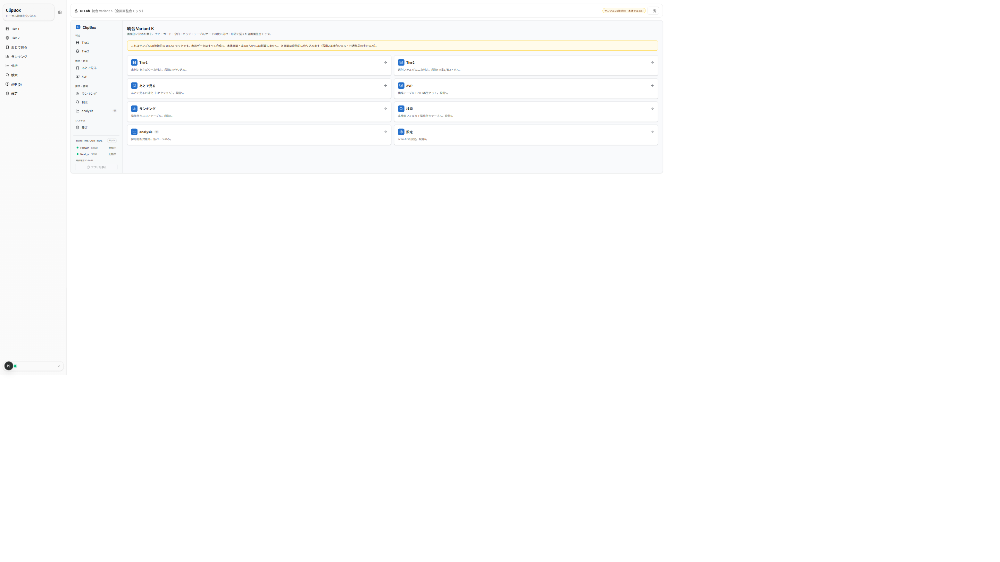

- **見るべき点**: 8画面（Tier1/Tier2/あとで見る/AVP/ランキング/検索/analysis/設定）をカードで一覧。各カードに1行説明。上部に「サンプルDB接続前・本体ではない」「一覧」リンク。左に variant-k 専用サイドバー＋下部 Runtime control（FastAPI/Next.js・アプリを停止）。
- **気になる点**: ラボ/ルートの外側 `SidebarNav`（さらに左の細い列＝Tier1/Tier2/…/設定＋ローカル動画判定パネル）が variant-k シェルの外側に重なり、**左に二重のナビ**が見える。レビューは中央の variant-k シェルが対象（既知のラボ入れ子制約）。
- **STAGE7監査との関係**: 画面横断のシェル方針（Runtime control をサイドバー下部に残す）を満たす。

### 2. Tier1（最新フィードバック反映・2026-06-30）

ヘッダは見出し「Tier1」直下に大型 KPI パネル（未判定/判定済み/判定率＋バー/今日の処理目安＋スパークライン）。**KPI はカード枠のサイズを変えずにラベル文字と数値だけを拡大**して視認性を上げた。KPI はタブ切替の上に1回だけ描画し、ライブラリ/ランダム/運命の1本の3タブで共通。

今回の3タブ共通のカード仕様（最新反映分）:

- **いいねはインクリメント式**: 押すたびに +1（On/Off トグルではない）。1回押すとハートが塗りつぶしになり、件数が積み上がる。
- **状態識別**: 利用不可＝カード全体をグレーアウト、未判定（レベル -1）＝左端にテーマカラー（`--primary`）のアクセントバー、判定済み＝グレーアウトもアクセントバーも無し（無印で識別）。「判定済みを薄くする」トグルは廃止。
- **メタ情報を1行に簡素化**: ストレージ表記と最下行「判定 Lv●」を削除し、「視聴日数 ○○日」→「視聴○○日」に短縮。残すのは 視聴◯日／作成日／判定日 の3項目で flex の1行にまとめた。

#### ライブラリ（カード）

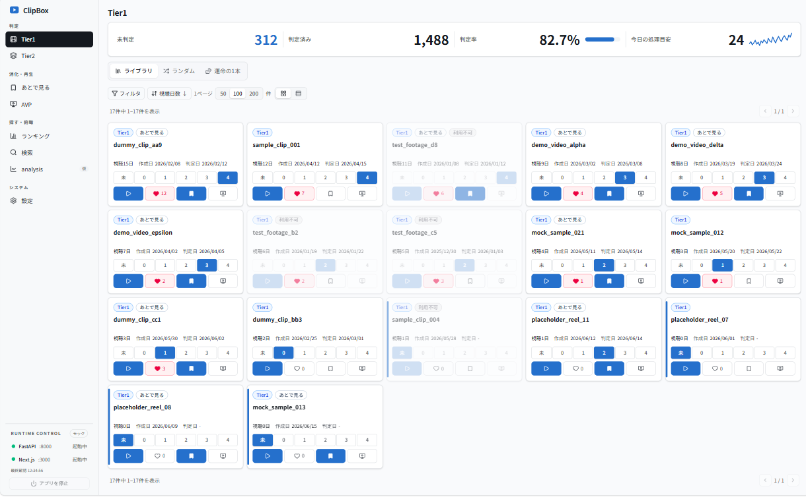

- **見るべき点**: KPI の数値（312 / 1,488 / 82.7% / 24）が拡大。各カードのメタは「視聴15日 作成日 … 判定日 …」の1行。いいねは ♥＋件数のインクリメント。未判定カード（`placeholder_reel_07`/`08`・`mock_sample_013` 等）は左端にアクセントバー、利用不可カード（`test_footage_*` 等）はグレーアウト、判定済みカードは無印。

#### ライブラリ（テーブル）

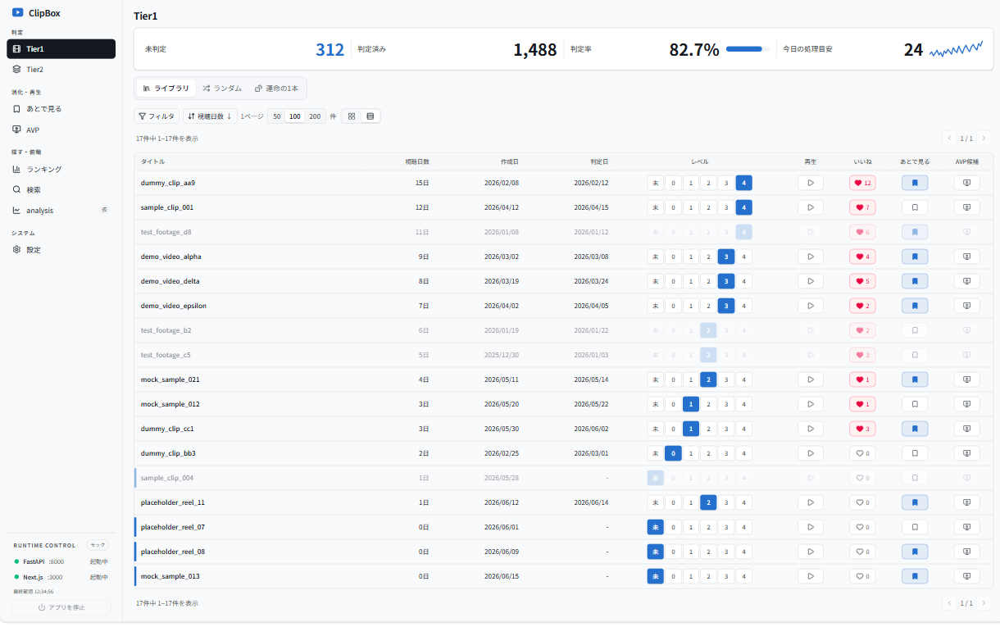

- **見るべき点**: テーブル表示でもカードと同じ状態識別を適用。**未判定行は先頭セル左端にアクセントバー**、利用不可行はグレーアウト、判定済み行は無印。いいね列もインクリメント。操作は 再生／いいね／あとで見る／AVP候補 の4列に分割し、列幅はドラッグ調整可（メモリのみ）。

#### ランダム

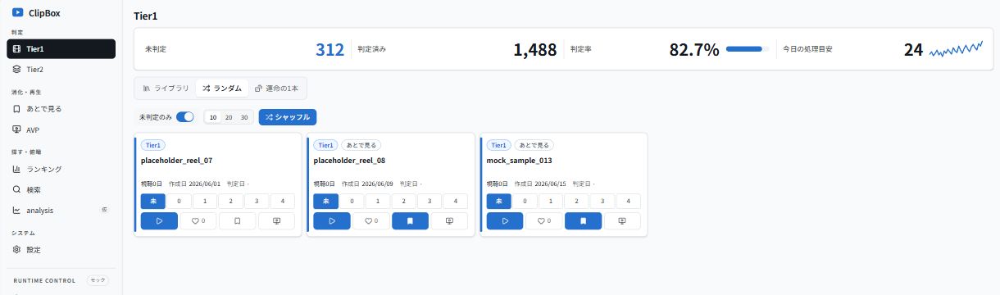

- **見るべき点**: 未判定かつ再生可能から多本提示。各カードに未判定アクセントバー・1行メタ・インクリメントいいね。引き数 10/20/30（既定10）・`未判定のみ` トグル（既定オン）はそのまま。

#### 運命の1本（抽選アニメーション → 当選 → 判定固定）

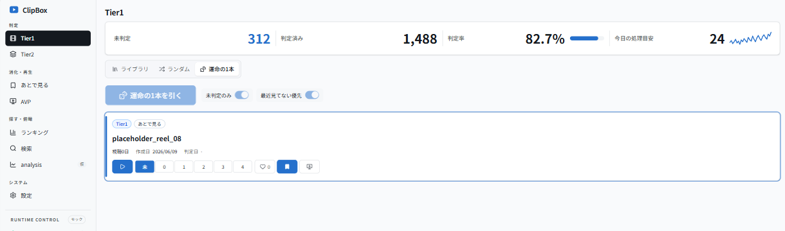
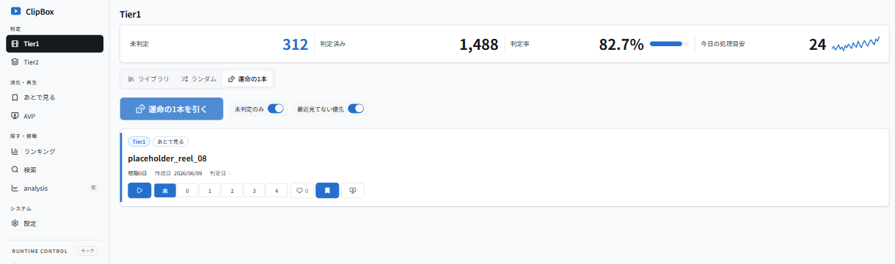
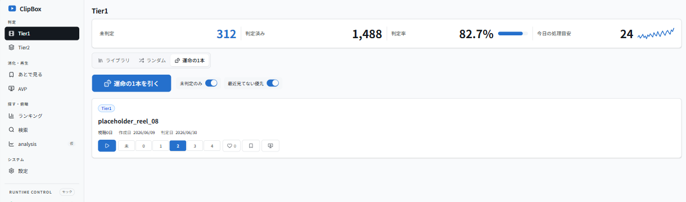

- **抽選アニメーション**（`04`）: 「運命の1本を引く」を押すと約1秒のインターバルで候補をスロット風にちらつかせ、減速して1本に当たる。当たりカードをハイライト（リング）し、ボタンは「抽選中…」表示・トグルは無効。
- **当選1本**（`05`）: 当選した1本を全幅ワイドカードで固定表示。未判定ならアクセントバー、メタは1行。「運命の1本を引く」を再度押したときだけ次の1本へ入れ替わる。
- **判定してもカードは固定**（`06`）: 当選カードでレベルを選んでも次の動画に**切り替わらず**、同じ1本のまま判定日（例: `2026/06/30`）が入り、未判定アクセントバーが消える（＝判定済み化）。従来は判定すると候補から外れて勝手に次へ進んでいたのを修正した。

#### フィルタ / 並び替え Popover ・ 再生中ハイライト（2026-06-29 取得分・構造は不変）

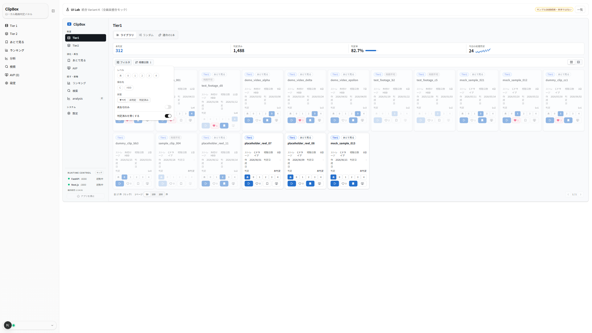
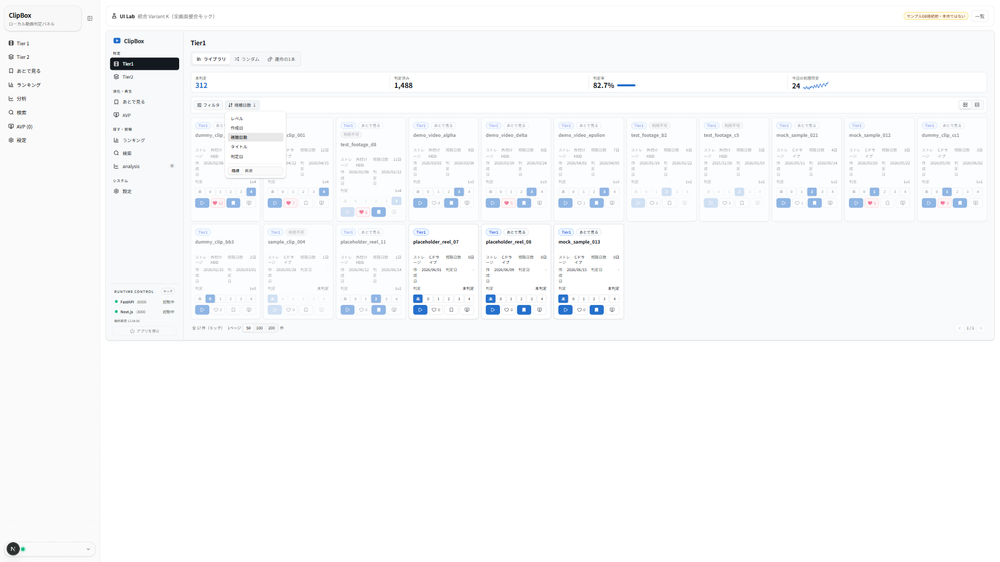
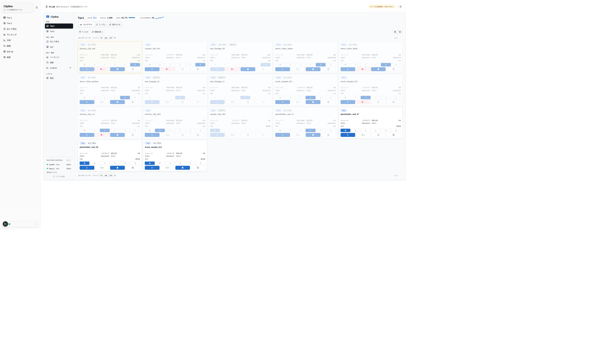

- **フィルタ Popover**: 漏斗→Popover。レベル(未/0–4 chip)・保存先(C/HDD)・状態(すべて/未判定/判定済み)・再生可のみ＋有効フィルタ数バッジ。※「判定済みを薄くする」トグルは最新版で廃止（上記の状態識別に置換）。
- **並び替え Popover**: 1段目＝レベル/作成日/視聴日数/タイトル/判定日、2段目＝降順/昇順。
- **再生中ハイライト**: 押したカード/行が再生中（amber）ハイライト。アクセントバーより優先。

### 3. Tier2（Tier1流用案を正式採用・最新・2026-07-01）

Tier2 を Tier1 と同じ構造・サイズ感に作り替えた（**Tier1流用案を正式採用**）。語彙だけ Tier2（選別／未選別／選別日／tier2_status）。案1/案2 の比較トグルと画面上の説明文（「Tier1と近い操作感で〜」「Tier2対象を一覧で確認し〜」「未選別優先（固定条件）」等）は**全撤去**。見出し「Tier2」直下に大型 KPI（未選別/選別済み/選別率/本日の選別数）を3タブ共通で1回だけ描画。

Tier1 と同じ3タブ共通カード仕様:

- **いいねはインクリメント式**（押すたびに +1）。
- **状態識別**: 利用不可＝グレーアウト、未選別＝左端にテーマカラー（`--primary`）のアクセントバー、選別済み(0..4)＝無印。
- **メタ情報を1行に簡素化**: 視聴◯日／作成日／選別日（ストレージ表記と「選別 Lv●」は削除）。選別レベルボタンは 未/0/1/2/3/4。

#### ライブラリ（カード）

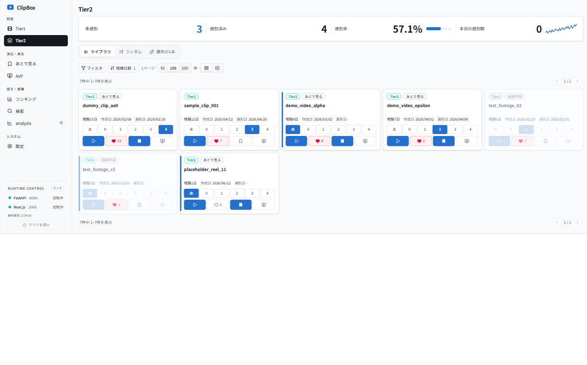

- **見るべき点**: Tier1 と同じ漏斗フィルタ／2段並び替え／カード⇔テーブル切替／件数・上下ページャ。各カードは1行メタ（視聴◯日 作成日 選別日）・インクリメントいいね・選別レベル 未/0..4。未選別カードは左アクセントバー、利用不可カードはグレーアウト、選別済みは無印。

#### ライブラリ（テーブル）

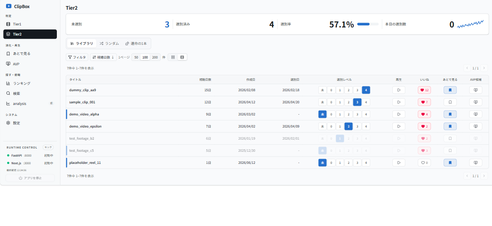

- **見るべき点**: テーブルでもカードと同じ状態識別（未選別行=先頭セル左アクセントバー／利用不可行=薄表示／選別済み=無印）。操作は 再生／いいね／あとで見る／AVP候補 の4列分割＋列幅ドラッグ。選別レベル列は 未/0..4。
- **STAGE7監査との関係**: §7-C 共通部品（Tier2 も `VariantKCardActions`/`VariantKLevelButtons`）を Tier1 と共有。

#### ランダム

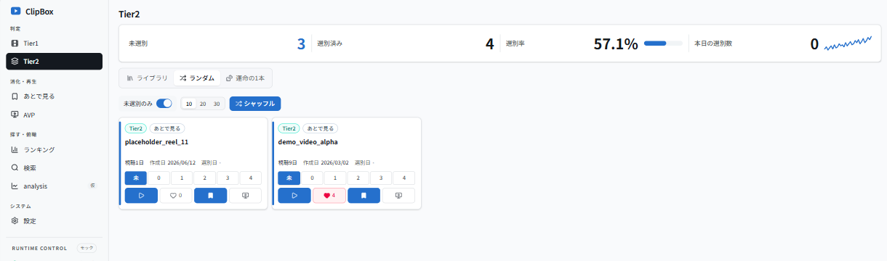

- **見るべき点**: 「未選別のみ」トグル＋引き数10/20/30＋シャッフルで**複数枚**提示（設定連動の列数）。未選別カードにアクセントバー・1行メタ・インクリメントいいね。

#### 運命の1本（抽選アニメーション → 当選 → 選別固定）

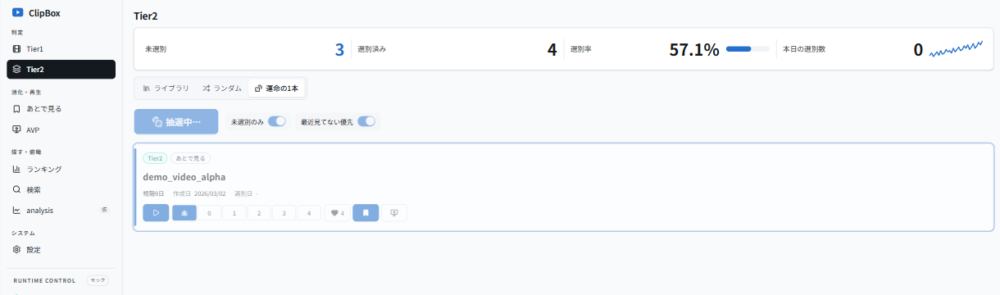
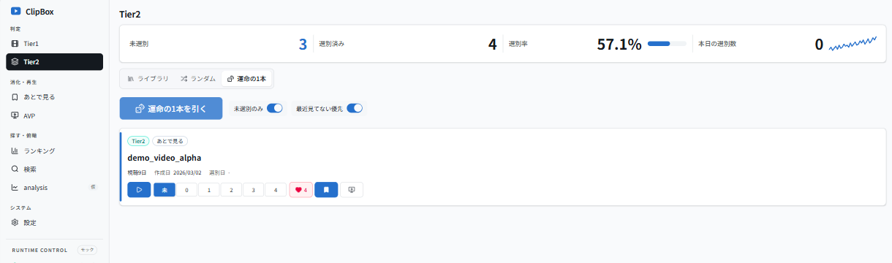
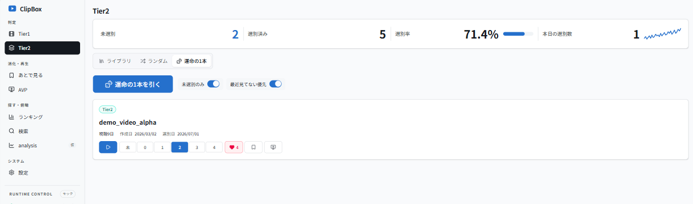

- **抽選アニメーション**（`04`）: 「運命の1本を引く」を押すと約1秒のインターバルで候補をスロット風にちらつかせ、減速して1本に当たる（当たりカードをハイライト・ボタンは「抽選中…」）。
- **当選1本**（`05`）: 当選した1本を全幅ワイドカードで固定表示。未選別ならアクセントバー、メタは1行。
- **選別してもカードは固定**（`06`）: 当選カードで選別レベルを選んでも次の動画に**切り替わらず**、同じ1本のまま選別日（例: `2026/07/01`）が入りアクセントバーが消える（＝選別済み化）。次の1本へは「運命の1本を引く」を押したときだけ入れ替わる。

### 4. あとで見る

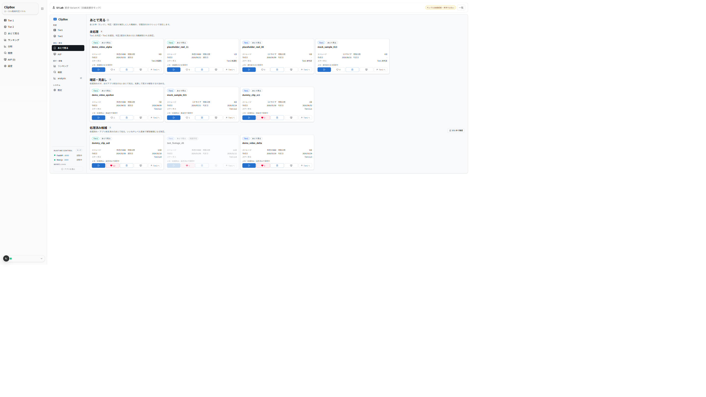

- **見るべき点**: 未処理／確認・見直し／処理済み候補の3セクション。PC幅5列基準。カード操作は解除（栞×）variant＋AVP候補＋該当Tierへ戻る導線。ステータスは `Tier1 Lv3`/`Tier2 未選別` で混同しない。
- **気になる点**: 「解除後」の状態差分（item 15）は未取得。必要なら追補可能。
- **STAGE7監査との関係**: §2-5（5列）/§7-C 反映。

### 5. AVP

#### 初期（候補テーブル＋空2×2）

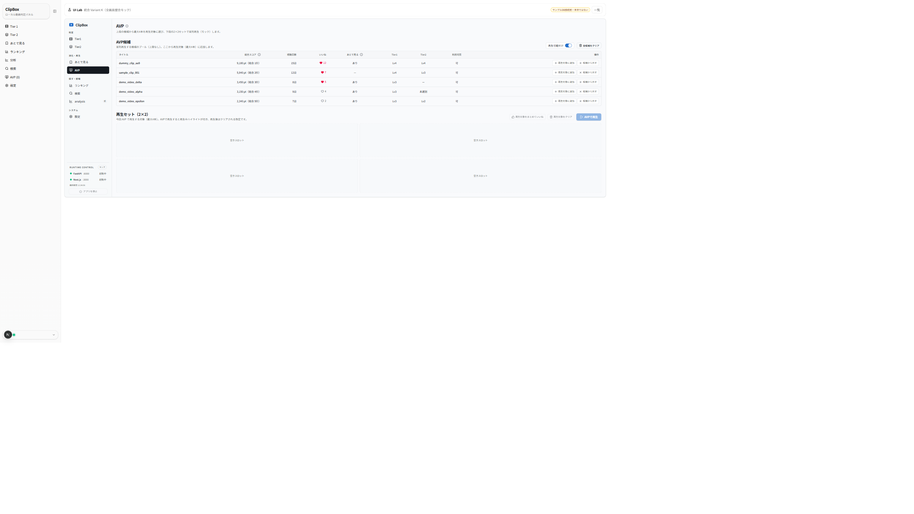

- **見るべき点**: 候補テーブルの総合スコアが **9,180 pt（総合 1位）** 等の公式整数。タイトル省略（全名 hover）。あとで見る列は表示のみ。空2×2は控えめプレースホルダ。
- **STAGE7監査との関係**: §3-2（公式統一）/§2-2（タイトル省略）反映。

#### 再生対象4本

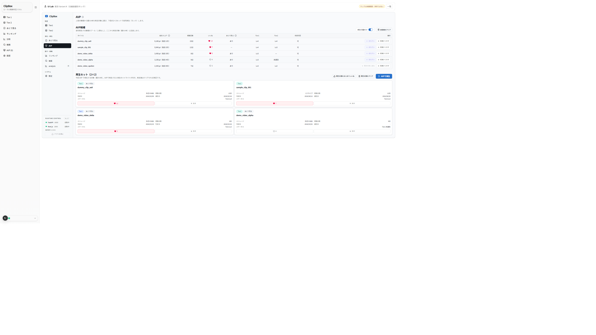

- **見るべき点**: 上位4本を2×2へ。下段ヘッダ右に **「AVPで再生」を強調**（primary・大きめ）。「再生対象をまとめていいね」「再生対象をクリア」。
- **STAGE7監査との関係**: §2-1（ボタン名）/§2-6（強調）/§1-C（主要ボタンの Tooltip 撤去）反映。

#### AVP再生後ハイライト

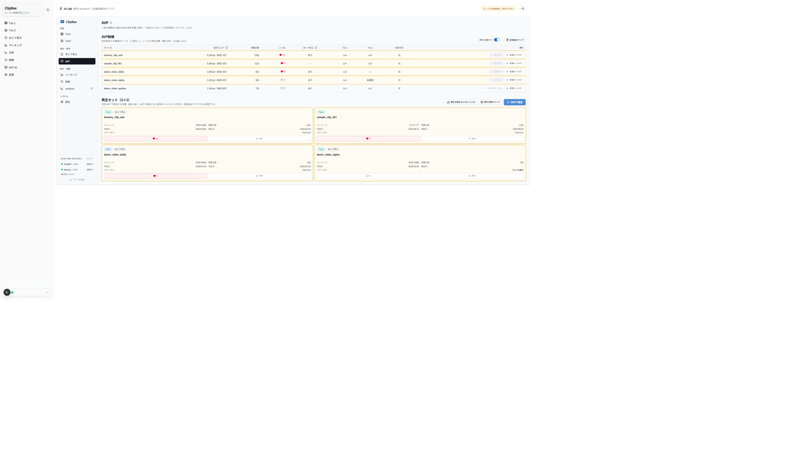

- **見るべき点**: 再生対象が再生中ハイライト。あとで見るは自動解除しない。

#### 利用不可は追加不可

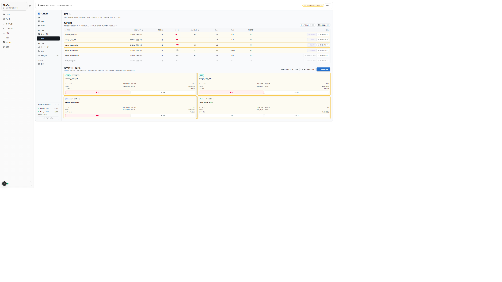

- **見るべき点**: 「再生可能だけ」OFF で利用不可候補が現れ、「再生対象に追加」が disabled（理由は残した title のみ）。

### 6. ランキング

#### 既定表示

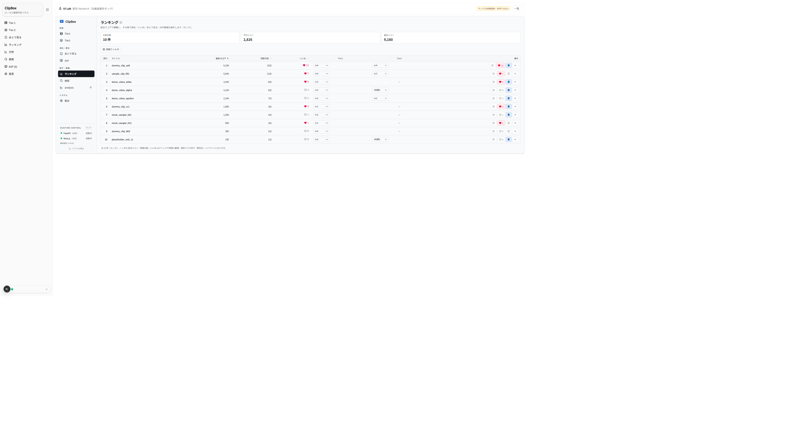

- **見るべき点**: 概要KPI（対象本数/平均/最高 9,180）。Tier1/Tier2 列が**プルダウン**（対象外は「—」）。ヘッダ（総合スコア/視聴日数/いいね）クリックで降順⇔昇順。既定＝再生可能だけ。
- **STAGE7監査との関係**: §1-B（Tier 列プルダウン）反映。

#### 詳細列ON ＋ 詳細フィルタ Popover

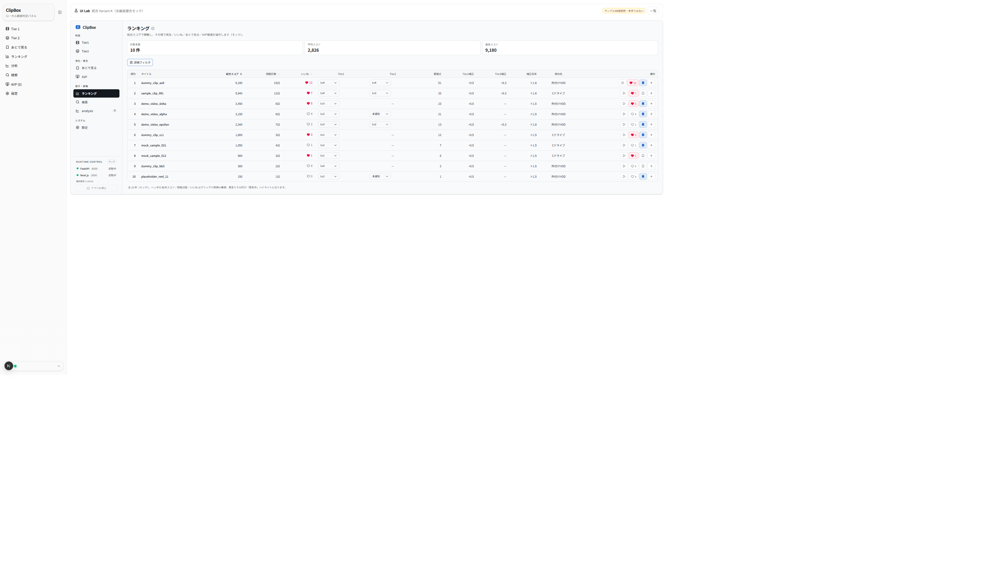
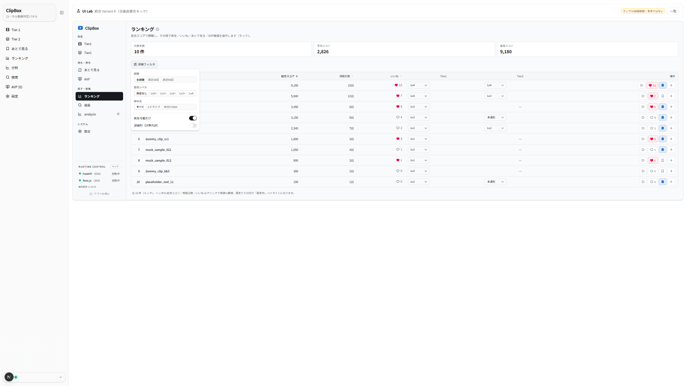

- **見るべき点**: 詳細列で 基礎点/Tier1補正(+0.5)/Tier2補正(+0.3)/補正倍率(×1.8)/保存先 を表示し総合スコアと整合。詳細フィルタは漏斗 Popover に畳む（有効数バッジ）。1920px で列はあふれず収まる。
- **STAGE7監査との関係**: §2-3/§2-8（詳細フィルタ畳み）反映。

#### 全動画（利用不可行）

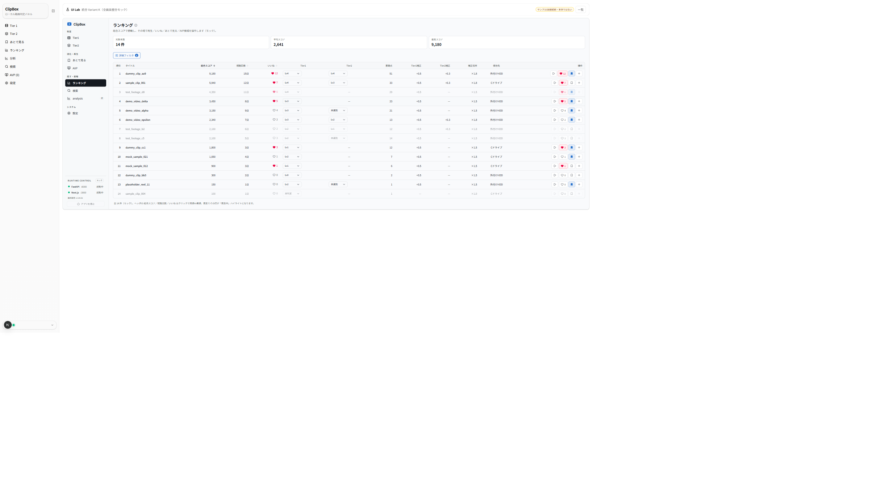

- **見るべき点**: 「再生可能だけ」OFF で利用不可行が薄表示＋操作 disabled。値編集で行を即時除去しない方針。

### 7. 検索

#### 空状態

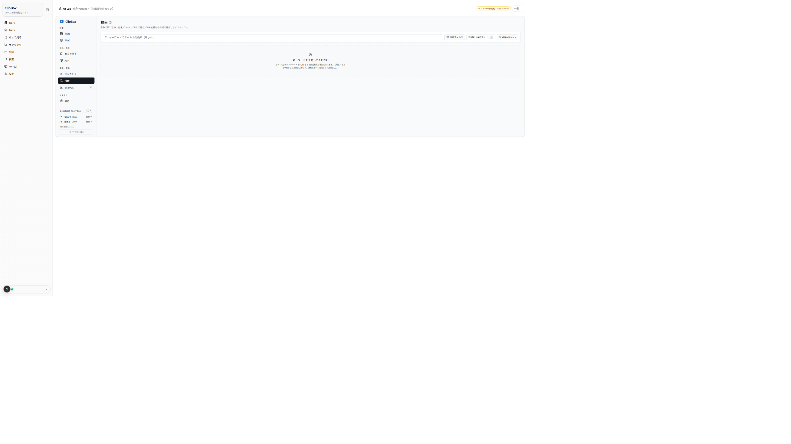

- **見るべき点**: キーワード未入力で空状態。詳細フィルタだけでは検索しない旨を明記。

#### 結果

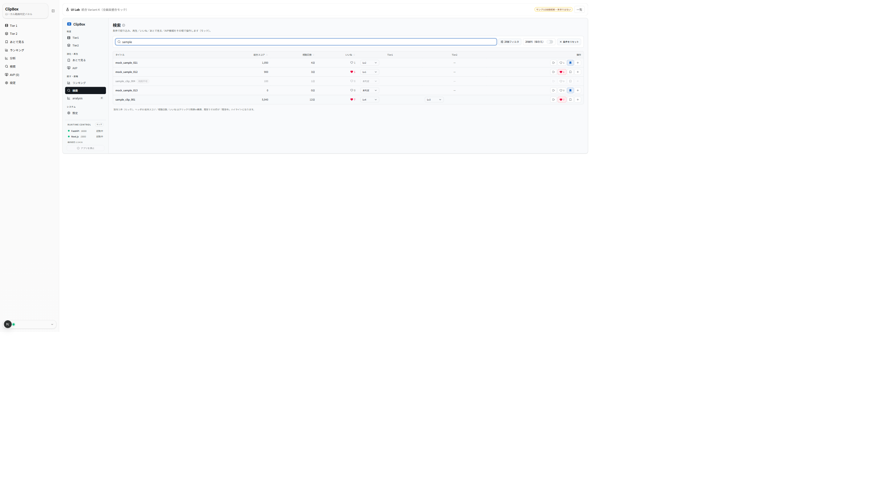

- **見るべき点**: キーワード「sample」一致。順位列なし。Tier 列プルダウン。総合スコアは公式整数。
- **STAGE7監査との関係**: §1-B 反映。

#### 詳細フィルタ Popover

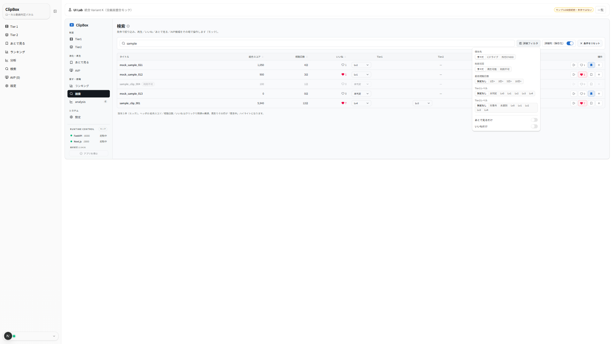

- **見るべき点**: キーワードは常時表示、それ以外（保存先/利用可否/最低視聴日数/Tier1/Tier2/あとで見る/いいね）を漏斗 Popover に畳む。有効数バッジ。詳細列（保存先）トグルあり。
- **STAGE7監査との関係**: §1-D/§2-8 反映。

#### 利用不可行＋バッジ

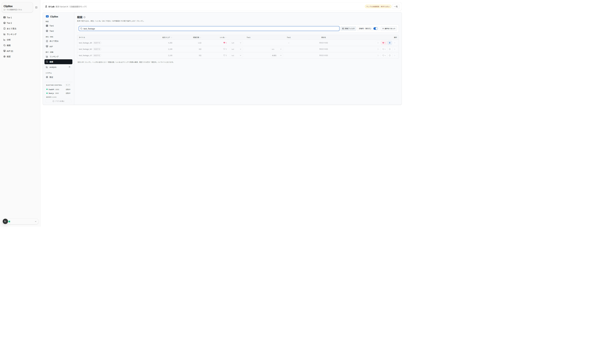

- **見るべき点**: キーワード「test_footage」。タイトル横に「利用不可」バッジ＋行薄表示。詳細列で保存先（匿名化分類）。
- **STAGE7監査との関係**: §2-7（利用不可タイトル横バッジ）/§1-D（保存先詳細列）反映。

### 8. 設定

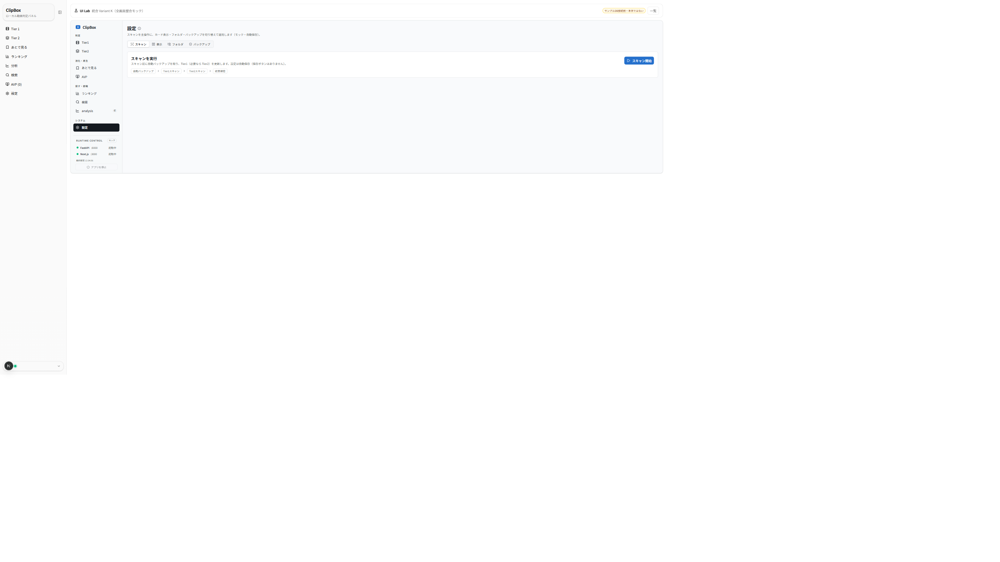
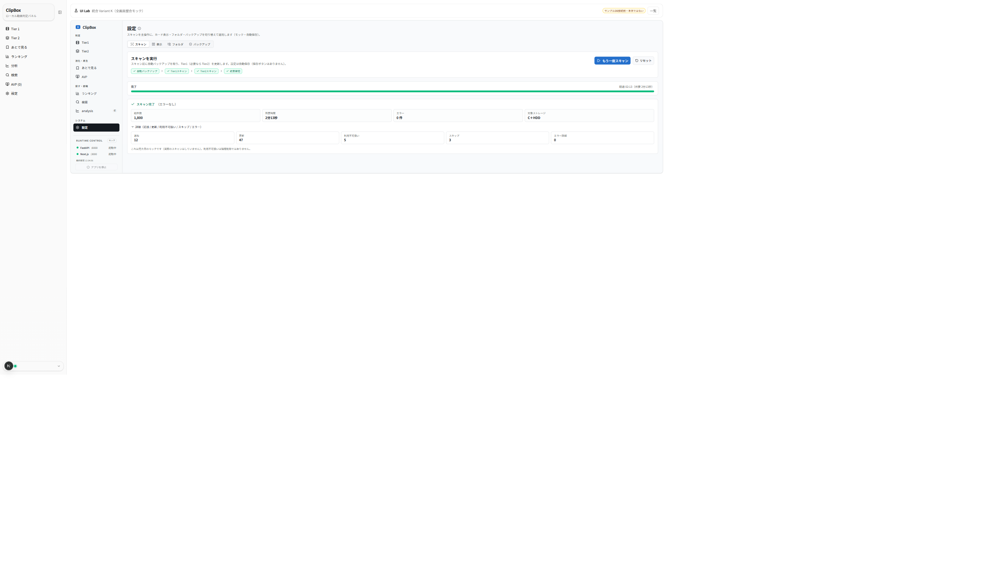

- **見るべき点**: scan-first の上部タブ（スキャン/表示/フォルダ/バックアップ・既定=スキャン）。自動バックアップ→Tier1→Tier2→結果確認の4ステップ。完了で結果サマリー（総件数/所要時間/エラー/対象ストレージ）＋詳細折りたたみ。自動保存（保存ボタンなし）。

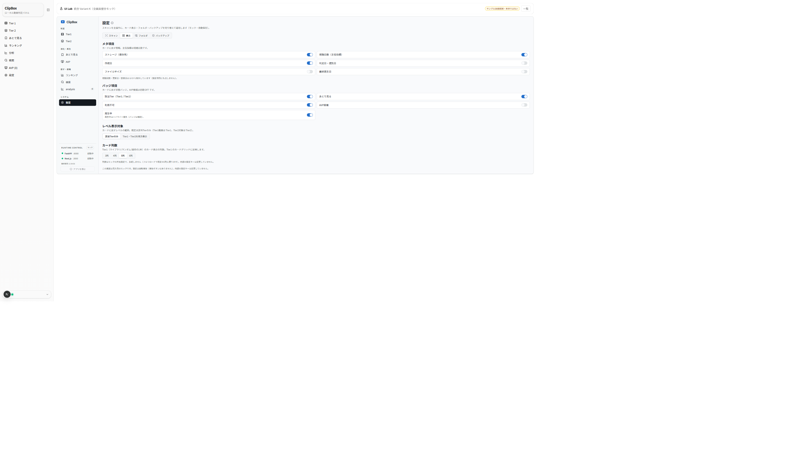
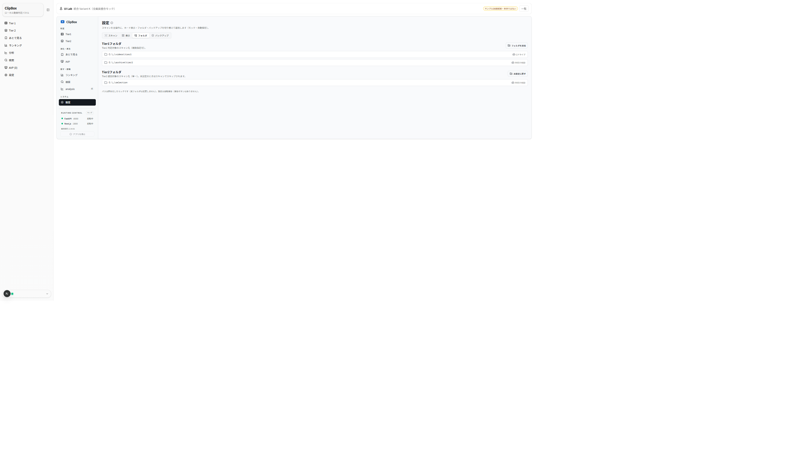
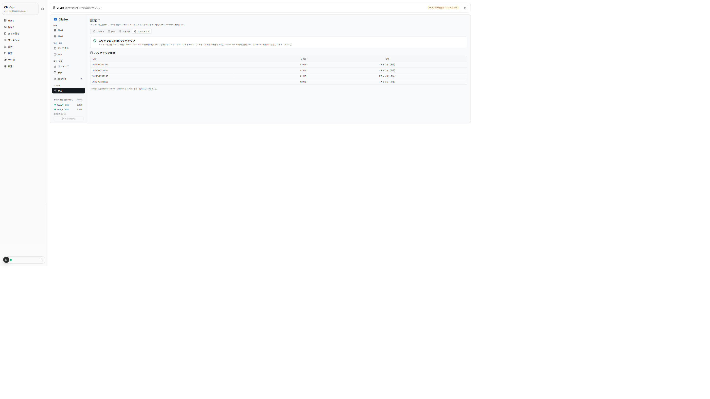

- **見るべき点**: 表示＝メタ/バッジ項目分離（AVP候補初期OFF）＋レベル表示対象（該当Tierのみ既定／Tier1・Tier2を両方表示）＋**カード列数**（3–6・既定5・Tier1 のカードグリッドに即時反映＝メモリ共有・永続しない・内部キー不変）。フォルダ＝「Tier1フォルダ/Tier2フォルダ」表示名（内部キー不変）。バックアップ＝自動が主役で**手動バックアップボタンが無い**。
- **STAGE7監査との関係**: §1-E（手動バックアップ撤去）反映。

### 9. analysis

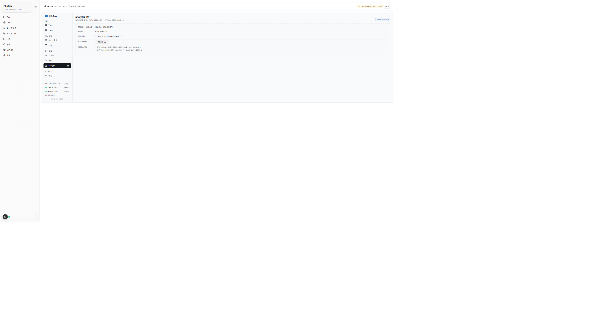

- **見るべき点**: 採用判断対象外の仮ページ（共通シェル/余白/テーマの波及のみ確認）。再設計していない。

### 10. レスポンシブ

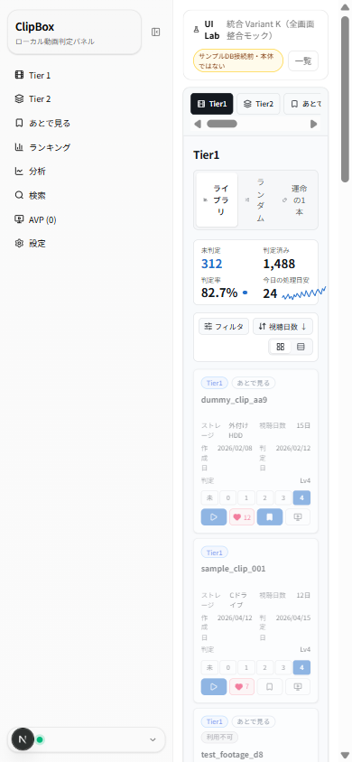

- **見るべき点**: 狭幅（390px）で variant-k の横スクロールナビ（Tier1/Tier2/あとで…＋スクロール矢印）が出る。カードは1列に縮約。
- **気になる点**: ラボ/ルートの外側 `SidebarNav` が狭幅でも畳まれず左半分を占有し、variant-k コンテンツが右半分に押し込まれる（既知のラボ入れ子制約）。実画面（ルート直下）では本体レイアウトのレスポンシブが効く前提。

## STAGE7監査との対応

| STAGE7項目 | 画面 | スクリーンショット | 画面で確認できる状態 | 残対応 |
|---|---|---|---|---|
| §1-A カード⇄テーブル＋ページャ | Tier1 | 02/03 | 切替＋50/100/200＋前後送り | ✅ 反映済み |
| §1-B Tier 列プルダウン | ランキング/検索 | 21/22/26 | 行内 Select・対象外「—」 | ✅ 反映済み |
| §1-C AVP 主要ボタン Tooltip 整理 | AVP | 18/20 | 主要ボタン title 無し・disabled 理由のみ | ✅ 反映済み |
| §1-D 検索 詳細フィルタ畳み＋保存先列 | 検索 | 27/28 | Popover＋保存先列 | ✅ 反映済み |
| §1-E 設定 手動バックアップ撤去 | 設定 | 33 | 手動ボタン無し・自動主役 | ✅ 反映済み |
| §2-1 AVP 一括いいね名 | AVP | 18 | 「再生対象をまとめていいね」 | ✅ 反映済み |
| §2-2 AVP タイトル省略 | AVP | 16 | truncate＋全名 hover | ✅ 反映済み |
| §2-3/§2-8 詳細フィルタ畳み統一 | ランキング/検索 | 22b/27 | 両方 Popover＋有効数バッジ | ✅ 反映済み |
| §2-4 自作 SVG ロゴ | 全画面サイドバー | 01 ほか | 箱＋再生三角マーク | ✅ 反映済み |
| §2-5 あとで見る5列 | あとで見る | 14 | PC幅5列基準 | ✅ 反映済み |
| §2-6 「AVPで再生」強調 | AVP | 18 | 主操作として強調 | ✅ 反映済み |
| §2-7 検索 利用不可バッジ | 検索 | 28 | タイトル横バッジ | ✅ 反映済み |
| §7-A Tier1 フィルタ Popover | Tier1 | 04 | 漏斗 Popover＋バッジ | ✅ 反映済み |
| §7-B Tier1 並び替え2段 Popover | Tier1 | 05 | 5項目＋降順/昇順 | ✅ 反映済み |
| §7-C カード操作共通部品化 | Tier1/Tier2/あとで見る/AVP | 02/09/14/18 | 1段アイコン操作の統一 | ✅ 反映済み |
| §7-D レベル6択＋1段操作 | Tier1 | 02/03 | 未/0/1/2/3/4・アイコン化 | ✅ 反映済み |
| §3-1 ランダム多本化 | Tier1 | 06 | シャッフル＋10/20/30（既定10） | ✅ 反映済み |
| §3-2 AVP スコア公式統一 | AVP | 16/18 | 整数 pt＋総合順位 | ✅ 反映済み |
| §3-3 スコア桁の見せ方 | ランキング/検索 | 21/26 | 整数3桁区切り（式不変） | 対応不要 |
| §3-4 サンプルDB接続前 API 束 | （UI 外） | — | 画面に現れない | ⏸ 延期（本体作業・必要性未確定） |

> 補足: STAGE7 とは別に、2026-06-29 に Tier1 の追加フィードバック（KPI を見出し右へ横並び化／ツールバー枠撤去／ページャ上下二重・既定100／カード5列・設定の「カード列数」連動／テーブルの操作4列分割＋列幅ドラッグ／ランダム 10/20/30／運命の全幅ワイドカード）を反映済み。詳細は `CHANGELOG.md`（2026-06-29 Tier1 エントリ）。

## レビュー依頼ポイント

以下はいずれも**実装済み**です。スクリーンショットで最終確認をお願いします。

- Tier1 KPI の拡大（`02`・カード枠サイズ据え置きで文字/数値のみ拡大した見やすさ）。
- Tier1 いいねのインクリメント式（`02`/`03`・押すたびに +1・解除手段なしで問題ないか）。
- Tier1 カード/テーブルの状態識別（`02`/`03`・利用不可=グレーアウト／未判定=左アクセントバー／判定済み=無印・「判定済みを薄くする」廃止）。
- Tier1 カードのメタ1行化（`02`/`06`・視聴◯日/作成日/判定日の3項目で十分か）。
- Tier1 運命の1本の抽選アニメーション＋当選固定（`04`/`05`/`06`・約1秒の演出のテンポ、判定でカードが切り替わらない挙動）。
- Tier1 カードの5列と設定「カード列数」連動（`02`/`31`）・テーブルの操作4列分割＋列幅ドラッグ（`03`）・フィルタ/並び替え Popover（`04`/`05`）・レベル6択 未/0/1/2/3/4（`02`）はそのまま。
- AVP のスコア表示を公式再計算へ寄せた結果（`16`/`18`・桁感がランキング/検索と一致）。
- 検索/ランキングの詳細フィルタの畳み方（`22b`/`27`・有効数バッジの分かりやすさ）。
- 設定の手動バックアップボタン撤去（`33`・履歴は全て自動取得表記で問題ないか）。
- あとで見るの5列（`14`・カード幅と情報密度）。
- 入れ子チロームの二重ナビ／狭幅で外側サイドバーが畳まれない点（`01`/`35`）について、ラボ表示としては許容するか、別途レイアウト調整を要するか。

## 確認環境

- OS: Windows 11
- ブラウザ: Playwright（Chromium）
- 撮影方法: Playwright MCP（フルページ＝`fullPage`、Popover/狭幅は viewport 撮影）
- viewport / 最大化条件: **最大化相当 1920×1080**（主撮影）／レスポンシブのみ 390×844
- 起動コマンド: `cd frontend && npm run dev`（http://localhost:3000）
- 未起動サービス: FastAPI（:8000）— UI LAB モックのため不要

## 注意

- 本体画面・API・DB・設定ファイルは変更していない（スクリーンショットとレポート作成のみ）。
- 既存 `STAGE7_FEEDBACK_AUDIT.md` の構成・内容は変更していない（参照のみ）。
- 「Pull request」は略していない。「全Tier」は使わず「Tier1・Tier2を両方表示」と記載。
- 実動画名・実パス・個人情報は含まない（合成データのみ）。スクリーンショットに個人情報の写り込みが無いことを確認済み。
