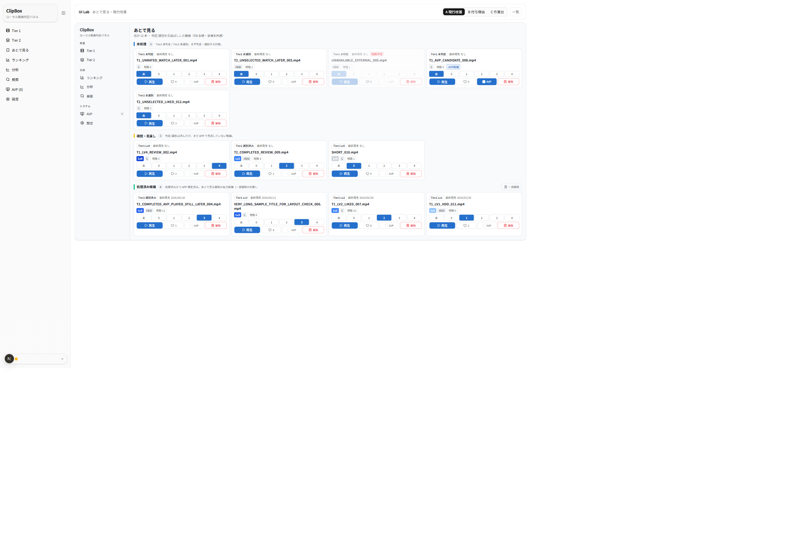
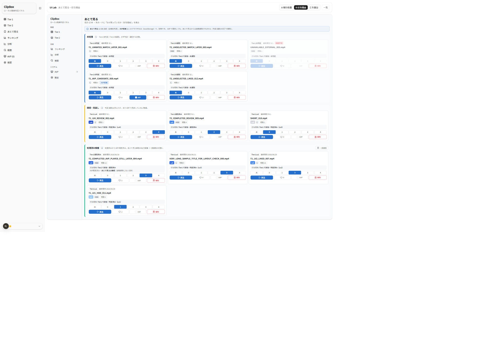
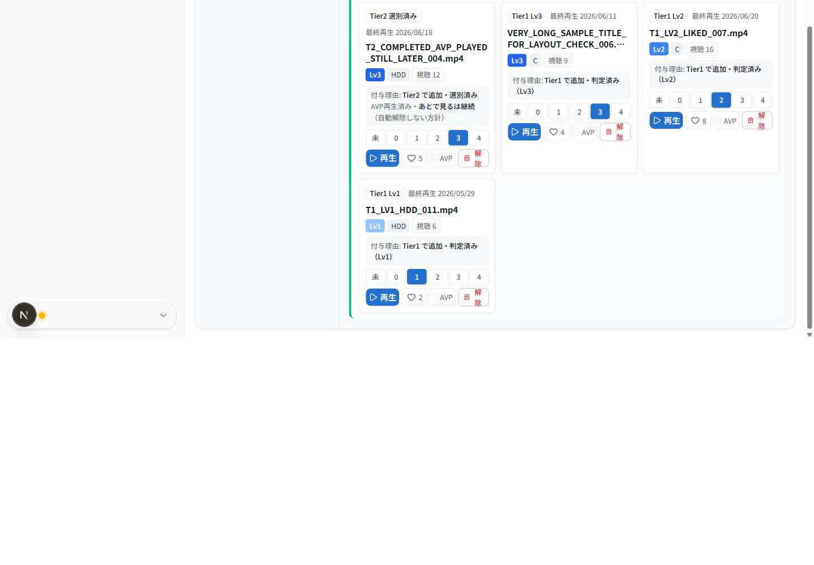
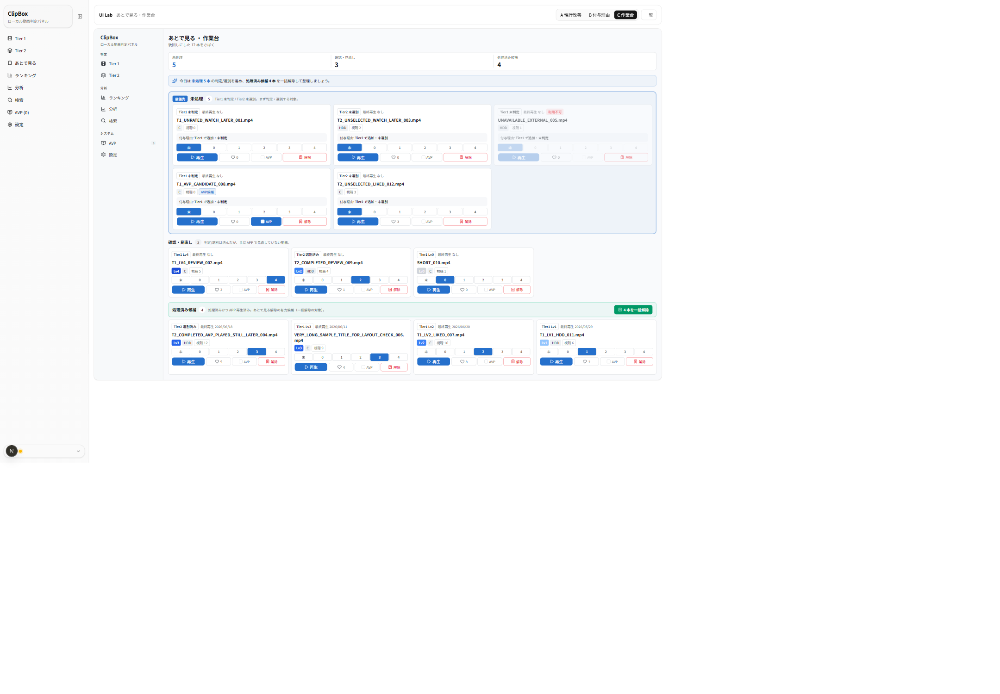
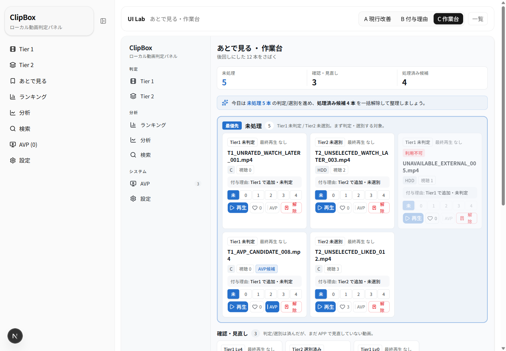
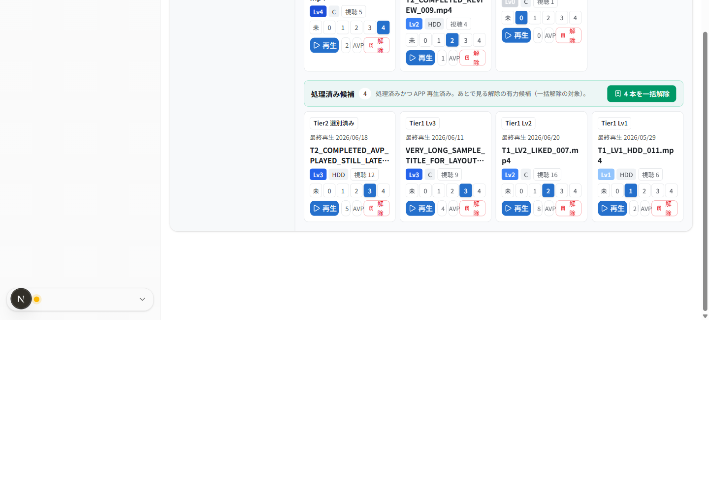

# UIラボ あとで見る画面 — 3案 比較レビュー（2026-06-24）

ClipBox Next.js 版「あとで見る」画面の UI 改修にあたり、本体実装の前段として**比較候補3案**をモック専用で作成しました。
現行の3セクション構成（**未処理 / 確認・見直し / 処理済み候補**）は維持しつつ、見た目をモダンに刷新します。
本レビューは、ユーザーが3案を見比べ、今後本体へ反映する方向性を選ぶための資料です。

- URL: `/lab/watch-later`（索引）／ `/lab/watch-later/variant-a` ・ `/variant-b` ・ `/variant-c`
- 対象タスク: あとで見る（判定/選別の先延ばし）。サムネなしの情報カード前提。
- 制約: 実 DB/API/localStorage 非接続・本体無変更・本体 `/watch-later` と `VideoCard` 無変更（モック専用・合成データ）。寒色（Variant J の THEME 流用）。

## 参照した正本・方針メモ

- `docs/context/SPEC_NEXTJS.md` §0（永続境界）・§4（あとで見る／3セクション分類） — **挙動仕様の正本**
- `docs/context/ACCEPTANCE_CRITERIA.md`（あとで見るの受け入れ基準）
- `docs/context/GLOSSARY.md`（Tier1/Tier2・未判定/判定済み・未選別/選別済み・いいね・AVP候補・あとで見る・ライブラリ）
- `docs/nextjs-ui-renovation-master-memo.md`（Phase 0 方針・比較候補・AVP非解除の採用方針＝未実装）
- 既存ラボ規約: `frontend/src/app/lab/tier1-random/_review/COMPARISON_J.md` 等

> 注: スクショ左端の細いナビは**本体 `SidebarNav`**（ルートレイアウト由来）。各案の本体は中央の枠内（`ModernSidebar`＋main）です。
> モック専用のため、再生・レベル・いいね・あとで見る解除・AVP・一括解除はすべて画面内ローカル状態のみで、保存されません。

---

## 3案の概要

| 案 | 名称 | 狙い | 一言 |
|---|---|---|---|
| **A** | 3セクション維持・現行改善型 | 現行構造を最も素直に保ち、余白・見出し・件数バッジでモダンに | 移行しても迷いにくい安心案 |
| **B** | 付与理由・状態説明強化型 | 各カードに「なぜ残っているか（付与理由）」を表示 | 状態と方針が読み取りやすい |
| **C** | 作業台型 | あとで見るを「さばく作業台」として上部サマリー＋推奨アクション | 行動に結びつける |

共通: 寒色モダンテーマ、`ModernSidebar`、3セクション（見出し＋件数バッジ）、サムネなし情報カード。
カードのバッジは **レベル（青スケール）／ストレージ（C・HDD）／視聴数／AVP候補／利用不可（赤）**、操作は **再生・レベル（数値ボタン）・いいね・あとで見る解除・AVP候補**。
状態キャプションは本体 `statusLabel` と同じ文言（`Tier1 未判定` / `Tier1 Lv3` / `Tier2 未選別` / `Tier2 選別済み`）＋ `最終再生 日付`。

---

## 案A: 3セクション維持・現行改善型

現行 `/watch-later` の3セクションをそのまま踏襲。各セクション見出しに**色アクセント帯**（未処理=寒色プライマリ／確認・見直し=アンバー／処理済み候補=エメラルド）と**件数バッジ**を付け、処理済み候補のみ右端に **一括解除** ボタンを出します。

**良い点**
- 現行画面との差分が最小で、移行コスト・学習コストが低い。
- セクションの見分けが色帯＋件数で素早い。
- カードの情報量が本体 `VideoCard` 相当に抑えられ、密度が高すぎない。

**懸念点**
- 「なぜこの動画が残っているか」は状態バッジから読み取るしかなく、Tier1/Tier2 の由来説明は弱い。
- セクションが縦に長くなると、処理済み候補の一括解除ボタンまでスクロールが要る。

---

## 案B: 付与理由・状態説明強化型

各カードに**付与理由ボックス**（例: 「Tier2 で追加・選別済み」「Tier1 で追加・未判定」）を追加。
**AVP再生済みでもあとで見るに残る**ケースは、カード内に「AVP再生済み・あとで見るは継続（自動解除しない方針）」と明示します。
上部の説明バナーで、**あとで見る=DB／AVP候補=localStorage は別物**で、AVP再生では自動解除されないことを伝えます。

**良い点**
- 残存理由が言語化され、未判定/判定済み・未選別/選別済みの区別が明確。
- AVP再生→非解除の採用方針が、画面上で自然に理解できる（将来方針の可視化）。
- 永続境界（DB と localStorage）をユーザー文言として説明できる。

**懸念点**
- 情報量が案Aより増え、カード1枚が縦に伸びる（密度とのトレードオフ）。
- 付与理由は本体に新フィールドではなく既存状態からの導出だが、文言設計の合意が要る。

---

## 案C: 作業台型

上部に**状態サマリー**（未処理 / 確認・見直し / 処理済み候補の件数）と**推奨アクション**バナーを置き、
**未処理**を「最優先」ブロックとして枠で強調、**処理済み候補**は緑のバーに **「N本を一括解除」** ボタンを独立配置します。

**良い点**
- 「今日は何をすればよいか」が上部で分かり、行動に結びつく。
- 未処理が最も目立ち、先延ばしの解消を促す。
- 一括解除が独立バーで目立ち、処理済み候補の整理がしやすい。

**懸念点**
- 上部サマリー＋推奨文＋強調ブロックで装飾が増え、現行からの変化が3案で最も大きい。
- 推奨アクションの文言ロジック（何を勧めるか）の設計が必要。

---

## 評価観点まとめ

| 観点 | 案A 現行改善 | 案B 付与理由 | 案C 作業台 |
|---|---|---|---|
| 現行機能の維持 | ◎ ほぼ現行どおり | ○ 維持＋情報追加 | ○ 維持＋上部UI追加 |
| 3セクションの分かりやすさ | ○ 色帯＋件数 | ○ 左枠線＋件数 | ◎ サマリー＋最優先強調 |
| Tier1 / Tier2 の区別 | ○ 状態バッジ | ◎ 付与理由で明示 | ◎ 付与理由＋サマリー |
| 未判定/判定済み・未選別/選別済みの非混同 | ○ | ◎ 文言で明示 | ◎ |
| AVP候補とあとで見るの非混同 | ○ バッジ＋別操作 | ◎ バナーで明示 | ○ バッジ＋別操作 |
| AVP再生でも残る方針の自然さ | △ 説明なし | ◎ カード＋バナーで明示 | ○ サマリー前提 |
| サムネなしでも寂しくないか | ○ | ◎ 付与理由で密度確保 | ◎ サマリーで賑やか |
| 情報密度（多すぎないか） | ◎ 低め | △ やや高い | ○ 中 |
| モダンさ | ○ | ○ | ◎ |
| 操作の分かりやすさ | ○ | ○ | ◎ 推奨アクション |
| 実装難易度 | ◎ 低 | ○ 中（文言設計） | △ 中〜高（サマリー/推奨） |
| `VideoCard` との共通化余地 | ◎ 大 | ○ 付与理由行を追加で対応 | ○ カードは共通＋外側で構成 |

凡例: ◎ 強い / ○ 良い / △ 注意。

---

## ClipBox 現行仕様との整合性

- 3セクションの membership は本体 `watch-later/page.tsx` のロジックを純関数で再現（`_data/watchLaterMock.ts` の `sectionOf`）。未処理＝Tier1未判定 / Tier2未選別、確認・見直し＝処理済み状態かつ最終再生日なし、処理済み候補＝処理済み状態かつ最終再生日あり（一括解除の対象）。
- 永続境界は変更しない。あとで見る=DB（全端末共通）、AVP候補/AVP再生対象=localStorage。コピーでも混同しない。
- サムネイル不使用（情報カード方針）。「ライブラリ」語は Tier タブ名予約のため別概念に流用していない。
- **AVP再生で自動解除しない**方針は採用済みだが**未実装**。本ラボはその「将来の正しい姿」を見せるのみで、本体挙動・API・DB・GLOSSARY は変更していない。

## 本体反映時の注意点

- 反映は**見た目のみ**を対象にし、AVP非解除の挙動変更（仕様変更）とは**別 Pull request**に分ける（master-memo §7）。
- #45 の反映安定化（`localWatchLater` ＋スコープ限定 invalidate）を壊さない。手動/一括解除後は `["watch-later-videos"]` を invalidate。
- カードは本体 `VideoCard` を共通利用。付与理由（案B）を採る場合は、あとで見る画面側の caption 拡張として載せ、`VideoCard` 本体は Tier 別最適化の範囲に留める。
- 一括解除は `POST /api/videos/watch-later/bulk-clear`（処理済み候補のみ）。確認ダイアログはモックでは省略しているため、本体では現行どおり確認を出す。

---

## 推奨案

**案B（付与理由・状態説明強化型）をベースに、案Cの上部サマリー要素を任意採用** を推奨します。

- 理由: あとで見るの本質的な課題は「なぜ残っているか分からず、解除判断がつかない」こと。付与理由（案B）はこれを直接解消し、AVP非解除方針も自然に説明できます。情報密度は案Cの「最優先ブロック」までは持ち込まず、案Bのカード拡張に留めれば現行からの変化も中程度に収まります。
- 段階案: まず**案A相当の見た目刷新**を先に本体反映（低リスク）→ 次フェーズで**案Bの付与理由**を追加、という2段で進めるのも可。

---

## ユーザーに確認したい未決事項

1. **方向性**: 推奨どおり「案B ベース＋案C サマリー任意」で進めるか、案A（最小変更）から段階的に進めるか。
2. **付与理由の文言**: 「Tier2 で追加・選別済み」等の言い回しでよいか（語の確定）。
3. **AVP非解除の見せ方**: カード内注記＋上部バナーの両方を出すか、どちらか一方に絞るか。
4. **作業台の推奨アクション**（案C）: 何を勧めるか（未処理の消化／処理済み候補の一括解除）の優先順位。
5. **セクション色アクセント**: 未処理=寒色/確認=アンバー/処理済み=エメラルドの配色でよいか。
6. **テーマ**: 寒色モダン（Variant J 系）を本採用とするか（master-memo では確定度「要再確認」）。

---

_本ドキュメントは確認・レビュー用です。スクリーンショットは本ラボ（モック専用・合成データ）のもので、個人情報・実動画名・実パスは含みません。
拡大スクショ（`b-reason` / `c-summary` / `c-bulk-clear`）はページに CSS zoom を当てて撮影したため、本来の表示倍率とは異なります。_
